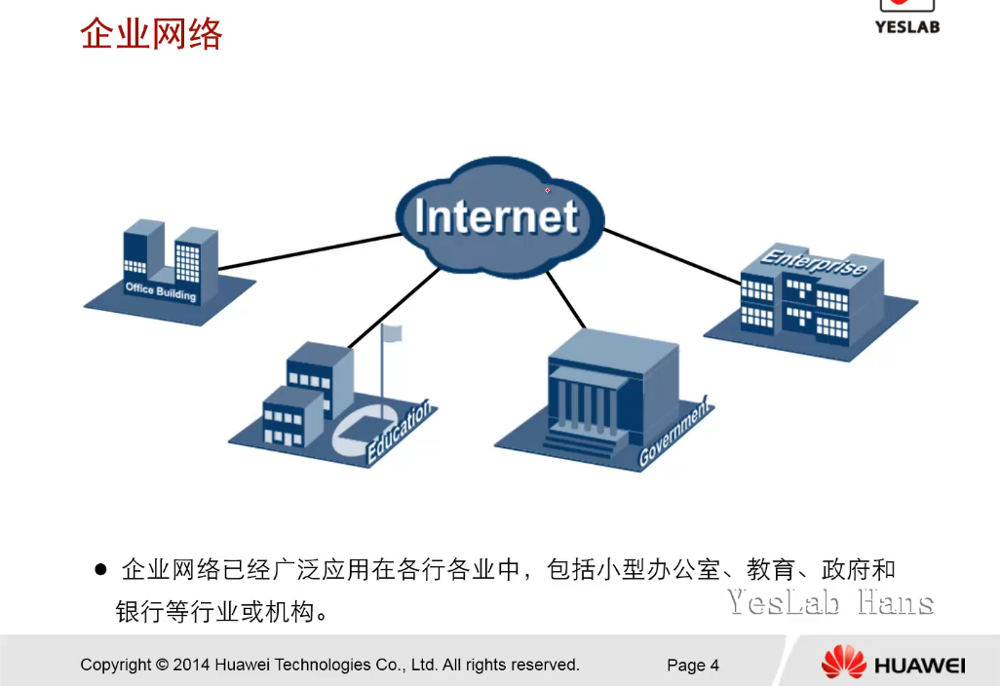
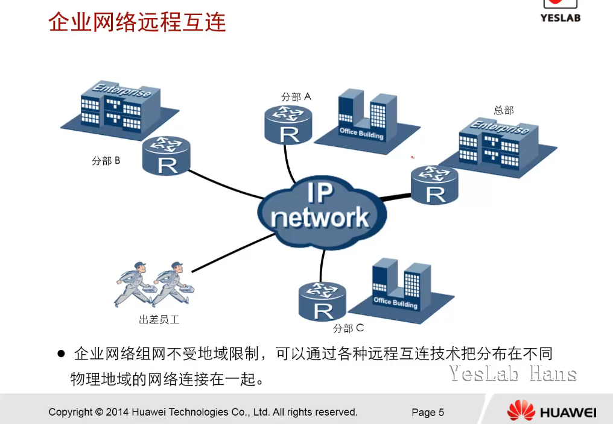
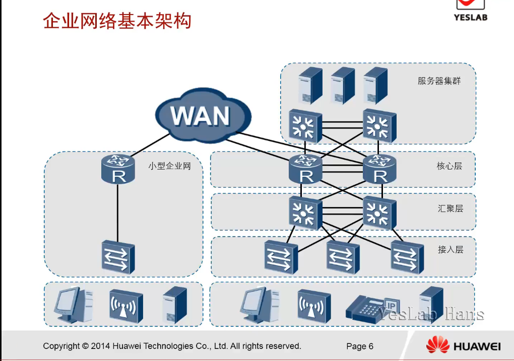

# 企业网络架构介绍

最初的企业网：企业网内互联互通做文件共享

什么是网络

## 学习目标

- 了解企业网络的基本架构

大型运营商isp：Internet Service Provider互联网服务提供商

中型企业机构

个人家庭

小型企业

## 企业网络

- 企业网络已经广泛应用在各行各业中，包括小型办公室，教育，政府和银行等行业或机构。

传统企业网特点：分离

现在企业网架构：通过因特网互联互通

## 企业网络远程互联

- 企业网络足网不受地域 限制，可以通过各种远程互联技术把分布在不同物理地域的网络连接在一起

总部，分部

出差，公司内部

vpn连接

## 企业网络基本架构

架构：组网特点，维护，成本

- 小型企业网络架构：扁平化，组网简单，维护简单，灵活，成本低，可靠性较差

- 大型企业网络架构：层次化，多链路，多冗余，多设备，分层次，成本高，维护复杂

接入层交换机：

        作用：接入终端，本地网段访问，相邻用户互访，用户管理，用户信息收集

        特点：设备不是特别高端，2层交换机，接口密集

        为提高上访流量的冗余性，通过2条链路互联到汇聚层设备

> 通常将网络中直接面向用户连接或访问网络的部分称为接入层，为用户提供了在本地网段访问应用系统的能力，主要解决相邻用户之间的互访需求，并且为这些访问提供足够的带宽。在大中型网络里，接入层还应当适当负责一些用户管理功能（如地址认证、用户认证、计费管理等），以及用户信息收集工作（如用户的IP 地址、MAC 地址、访问日志等）。

~~汇聚层~~**分布层**交换机：

        作用：实施策略,安全,工作组接入,VLAN间路由,地址过滤

        特点：较接入层比较，需要更高的性能，更快的速度，更少的接口

        一般采用2台3层交换机

> 汇聚层交换机用来连接核心层和接入层，处于中间位置，它的上行是核心交换机，下行是接入层交换，具有实施策略、安全、工作组接入、虚拟局域网（VLAN）之间的路由、源地址或目的地址过滤等多种功能，它是实现策略的地方。因为汇聚层交换机是多台接入层交换机的汇聚点，它必须能够处理来自接入层设备的所有通信量，并提供到核心层的上行链路，因此汇聚层交换机与接入层交换机比较，需要更高的性能和交换速度以及更少的接口。

核心层：

        作用：高速转发通信，提供快速可靠的骨干传输结构

        特点：可靠性，高效性，冗余性，容错性，可管理性，适应性，低时延性，更高带宽，更高性能

        核心层是网络主干部分，整个网络性能的保证

        设备包括：路由器，防火墙，核心交换机等

> 核心层是网络主干部分，是整个网络性能的保障，其设备包括路由器、防火墙、核心层交换机等等，主要目的在于通过高速转发通信，提供快速、可靠的骨干传输结构，因此核心层交换机应该具有如下特性：可靠性、高效性、冗余性、容错性、可管理性、适应性、低延时性等。因为核心层是网络的枢纽中心，重要性突出，因此核心层交换机应该采用拥有更高带宽、更高可靠性、更高性能和吞吐量的千兆甚至万兆以上可管理交换机。

以上为企业网的**办公网络环境**

服务集群：

接入层->汇聚层->接入层

## 总结

- 小型企业网路和大型企业网络的组网有什么差别？

**小型企业网络通常采用扁平网络结构，网络扩展能力低。如需支持未来不断增长的用户，应采用多层网络结构。大型企业网络用户较多，通常采用层次化结构以支持网络的扩展和用户的增长。（小型企业网络一般不分层， 大型企业网络分层）  
 1.小型企业网：用户终端–交换机–出口路由器–WAN(wide area network)广域网；**

~~小型企业网络通常采用扁平化网络结构，网络扩展能力低~~

~~组网简单，能保障网络正常使用就可以了~~

~~大型企业网络用户较多，采用层次化结构以支持网络的扩展和用户增长~~

~~办公地点可能分布广泛，需要建立专门的网络来满足企业ERP,邮件，服务器，数据传输，电话会议，视频会议等需求~~

~~整体解决方案会复杂一些，需要专门的服务商帮助搭建~~

- 大型企业网络设计的基本思想是什么？

**比如稳定性（设备冗余）、扩展性、安全性（防火墙、入侵检测装载），购买多个服务提供商业务（联通、电信）**

首先考虑企业业务的特点，在保证网络性能满足业务需求的前提下，

还要考虑：

可用性

稳定性

扩展性

安全性

可管理性

成本 
