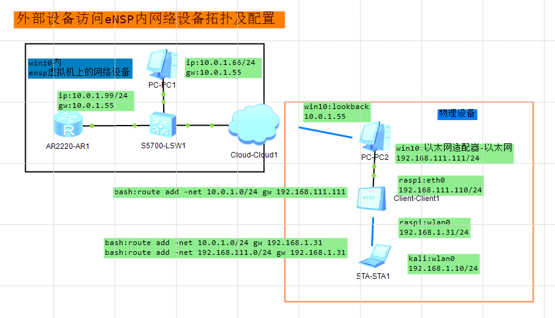
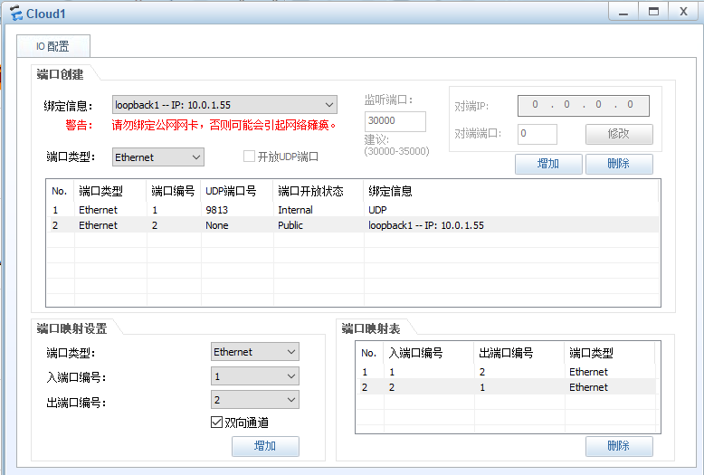
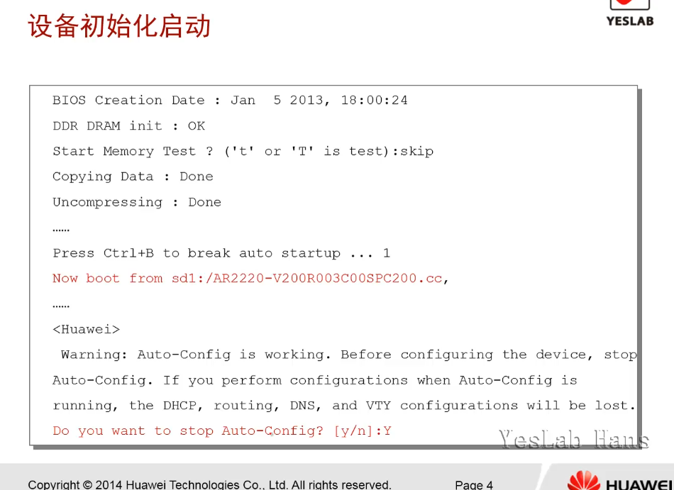
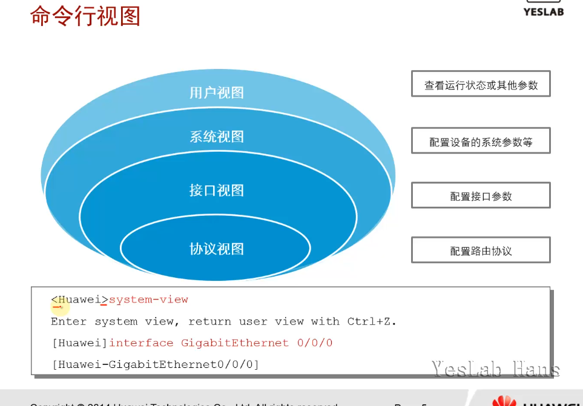
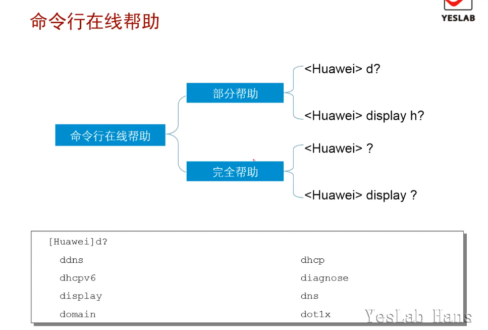

# 命令行基础

熟悉VRP命令行并且熟练掌握VRP配置是高效管理华为网络设备的必备基础。

[熟悉命令行](https://support.huawei.com/hedex/hdx.do?docid=EDOC1100021771&tocURL=resources%2Fdc%2Fcommand-privilege_level.html)

## 工具获取

- e.huawei.com->技术支持->工具

- HedExLite(以下架)-->ICS Lite

- ensp
  
  - 路由器：使用AR222
  - 接口不够用，添加板卡（右击->设置->视图）
  - 接口列表(最右侧)
  - 调色板(文本框旁边)，划分区域
  - 本机和模拟器中的设备通信(cloud),GE口，没有协商问题
  - WINOWS添加LOOKBACK网卡（SUPER+R->HDWWIZ->手动选择->显示所有设备->Microsoft:Microsoft KM-TEST环回适配器）**重启**





## 学习目标

- 掌握VRP命令行的基础知识

- 利用VRP命令行进行基本的配置

### 设备初始化启动

- 初始化启动，自动配置(向导式)：no



### 命令行视图

- 用户视图：查看运行状态和其他参数
  
  - `<设备名称>`
  
  - 参观级的命令，ping,tracert,display version,查看接口状态
  
  - `system-view`进入系统视图

- 系统视图：配置设备的系统参数
  
  - `[设备名称]`
  
  - 配置系统参数，协议，路由
  
  - `interface GigabitEthernet 0/0/0`进入接口视图

- 接口视图：配置接口参数
  
  - 配置接口参数，ip地址，ipv6地址

- 协议视图：配置路由协议
  
  - 可以从系统视图或者接口视图进入



### 命令行功能(快捷键)

| 快捷键          | 功能              |
| ------------ | --------------- |
| CTRL+A       | 把光标移动到当前命令行的最前端 |
| CTRL+E       | 把光标移动到当前命令行的最末尾 |
| CTRL+C       | 停止当前命令的运行       |
| CTRL+Z       | 回到用户视图          |
| CTRL+]       | 终止当前连接或者切换连接    |
| Backspace    | 删除当前光标前面的一个字符   |
| <--or Ctrl+B | 光标左移一位          |
| -->or Ctrl+F | 光标右移一位          |
| TAB          | 命令补全            |

### 命令行在线帮助

- 在命令后面加一个问号，例如`d？`



### 基本配置步骤

- 配置设备名称，系统视图下配置

- 配置系统时钟，用户视图下配置
  
  - 出现错误时，log日志会记录时间信息
  
  - display clock,查看时间

- 配置标题消息，系统视图下配置

| 命令                           | 功能             |
| ---------------------------- | -------------- |
| `sysname`                    | 配置设备名称         |
| `clock timezone`             | 设置时区           |
| `clock datetime`             | 设置时间和日期        |
| `clock daylight-saving-time` | 设置采用夏时制        |
| `header login`               | 配置用户登陆前显示的标题消息 |
| `header shell`               | 配置用户登陆后显示的标题消息 |

### 命令等级

- 系统视图下配置
- 用户等级`user_level=a`的用户可以使用命令等级`command_level<=a`的命令

#### [command-privilege level](https://support.huawei.com/hedex/pages/EDOC1100021771AZH05262/13/EDOC1100021771AZH05262/13/resources/dc/command-privilege_level.html)

- **command-privilege level**命令用来**设置指定视图内的**<mark>命令的级别</mark>。

- **undo command-privilege**命令用来恢复命令为缺省级别。

- 缺省情况下，各个视图下的每条命令都有指定的级别

- 修改`save`命令的级别为`5`（默认为0），（系统视图下会发现无法使用save命令了）

```vrp
<Huawei> system-view
[Huawei] command-privilege level 5 view user save
```

#### [user privilege](https://support.huawei.com/hedex/pages/EDOC1100021771AZH05262/13/EDOC1100021771AZH05262/13/resources/dc/user_privilege.html)

- 用户接口视图下进行配置

- **user privilege**命令用来<mark>配置用户级别</mark>。

- **undo user privilege**命令用来恢复用户级别到缺省情况。

- 缺省情况下，Console口用户界面下用户的级别是15，而其他用户界面用户的级别是0

```vrp
<Huawei> system-view
[Huawei] user-interface vty 0
[Huawei-ui-vty0] user privilege level 2
<Huawei> display user-interface vty 0
```

#### 测试

```vrp
[Huawei]user-interface vty 0 4
[Huawei-ui-vty0-4]authentication-mode password 
Please configure the login password (maximum length 16):16
[Huawei-ui-vty0-4]set authentication password cipher 123
[Huawei-ui-vty0-4]
[Huawei]int LoopBack 0
[Huawei-LoopBack0]ip address 10.1.1.1 32
[Huawei-LoopBack0]
<Huawei>telnet 10.1.1.1
  Press CTRL_] to quit telnet mode
  Trying 10.1.1.1 ...
  Connected to 10.1.1.1 ...

Login authentication


Password:
<Huawei>?
User view commands:
  display        Display information
  hwtacacs-user  HWTACACS user
  local-user     Add/Delete/Set user(s)
  ping           Ping function
  quit           Exit from current mode and enter prior mode
  super          Modify super password parameters
  system-view    SystemView from terminal
  telnet         Open a telnet connection
  tracert        <Group> tracert command group
<Huawei>
```

| 用户级别 | 命令级别    | 级别名称 | 说明                                                                                                                                                                                                                                                                                                                                                                                                                                  |
| ---- | ------- | ---- | ----------------------------------------------------------------------------------------------------------------------------------------------------------------------------------------------------------------------------------------------------------------------------------------------------------------------------------------------------------------------------------------------------------------------------------- |
| 0    | 0       | 参观级  | 网络诊断工具命令（ping、tracert）、从本设备出发访问外部设备的命令（Telnet客户端）等。                                                                                                                                                                                                                                                                                                                                                                                 |
| 1    | 0、1     | 监控级  | 用于系统维护，包括display等命令。<br><br>说明：<br><br>并不是所有display命令都是监控级，比如[**display current-configuration**](https://support.huawei.com/hedex/pages/EDOC1100021771AZH05262/13/EDOC1100021771AZH05262/13/resources/dc/display_current-configuration.html)命令和[**display saved-configuration**](https://support.huawei.com/hedex/pages/EDOC1100021771AZH05262/13/EDOC1100021771AZH05262/13/resources/dc/display_saved-configuration.html)命令是3级管理级。 |
| 2    | 0、1、2   | 配置级  | 业务配置命令。                                                                                                                                                                                                                                                                                                                                                                                                                             |
| 3～15 | 0、1、2、3 | 管理级  | 用于系统基本运行的命令，对业务提供支撑作用，包括文件系统、FTP、TFTP下载、用户管理命令、命令级别设置命令、用于业务故障诊断的debugging命令等。                                                                                                                                                                                                                                                                                                                                                      |

### 用户界面

- console线接入，编号为0,一台设备同时只支持一个console线在线

- VTY(Virtual TYpe terminal：虚拟类型终端)接口最大可配范围为0-14

| 用户界面类型  | 编号  |
| ------- | --- |
| Console | 0   |
| VTY     | 0-4 |

### 配置用户界面命令

- 在登陆接口下配置,`user-interface console 0`

| 命令                         | 功能              |
| -------------------------- | --------------- |
| `idle-timeout`MIN SEC      | 设置超时时间          |
| `screen-length`            | 设置指定终端屏幕的临时显示行数 |
| `history-command max-size` | 设置历史命令缓冲区的大小    |
| `lock`                     | 锁住当前用户界面        |

### 配置登陆权限

在登陆接口下配置,`user-interface vty 0`

| 命令                                   | 功能             |
| ------------------------------------ | -------------- |
| `user privilege`                     | 配置指定用户界面下的用户级别 |
| `set authentication password cipher` | 配置本地认证密码       |

### 配置接口IP地址

- 在接口视图下配置`interface g 0/0/0`

- `ip address 10.1.1.1 24`

- `shutdown`命令用来去激活接口

## 总结

- 华为网络设备支持多少个用户同时使用console口登陆？

华为网络设备同时只能有一个用户登录Console界面 ,因此Console用户的编号固定为0。

- 在使用命令`interface loopback 0 `后，loopback 0 接口的状态是什么？

Loopback接口是一种逻辑接口, 在未创建之前, Loopback接口并不存在。从创建开始,Loopback接口就一直存在,并一直保持Up状态 ,除非被手动关闭。
