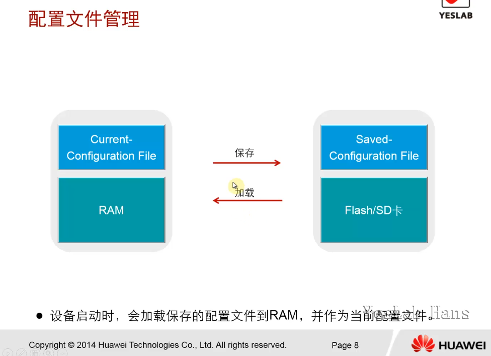
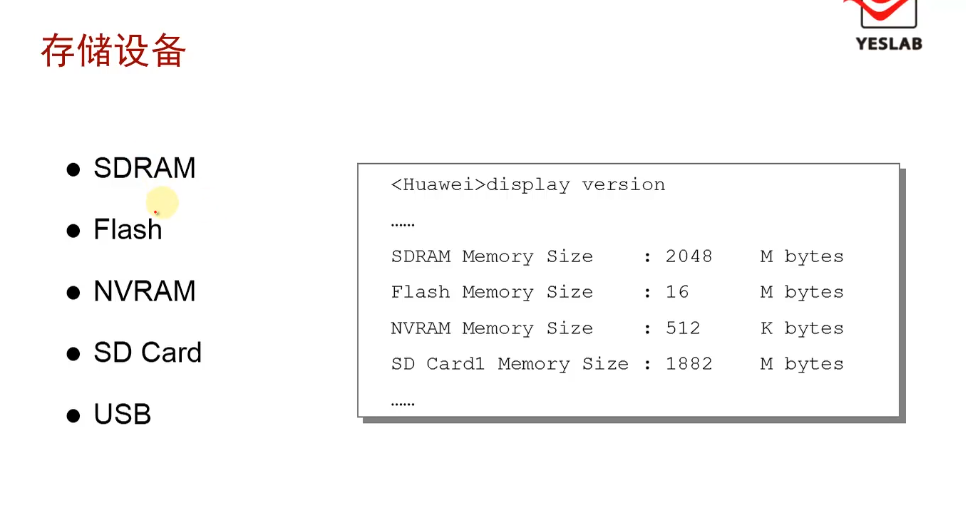

# 文件系统基础

华为网络设备的配置文件和VRP系统文件都保存在物理存储介质中，所以文件系统是VRP正常运行的基础。只有掌握了对文件系统的基本操作，网络工程师才能对设备的配置文件和VRP系统文件进行高效的管理

## 学习目标

- 掌握文件系统的基本操作

## 基本查询、目录，文件

### 基本查询命令

| 命令     | 功能           |
| ------ | ------------ |
| `pwd`  | 查看当前目录位置     |
| `dir`  | 查看当前目录下的文件信息 |
| `more` | 查看文本文件的具体内容  |

### 目录操作

| 命令      | 功能          |
| ------- | ----------- |
| `cd`    | 修改用户当前的工作目录 |
| `mkdir` | 创建新目录       |
| `rmdir` | 删除目录        |

### 文件操作

- <mark>可以使用[**dir**](https://support.huawei.com/hedex/pages/EDOC1100021771AZH05262/13/EDOC1100021771AZH05262/13/resources/dc/dir_user_view.html) **/all**命令显示当前路径下回收站中的文件，文件名用“[ ]”标识</mark>

| 命令                   | 功能          |
| -------------------- | ----------- |
| `copy`               | 复制文件        |
| `move`               | 移动文件        |
| `rename`             | 重命名文件       |
| `delete /unreserved` | 删除文件/永久删除文件 |
| `undelete`           | 恢复删除的文件     |
| `reset recycle-bin`  | 彻底删除回收站中的文件 |

## 配置文件管理

- 设备启动时，会加载保存的配置文件到RAM,并作为当前配置文件

- `save`命令



### 配置文件查询

| 命令                              | 功能        |
| ------------------------------- | --------- |
| `display current-configuration` | 显示当前配置文件  |
| `display saved-configuration`   | 显示保存的配置文件 |

### 配置文件保存

| 命令                          | 功能             |
| --------------------------- | -------------- |
| `save`                      | 保存当前配置信息       |
| `reset saved-configuration` | 清空下次启动时加载的配置文件 |

### 比较当前配置文件和保存的配置文件

| 命令                      | 功能             |
| ----------------------- | -------------- |
| `compare configuration` | 比较当前配置与下次启动的配置 |

## 系统文件管理

### 系统启动文件查询

| 命令                | 功能         |
| ----------------- | ---------- |
| `display startup` | 查看系统启动配置参数 |

### 系统启动配置文件修改

| 命令                                 | 功能               |
| ---------------------------------- | ---------------- |
| `startup saved-configuration FILE` | 配置系统下次启动时使用的配置文件 |

## 存储设备



### 存储设备修复

- 当存储设备的文件系统出现异常时，可以通过`fixdisk`命令进行修复

- `fixdisk`

```vrp
<AR1>fixdisk flash:
Fixdisk flash: will take long time if needed
%Fixdisk flash: completed.
<AR1>
```

### 存储设备格式化

- 格式化会导致数据丢失！！！

- `format`

## 总结

- 设备中的文件属性中有drw,其中d代表什么含义？

d表明是个目录。r , w是可读出,可写入的意思

- 如果设备中有多个配置文件，如何指定下次启动时使用的配置文件？

配置文件可以不使用默认的文件名vrp.cfg ,而用其他指定的名称保存在路由器或者交换机中。如果需要指定某一配置文件为下次启动时使用的配置文件,可以执行<mark>startup saved-configuration [configuration-file-name]命令</mark>, 这里的配置文件名包括文件名称和扩展名。
