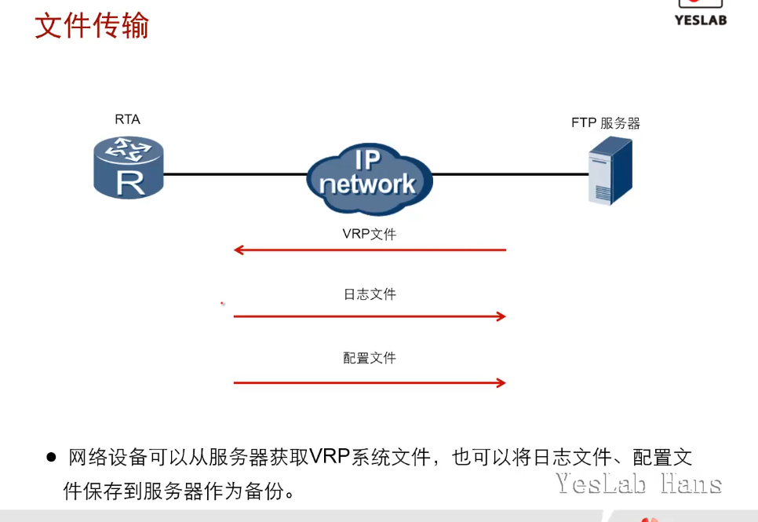

# VRP系统管理

为了满足企业业务对网络的需求，网络设备中的系统文件需要不断进行升级。另外，网络设备中的配置文件也需要时常进行备份，以防设备故障或其他灾害给业务带来损害。在升级和备份系统文件或配置时，经常会使用FTP和TFTP来传输文件。

FTP(File Transfer Protocol)**文件传输协议**

TFTP(Trivial File Transfer Protocol)**简单文件传输协议**

## 学习目标

- 掌握FTP和TFTP的应用

- 掌握VRP升级的方法

## 文件传输

- 网络设备可以从服务器获取VRP系统文件，也可以将日志文件、配置文件保存到服务器作为备份。

- 常用的文件传输协议有FTP(TCP)和TFTP(UDP)两种

## 升级VRP

- 随着VRP版本的更新，VRP支持的特性也越来越多，可根据需求更新VRP版本

### VRP下载

- `e.huawei.com`

- 技术支持

- 路由器

- 选择型号

- 软件

- 下载.`cc`,系统软件`.pat`补丁

- [AR2000 系列 软件补丁下载](https://support.huawei.com/enterprise/zh/routers/ar2000-pid-252010529/software/252044581?idAbsPath=fixnode01%7C24030814%7C21432787%7C7923148%7C252010529)

### VRP系统文件更新配置

- <mark>本设备升级</mark>：系统升级完成后正常情况下还会使用原来的配置文件
- <mark>更换新设备</mark>：
  - 备份配置文件(ftp put)
  - 然后下载旧设备的配置文件(ftp get)
  - 指定新设备的配置文件(`startup saved-configuration` )
  - 重新启动`reboot`

### 查看当前版本

- `display version`

- `display startup`

### 与FTP服务器连通

- `system-view`

- `sysname RTA`

- `interface g 0/0/0`

- `ip address 10.1.1.1 24 `

### 查看剩余存储空间

- 当剩余存储空间不足时，可以删除无关的VRP文件或其他文件以释放空间

- `dir`

- `delete /unreserved FILENAME`

### 从FTP服务器获取VRP系统软件

- `ftp SERVER_ADDRESS`

- `get FILENAME`

### 从TFTP服务器获取VRP系统软件

- `tftp SERVER_ADDRESS get FILENAME`

- ARG3路由器只需要使用上述命令即可从TFTP服务器上获取文件到本地

### 备份重要配置文件

重要：

- `ftp SERVER`

- `put FILENAME DESTFILE`

- `.cc`系统文件

- `vrpcfg.zip`配置文件-->saved-configuration

- `.pat`,补丁

### 指定下次启动时加载的VRP系统软件

- `startup system-software ar2220-v200r003c0spc200.cc`

- `display startup`

### 重启设备

- 设备在重启后将会加载新的VRP系统
- `reboot`
- **schedule reboot**命令用来配置设备的定时重启功能，可以设置具体的重启时间或重启前的等待时间。
- **undo schedule reboot**命令用来取消定时重启功能。

### 升级完成后查看是否升级成功

- `display version`

- `display startup`

## 总结

- 设备作为FTP客户端时，如何从服务器下载VRP系统软件？

首先必须保证客户端和服务器之间可以通信, 

然后客户端需使用ftp[ip address]命令与服务器建立FTP连接,

建立连接之后需要输入正确的用户名和密码进行验证,

验证通过后使用get命令即可下载VRP。

- 在完成VRP升级并重启之后，管理员如何确认升级成功？

管理员可以使用`display startup`命令验证系统启动的VRP软件,以此来判断VRP升级是否成功。
