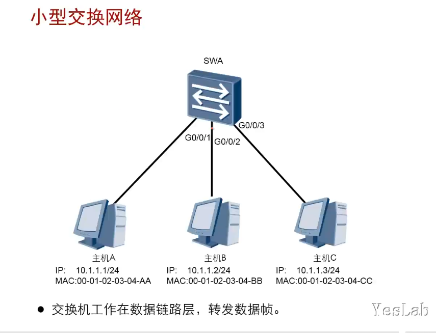
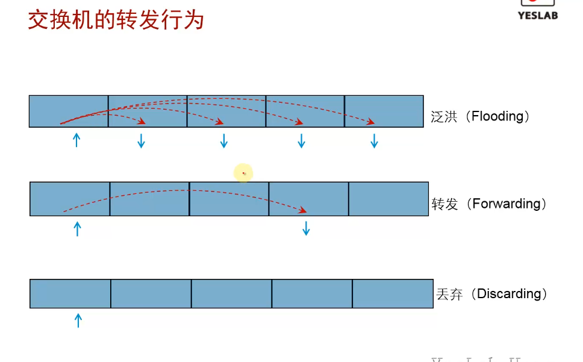
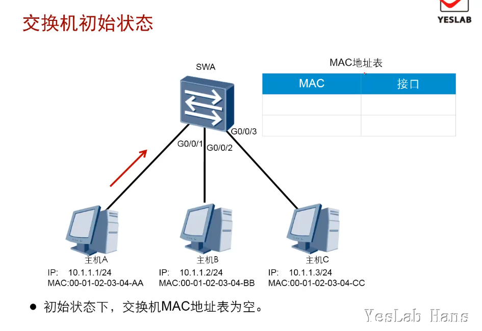
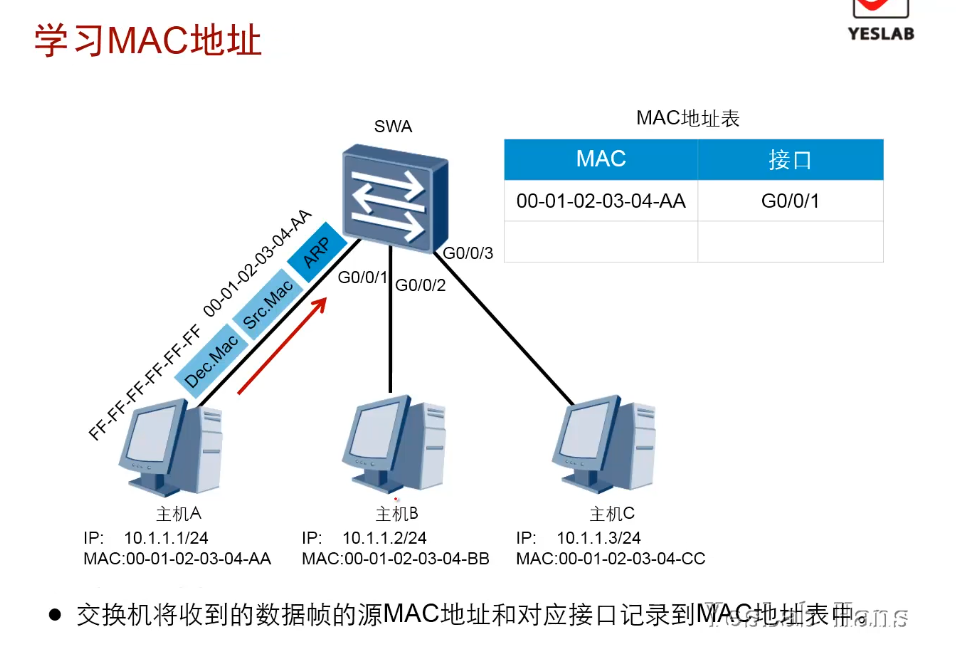
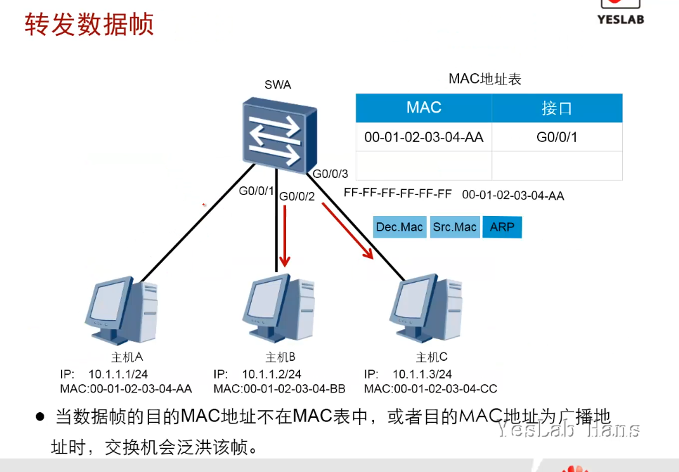
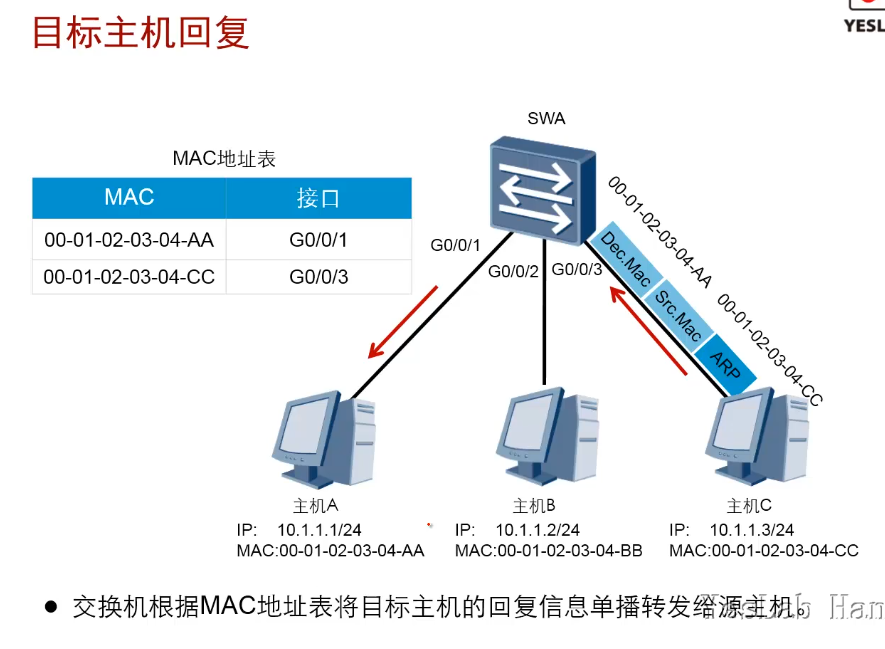
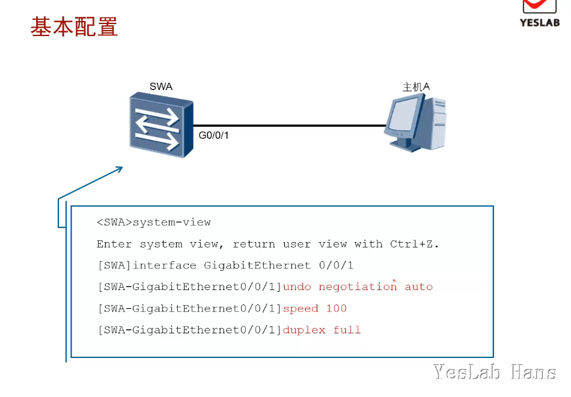
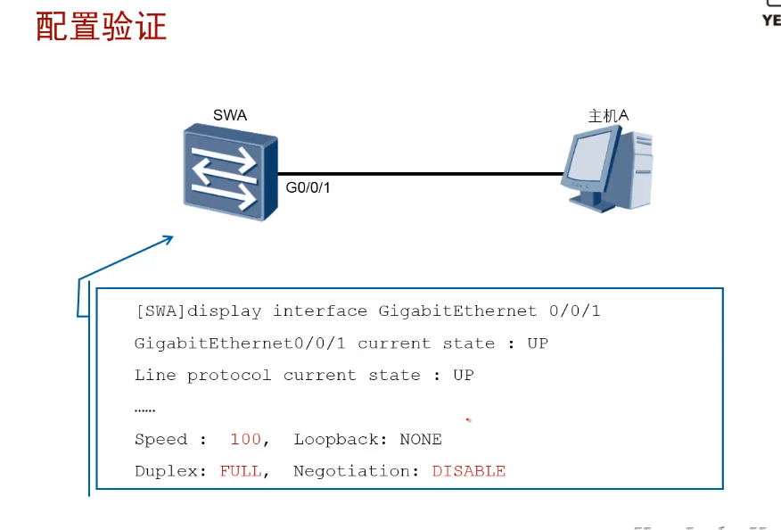

# 交换网络基础

常见的以太网设备包括Hub、交换机(2层交换机)等。二层交换机工作在数据链路层，它有效的隔离了以太网中的冲突域，极大地提升了以太网的性能。

## 学习目标

- 掌握交换机的基本工作原理

- 掌握交换机的基本配置

## 交换机的基本工作原理

- 学习MAC地址<mark>根据源MAC</mark>

- 形成MAC地址表

- 利用MAC表进行转发<mark>根据目的MAC</mark>

### 小型交换网络

- 交换机工作在数据链路层，转发数据帧(frame)

- 依靠mac地址转发数据



### 交换机的转发行为

<mark>依据：mac地址转发表(cam表Content Addressable Memory)</mark>

- 泛洪(Flooding):将从某个接口收到的数据流向除该接口之外的所有接口发送出去
  
  - 广播(arp)
  - 组播
  - 未知单播（目的mac地址在<mark>mac地址表</mark>中不存在）

- 转发(Forwarding):将从某个接口收到的frame从另一个接口转发出去的行为
  
  - 已知单播

- 丢弃(Discarding):对数据帧进行丢弃
  
  - frame的出接口和入接口一致
  
  - frame校验错误



### 交换机初始状态

- 初始状态下，交换机MAC地址表为空。



### 学习MAC地址

- 交换机将<mark>收到的数据帧的源MAC地址</mark>和<mark>对应接口</mark>记录到<mark>MAC地址表</mark>中

- 主机A向主机C发送信息，主机A没有主机C的MAC地址，**触发ARP Request广播帧**

- 交换机SWA利用该**ARP数据帧**的源MAC地址和交换机上的frame接收端口形成mac地址表项

- 交换机泛洪该frame



### 转发数据帧

- 当数据帧的<mark>目的mac地址不在mac表</mark>中，或者<mark>目的mac地址为广播地址</mark>时，交换机会<mark>泛洪</mark>该帧



### 目标主机回复

- 目标主机C收到交换机SWA转发来的源自主机A的ARP Request广播数据帧，回复一个单播ARP Reply给主机A

- 交换机SWA根据mac地址表将目标主机C的回复信息<mark>单播转发</mark>给源主机A



### MAC地址表

- 老化时间 300秒

- ARP老化时间 1200秒

- 当交换机MAC表项老化后，主机ARP表项生效，触发未知单播泛洪

- 当交换机上的某个接口物理down,则所以这个接口的mac地址表都会立即老化

## 交换机的基本配置

- 当前大部分交换机基本都支持自协商，不用配置

- 当一端的设备支持自协商，另一端不支持时，才需要手动配置速率和双工模式

- `undo negotiation auto`

- `speed 100`

- `duplex full`



### 查看交换机mac地址表

- `display mac-address verbose`

```vrp
[Huawei-GigabitEthernet0/0/1]display mac-address
MAC address table of slot 0:
-------------------------------------------------------------------------------
MAC Address    VLAN/       PEVLAN CEVLAN Port            Type      LSP/LSR-ID  
               VSI/SI                                              MAC-Tunnel  
-------------------------------------------------------------------------------
5489-98cc-733f 1           -      -      GE0/0/3         dynamic   0/-         
-------------------------------------------------------------------------------
Total matching items on slot 0 displayed = 1 
```

### 配置验证

- `display interface g 0/0/1`

- `[sw1-GigabitEthernet0/0/1]display interface Ethernet brief`



## 总结

- 当一台主机从交换机的一个端口移动到另外一个端口时，交换机的mac地址表会发生什么变化？

当一台主机从交换机的一个端口移除时,交换机检测到物理链路Down ,因此会从MAC地址表中清除对应主机的MAC表项。

一旦主机连接到交换机另外一个端口, 交换机会检测到新端口对应的物理链路UP。主机发送报文后,交换机就会学习到主机的MAC地址和新端口的映射关系,并且添加到MAC地址表中。
