# STP原理与配置

为了提高网络可靠性，交换机网络中通常会使用冗余链路。然而，冗余链路会给交换机带来环路风险，并导致广播风暴以及MAC地址表不稳定等问题，进而会影响到用户的通信质量。

生成树协议STP(Spanning Tree Protocol)可以在<mark>提高可靠性(冗余备份)</mark>的同时又能<mark>避免环路</mark>带来的各种问题。 

## 学习目标

- 掌握STP的工作原理

- 掌握STP的基本配置

## 目录

1. 环路引起的问题

2. STP工作原理

3. STP拓扑变化

4. STP的配置

## 环路引起的问题

### 二层交换网络

- 交换机之间通过多条链路互连时，虽然能够提升网络可靠性，但同时也带来环路问题。

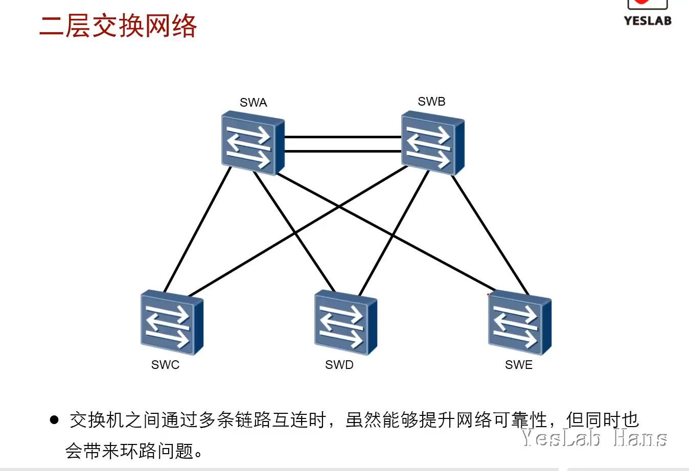

### 广播风暴

- 环路会引起广播风暴

- 主机会收到重复数据帧

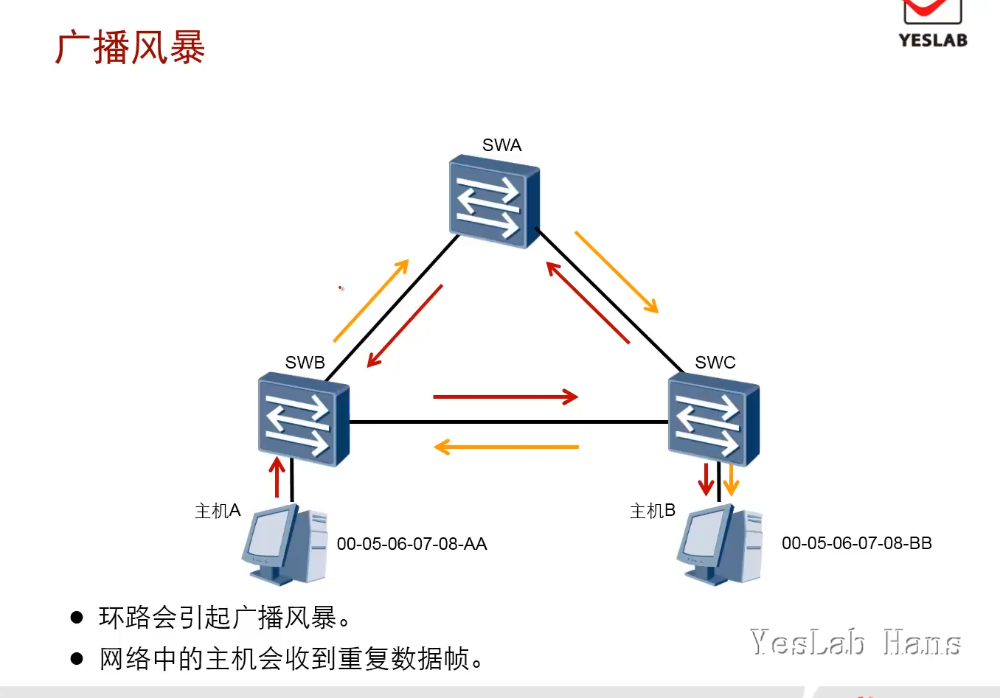

### MAC地址表震荡

- 环路会引起MAC地址震荡(MAC Address Flapping)

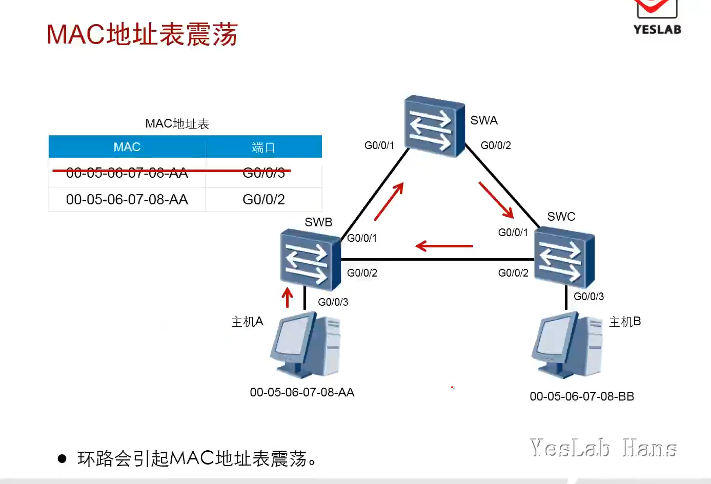

## STP工作原理

注意：

- 选举范围

- 怎么选举

- 最终状态，结果

### STP的作用

- <mark>STP</mark>通过<mark>阻塞端口</mark>来<mark>消除环路</mark>，并能够实现<mark>链路备份</mark>的目的。

- 逻辑阻塞，物理up

- 消除环路

- 链路备份

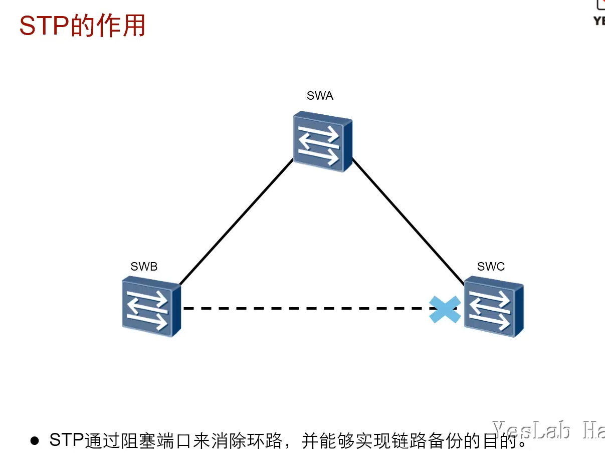

### STP操作

1. 选举一个<mark>根桥(Root Bridge)</mark>，范围：整个交换网

2. 每个非根交换机(Non-root-bridge)选举一个<mark>根端口(Root Port)</mark>，范围：非根交换机

3. 每个链路选举一个<mark>指定端口(Designated Port)</mark>，范围：每个链路

4. 阻塞<mark>预备端口(Alternate Port)</mark>(非根&&非指定端口)

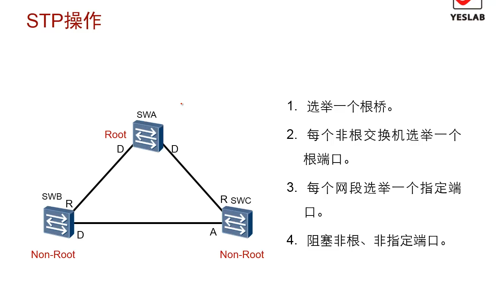

### 根桥选举

- 选举范围：整个交换网络

- 每一台交换机启动STP协议后，都认为自己是根桥

- 根桥选举(root bridge election)完全<mark>依赖参数BID(桥ID,Bridge IDentifier)进行</mark>

- BID组成：优先级+交换机的MAC地址
  
  - 优先级：缺省=32768

- BID数值越小越优先

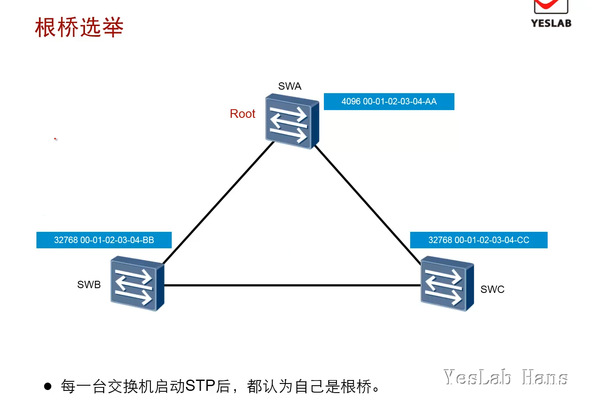

### 根端口选举

- 选举范围：每个非根网桥上都会进行

- 当根桥选举完毕后进行根端口的选举(root port election)

- 非根交换机在选举根端口时，分别依据该端口的根路径开销、对端BID、对端PID和本端PID.
  
  1. 比较该端口到根桥的开销(标准:802.1d-1998,802.1t,华为私有)，开销小的端口优先
  
  2. 当开销一样时;比较对端的BID,BID小的端口优先
  
  3. 当开销一样&&对端BID一样时;比较对端PID(Port IDentifier)（128.x）:优先级(默认128)+端口号,对端PID小的端口优先
  
  4. 当开销一样&&对端BID一样&&对端PID一样时;比较本端口PID，本端口PID小的端口优先

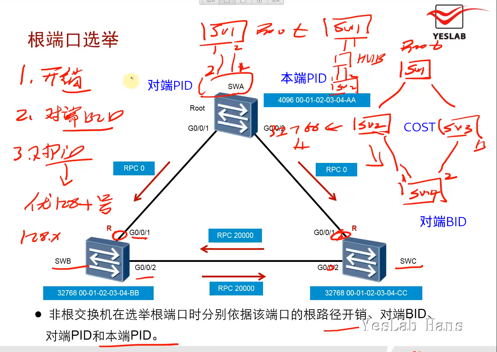

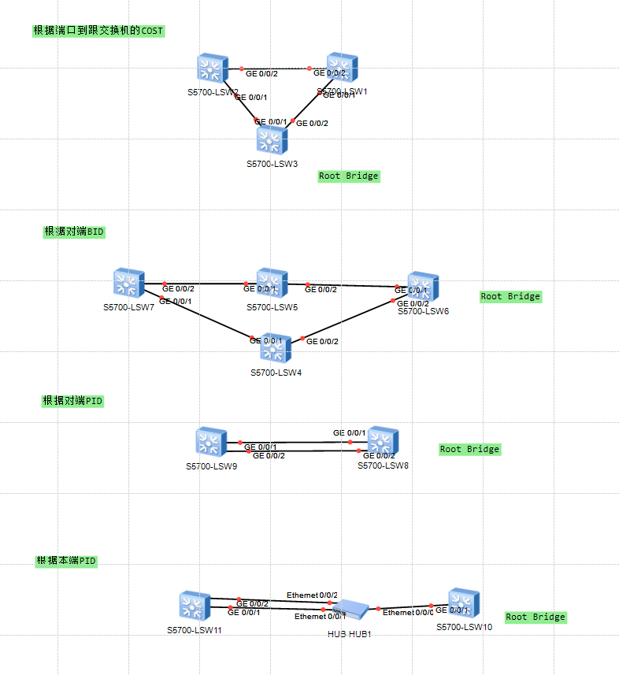

#### 路径代价

- 标准：**dot1d-1998** | **dot1t** | **legacy** 

- 默认标准：802.1t

- `stp pathcost-standard {dot1d-1998|dot1t|legacy }`配置路径开销值的计算方法

- [不同标准下路径开销列表](https://support.huawei.com/hedex/hdx.do?lib=EDOC1100021771AZH05262&docid=EDOC1100021771&lang=zh&v=13&tocLib=EDOC1100021771AZH05262&tocV=13&id=stp_pathcost-standard&tocURL=resources%2525252Fdc%2525252Fstp_pathcost-standard.html&p=t&fe=1&ui=3&keyword=stp%25252Bpathcost-standard)

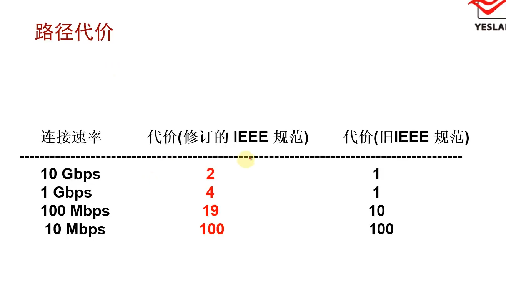

### 指定端口选举

- 选举范围：每个链路上

- 当根端口选举完毕后进行指定端口的选举(Designated Port election)

- 非根交换机在选举指定端口(Designated Port)时分别依据根路径开销、本端BID、本端PID。
  
  1. 比较本端口到根桥的开销，pathcost值小的端口优先
  
  2. 当开销一样时；比较本端口所在交换机的BID，本端口所在交换机BID值小的端口优先
  
  3. 当开销一样&&本端BID一样时；比较本端口的PID，本端口的PID值小的端口优先

- 未被选举为根端口或指定端口的端口为预备端口(Alternate Port),将会被逻辑阻塞。

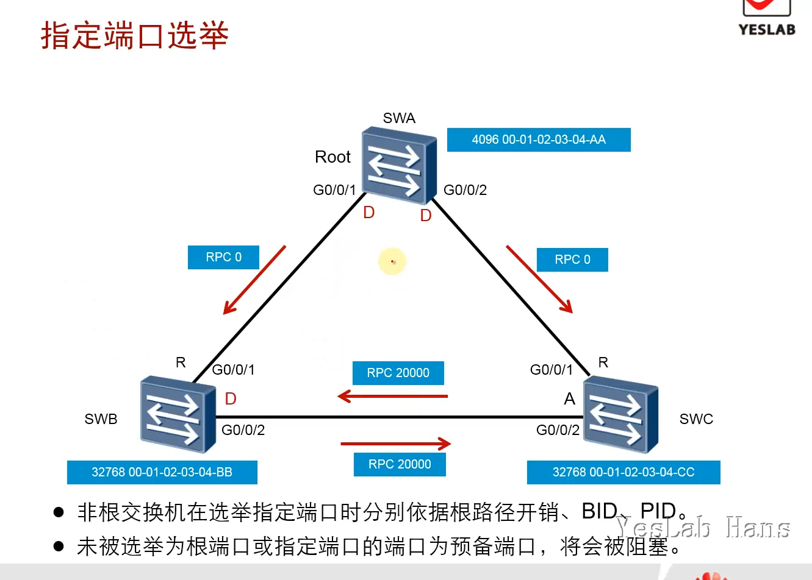

### 根端口、指定端口、预备端口的作用

- 根端口(RP,Root Port)：朝着根桥最短路径的接口，当有数据包需要向根桥发送时，一定是从根端口发送出去的

- 指定端口(DP,Designated Port)：处于转发状态，在当前链路上，由指定端口发送BPDU，从根桥收到的BPDU需要向下转发的时候，一定是从指定端口发送出去的

- 预备端口(AP,Alternate Port)：逻辑阻塞状态，冗余备份，<mark>根端口RP的备份端口</mark>

### 端口状态转换

- 端口UP后不能立刻进入转发状态：可能出现临时环路

- 端口状态转换出现的原因：消除临时环路

#### 端口状态

- Disable: 链路down的时候,还没有初始化的时候，stp还未运行的时候（很短暂，几乎看不到）

- Blocking/Discarding:可以接收和处理BPDU进行端口选举,但是不转发数据

- Listening:经过15秒的转发延迟后进入Learing状态

- Learning:开始学习mac地址，经过15秒的转发延迟，进入Forwarding状态

- Forwarding:开始转发数据

#### 端口转化

- 1端口初始化或使能

- 2端口被选举为根端口或指定端口

- 3端口不再是根端口或指定端口

- 4forward delay 计时器超时

- 5端口禁用或链路失效

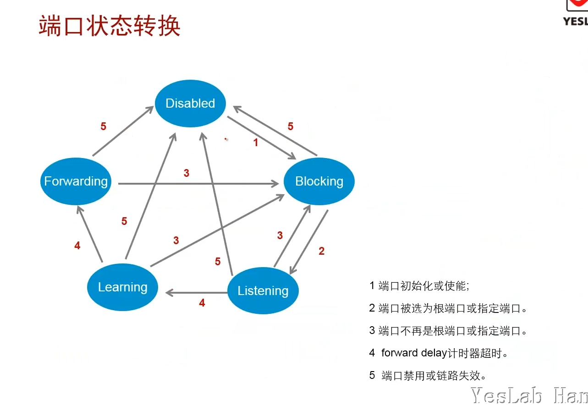

### BPDU

- BPDU(网桥协议数据单元，Bridge Protocol Data Unit)包含BID、路径开销PATHCOST、PID、计时器等参数。
- MSTP BPDU和RSTP BPDU报文可以互通。
- stp的状态稳定的时候：只有根桥主动发送BPDU，其他非根桥收到来自根桥的BPDU才会触发BPDU
- 初始情况下：每个交换机都认为自己是根桥，所有的交换机都会发送自己的BPDU，

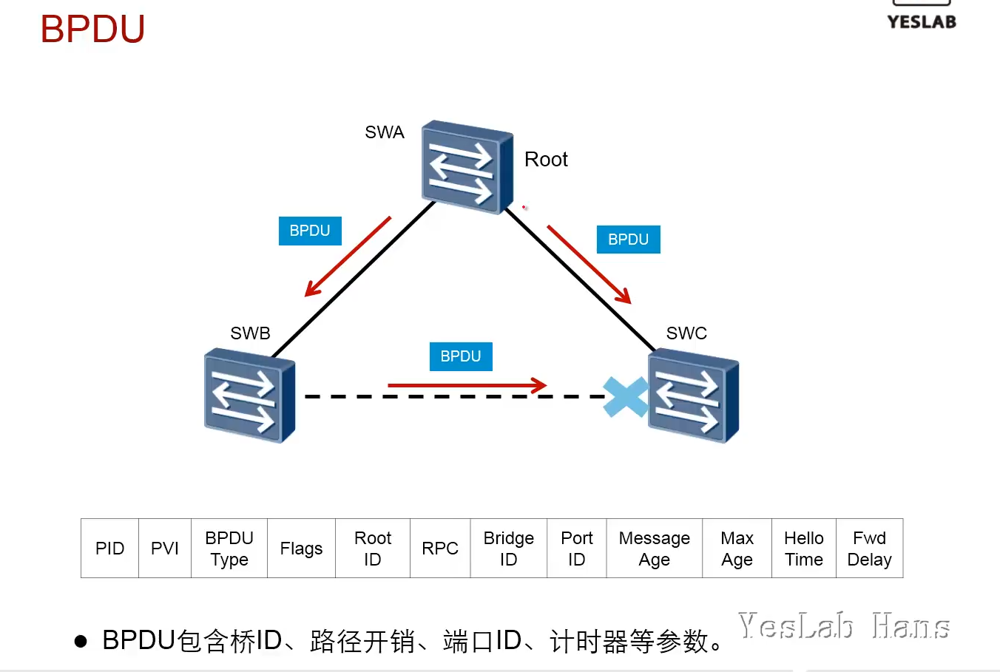

#### BPDU参数

- 为了计算生成树，交换机之间需要交换相关的信息和参数，这些信息和参数被封装在BPDU(Bridge Protocol Data Unit)中。

- stp的BPDU有2种类型：配置BPDU和TCN BPDU。
  
  - <mark>配置BPDU(Configuration BPDU,Type:0x00)</mark>包含了BID、路径开销COST,PID等参数。STP协议通过在交换机之间传递配置BPDU来选择根交换机，以及确定每个交换机端口的角色和状态。在初始化过程中，每个桥都主动发送配置BPDU.网络拓扑稳定以后，只有根桥主动发送配置BPDU,其他交换机在收到上游传来的配置BPDU后，才会发送自己的BPDU。
  
  - <mark>TCN BPDU( Topology Change Notification,Type:0x08)</mark>是指下游交换机感知到拓扑发生变化时向上游发送的拓扑变化通知

- **配置BPDU中**包含了足够的信息来保证设备完成生成树计算，其中包含的重要信息如下：
  
  - 协议ID(PID):STP协议ID，值为0
  
  - 协议版本ID(PVI)：协议版本，STP(802.1D)=0,RSTP(802.1W)=2,MSTP(802.1S)=3
  
  - BPDU Type：STP(配置BPDU=0x00,TCN BPDU=0x08),RSTP/MSTP(0x02)
  
  - 根桥ID(RID)：由根桥优先级和MAC地址组成，每个STP网路中仅有一个根交换机
  
  - 根桥路径开销(RPC)：到根桥的最短路径开销
  
  - 指定桥ID(BID)：发送该BPDU的BID
  
  - 指定端口ID(PID)：发送该BPDU的端口ID,由优先级+端口号组成
  
  - Message Age:配置BPDU在网络中传播的生存期(经过一个交换机值加1，默认最大值20跳,可调节)，限制了交换网络的横向的范围`stp max-hups`
  
  - Max Age:配置BPDU在设备中能够保存的最大生存期,20秒
  
  - Hello Time:配置BPDU的发送周期，2秒
  
  - Forward Delay:端口状态迁移延时，15秒

- 桥ID(BID)中的**优先级只能是4096的倍数，默认32768**`stp priority N*4096`

- 链路层普通数据使用`Ethernet II`，控制消息使用`803 Ethernet`

| **报文字段**        | **字节数** | **说明**                                                                                                                                                                                                                                |
| --------------- | ------- | ------------------------------------------------------------------------------------------------------------------------------------------------------------------------------------------------------------------------------------- |
| **PID**         | **2字节** | **STP协议ID**，该字段总是为0                                                                                                                                                                                                                   |
| **PVI**         | **1字节** | **STP协议版本**，  - STP（802.1D）传统生成树,值为0； - RSTP（802.1W）快速生成树,值为2； - MSTP（802.1S）多生成树,值为3；                                                                                                                                    |
| **BPDU Type**   | **1字节** | 指示当前**BPDU消息类型**：**配置BPDU**和**TCN BPDU**  - 0x00为配置BPDU，负责建立，维护STP拓扑; - 0x80为TCN BPDU，传达拓扑变更;                                                                                                                                |
| **Flags**       | **1字节** | **标志**  - 最低位=TC（Topology Change，拓扑变化）标志， - 最高位=TCA（Topology Change Acknowledgement，拓扑变化确认）标志                                                                                                                                |
| **Root ID**     | **8字节** | **根桥ID**，指示当前根桥的RID（即“根ID”），由2字节的桥优先级和6字节MAC地址构成                                                                                                                                                                                      |
| **RPC**         | **4字节** | **根路径开销**，指示发送该BPDU报文的端口累计到根桥的开销                                                                                                                                                                                                      |
| **Bridge ID**   | **8字节** | **桥ID**，指示发送该BPDU报文的交换设备的BID（即“发送者BID”），也是由2字节的桥优先级和6字节MAC地址构成                                                                                                                                                                        |
| **Port ID**     | **2字节** | **端口ID**，指示发送该BPDU报文的端口ID，即“发送端口ID”                                                                                                                                                                                                   |
| **Message Age** | **2字节** | **消息生存时间**，指示该BPDU报文的生存时间，即端口保存BPDU的最长时间，过期后将删除，要在这个时间内转发才有效，如果配置BPDU是直接来自根桥的，则Message  Age为0，如果是其他桥转发的，则Message  Age是从根桥发送到当前桥接收到BPDU的总时间，包括传输延时等。实际实现中，配置BPDU报文经过一个桥，Message  Age增加1，如果Message Age大于Max Age，非根桥会丢弃该配置BPDU。 |
| **Max Age**     | **2字节** | **最大生存时间**，指示BPDU消息的最大生存时间，也即老化时间                                                                                                                                                                                                     |
| **Hello Time**  | **2字节** | **Hello消息定时器**，指示发送两个相邻BPDU的时间间隔，根桥通过不断发送STP维持自己的地位，Hello time 是发送的间隔时间                                                                                                                                                               |
| **Fwd Delay**   | **2字节** | **转发延时**，指示控制listening和learning状态的持续时间，表示在拓扑结构改变后，交换机在发送数据包前维持在监听和学习状态的时间                                                                                                                                                             |

#### STP/RSTP/MSTP抓包

- 链路层普通数据使用`Ethernet II`，控制消息使用`803 Ethernet`

- 协议ID(PID):STP协议ID，值为`0x0000`

- 协议版本ID(PVI)：协议版本，STP(802.1D)=`0x00`,RSTP(802.1W)=`0x02`,MSTP(802.1S)=`0x03`

- BPDU Type：STP(配置BPDU=`0x00`,TCN BPDU=`0x08`),RSTP/MSTP(`0x02`)

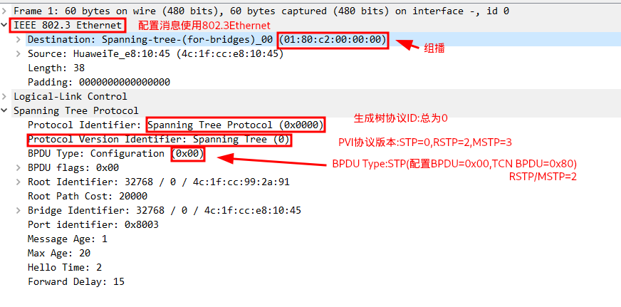

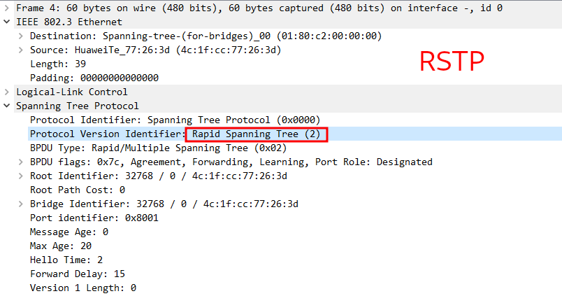

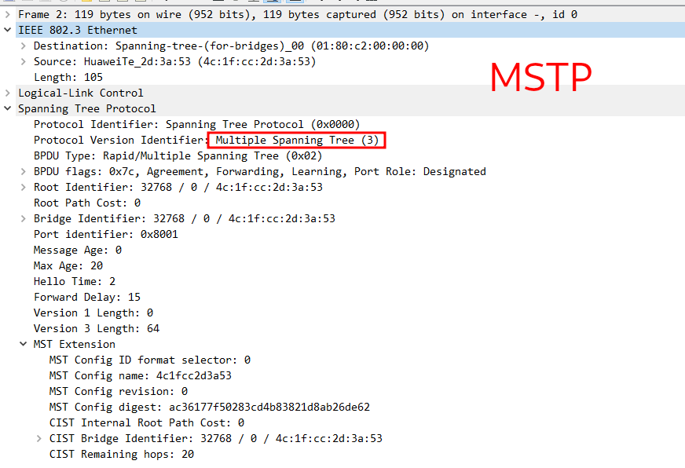

#### 计时器

- 配置BPDU报文每经过一个交换机，Message Age的值都加1

- 如果Message Age大于Max Age,非根桥会丢弃该配置BPDU

STP协议包含一些重要的时间参数，这里举例说明如下：

- `Hello Time`：是值运行STP协议的设备**发送配置BPDU的时间间隔，默认2秒**，用于检测链路是否存在故障。交换机每隔`Hello Time`的时间间隔会向周围的交换机发送配置BPDU报文，已确认链路是否存在故障。**当网络拓扑稳定后，该值只有在根桥上修改才有效**

- `Message Age`：如果配置BPDU是根桥发出的，则`Message Age`为0。否则，该值是从根桥发送到当前桥接收到BPDU的总时间，包括传输延时等，实际实现中，配置BPDU报文每经过一个交换机，该值增加1。

- `Max Age`：是指BPDU的老化时间，默认20秒，可在根桥上通过命令人为改动这个值。`Max Age`通过配置BPDU报文传递，可以保证`Max Age`在整个交换网中一致。非根桥设备收到配置BPDU报文后，会将报文中的`Message Age`和`Max Age`进行比较；`Message Age`小于等于`Max Age`，则该非根桥设备会继续转发配置BPDU报文。否则，该配置BPDU报文会被老化掉，该非根桥设备将会直接丢弃该配置BPDU,并认为是网络直径过大，导致了非根桥连接失败。

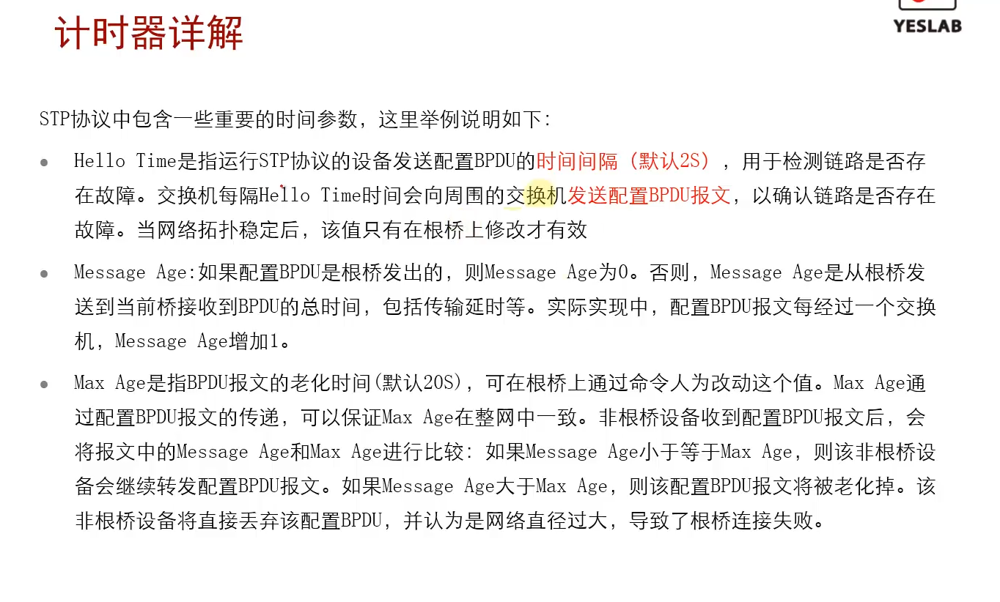

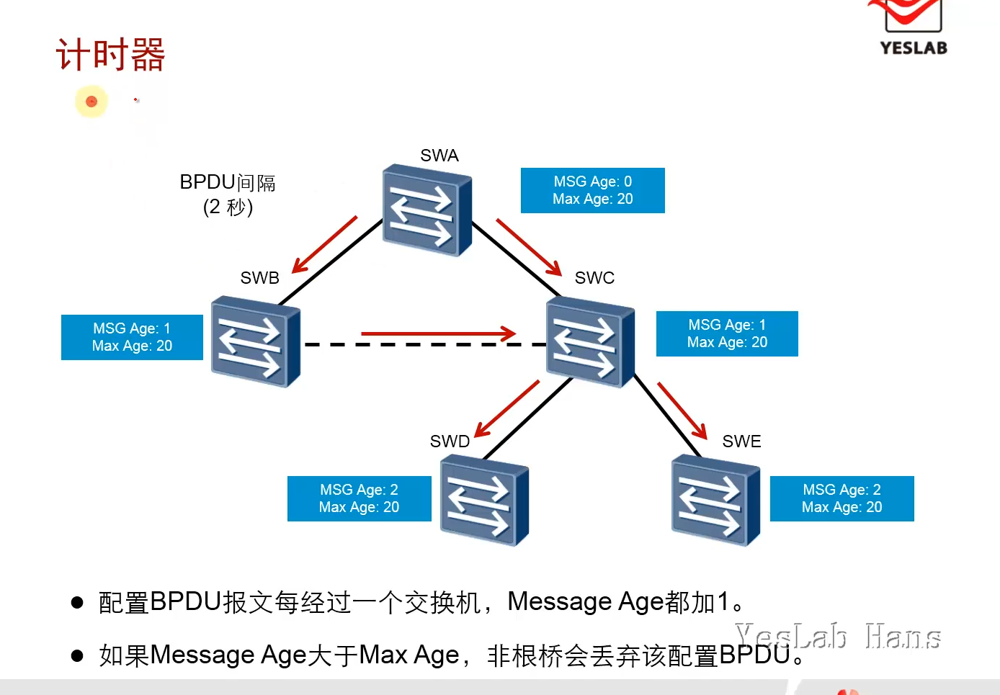

## STP拓扑变化

- **STP拓扑判断标准：**<mark>当一个端口从不转发状态变为转发状态，就叫拓扑变化</mark>

不是从端口dwon来判断

- SW2的旧`RP`DOWN掉，`AP`端口角色变为`RP`端口

- `TCN BPDU`报文是在新`RP`端口(SW2 的E 0/0/3)从`DISCARDING`状态转变为`FORWARDING`转发状态时发出的

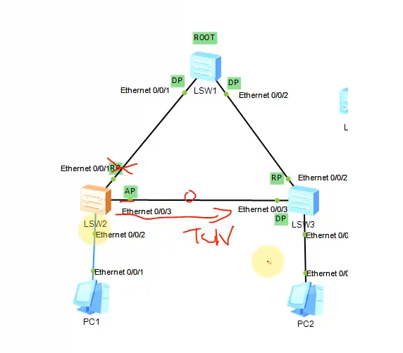

### 根桥故障

- 非根桥会在BPDU老化之后开始根桥的重新选举

- `Max Age`:20s BPDU老化时间

- 当根桥SWA故障后，SWB和SWC最坏情况下需要`Max Age=20s`才能意识到根桥出问题了

- SWB和SWC相互发送BPDU,重新进行选举 

- 重新选举会引发SWB和SWC上的端口发生状态变迁

- 最长需要30s(Listening 15s + Learning 15s)转发延迟才能正常通信

- 从发生拓扑变化到生成树稳定，正常通信。最长需要20s+30s=50s

- 收敛速度慢

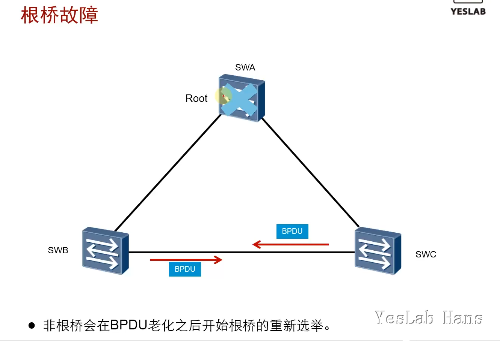

### 直连链路故障(物理DOWN,没有20S的BPDU老化时间)

- SWB检测到直连链路(Direct Link)物理故障后，会将预备端口AP转换为根端口RP

- SWB的预备端口会在30s后恢复到转发状态。 

- 和根桥故障相比，减少了20的BPDU老化时间

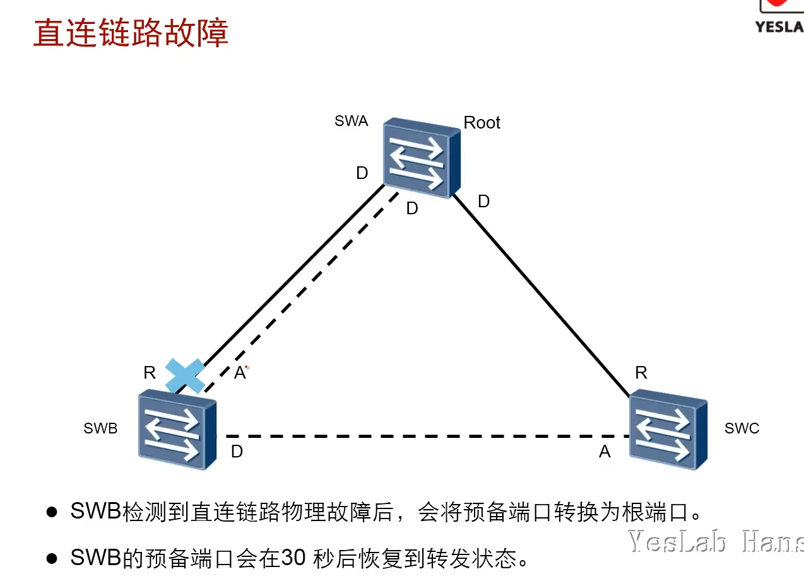

### 非直连链路故障（物理没DOWN,有20S的BPDU老化时间）

- 非直连链路故障后，SWC的预备端口AP恢复到转发状态大约需要50s。

- 根桥SW1的`GE 0/0/4`口发生故障

- SW2的RP`GE 0/0/2`口接收不到BPDU,SW2从DP`GE 0/0/3`接收不到BPDU

- <mark>经过20秒的BPDU老化时间后，SW2认为根桥故障，</mark>开始重新进行选举，从DP`GE 0/0/3`口向外发送自己的BPDU

- SW3知道根桥在线，当接收到来自SW2的RID=SW2的BPDU时，发现该BPDU没有来自SW1的BUDU的RID优先级高，通过RP端口向根桥SW1发送`BPDU Type=0x80`的`TCN BPDU`报文，通知根桥网络拓扑发生变化了

- SW3的AP端口`GE 0/0/3`转变为DP

- 根桥向SW3的RP口发送一个`Flags TC=1,TCA=1`的配置BPDU,告知SW3自己收到了SW3发来的TCN BPDU,并进行拓扑更新

- SW3通过AP转变为DP的`GE 0/0/3`端口向SW2发送配置BPDU

- SW2发现来自SW3的BPDU优先级更高，`GE 0/0/3`停止发送BPDU

- SW2的`GE 0/0/3`口转变为RP,`GE 0/0/2`口转变为DP

- <mark>30s的转发延迟后，拓扑稳定，开始转发数据</mark>

- 总计需要20s的BPDU老化时间+30s的转发延时=50s收敛时间

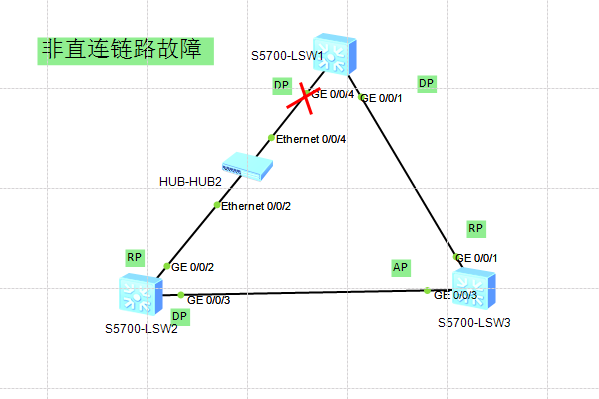

### 拓扑改变导致MAC地址表错误

- MAC地址表项的默认老化时间是300秒。

- ARP表的默认老化时间是1200秒

- <mark>当ARP表生效&&MAC表未老化的这段时间内</mark>，**SWB无法主动**将数据从`G 0/0/2`端口转发给主机B。但是主机B如果向主机A发送数据(会触发ARP，更新MAC地址表)后，则双方能正常通信

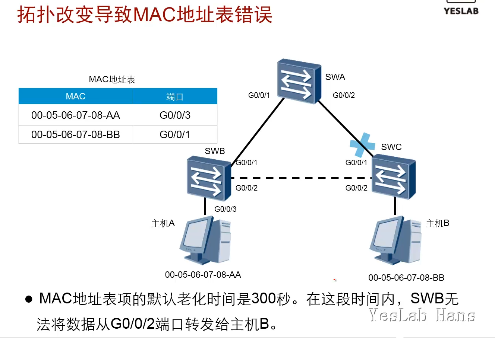

### 拓扑改变导致MAC地址表变化

- 拓扑变化，确认机制

- TC,TCA：BPDU Flags中的标志位

- TCN：BPDU Type=0x80的BPDU

- 配置BPDU ：BPDU Type=0x00的BPDU

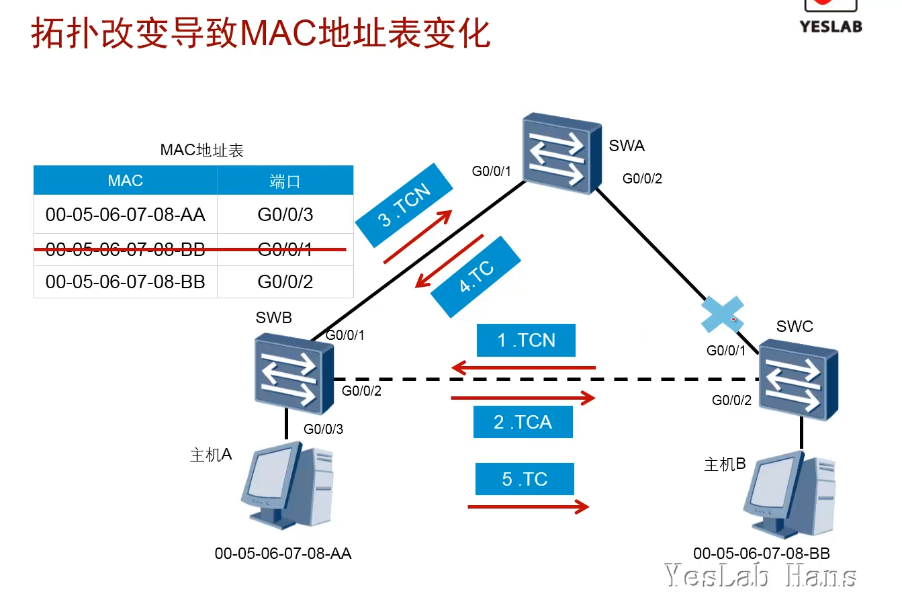

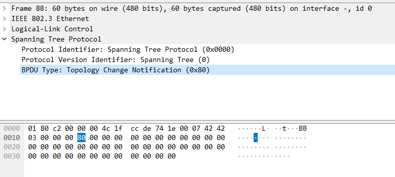

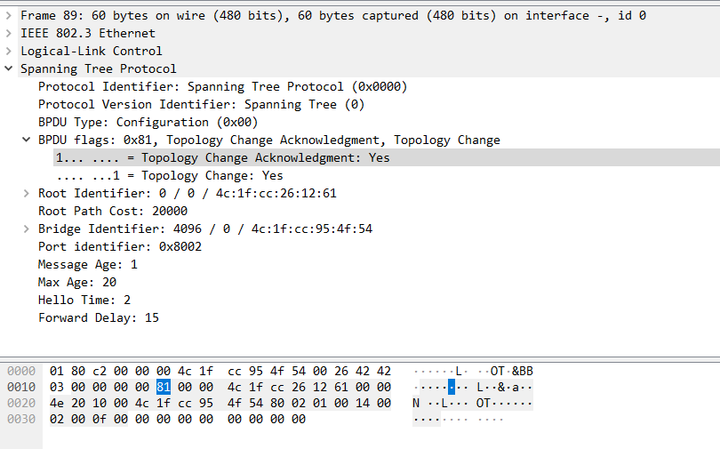

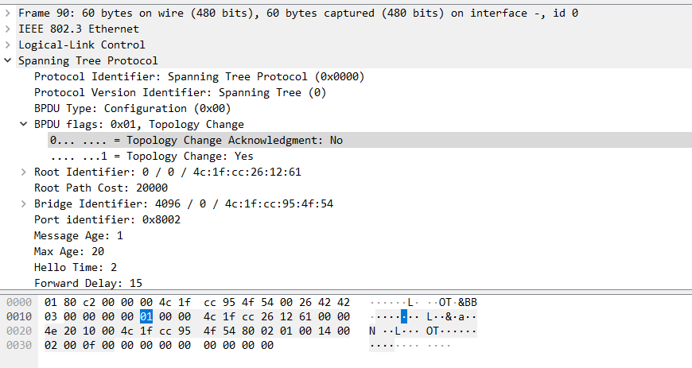

### TCN过程

**在一棵生成树中，对于互相连接的两台交换设备，离根桥近的交换设备即为另外一台交换设备的上游设备。**

**置位的TC标记的配置BPDU报文主要是上游设备用来告知下游设备拓扑发生变化，请下游设备直接删除桥MAC地址表项，从而达到快速收敛的目的。**

**拓扑变化过程中，根桥通过TCN BPDU报文获知生成树拓扑里发生了故障。**

**根桥通知其他交换机加速老化现有的MAC地址表项。**

拓扑变更以及MAC地址表项更新的具体过程如下：

- SWC感知到网络拓扑发生变化后，会不间断地向SWB发送TCN BPDU.

- SWB收到SWC发来的TCN BPDU报文后，会把配置BPDU报文中的Flags的TCA位置1,然后发送给SWC,告知SWC停止发送TCN BPDU报文。

- SWB向根桥发送TCN BPDU报文。

- SWA把配置BPDU报文中的Flags的<mark>TC位置1</mark>（多个）&&TCA位置1(第一个)后发送，通知下游设备把<mark>MAC地址表项的老化时间</mark>由默认的300秒<mark>修改为`Forwarding Delay`的时间，默认15秒</mark>。在以后的35秒内（BPDU Max age + Forwarding Delay），都会把要发送的配置BPDU中Flag中的TC置位。

- 最多等待15秒后，SWB中MAC表的错误映射关系会被自动清除。此后SWB就能通过`G 0/0/2`端口把从主机A到主机B的帧正确地进行转发。

### Alternate port down

- Alternate port预备端口的down不会引起stp拓扑变化

## STP的配置

[华为官方文档：STP命令](https://support.huawei.com/hedex/hdx.do?lib=EDOC1100021771AZH05262&docid=EDOC1100021771&lang=zh&v=13&tocLib=EDOC1100021771AZH05262&tocV=13&id=stp_mode_system_view&tocURL=resources%2525252Fdc%2525252Fstp_mode_system_view.html&p=t&fe=1&ui=3&keyword=STP%25252BMODE)

### STP模式

- 系统视图

- **stp mode** { **mstp** | **rstp** | **stp** }命令用来配置交换设备的生成树协议工作模式

- **undo stp mode**命令用来恢复交换设备的生成树协议工作模式为缺省值。

- 缺省情况下，设备的生成树协议工作模式为MSTP模式

**配置影响**

- 执行**stp mode** **mstp**命令后，在交换设备所有启用生成树协议的端口中，除了和STP交换设备直接相连的端口工作在STP模式下，其他端口都工作在MSTP模式下，即向外发送MST
  BPDU报文。

- 执行**stp mode** **rstp**命令后，在交换设备所有启用生成树协议的端口中，除了和STP交换设备直接相连的端口工作在STP模式下，其他端口都工作在RSTP模式下，即向外发送RST
  BPDU报文。

- 执行**stp mode** **stp**命令后，交换设备所有端口工作在STP模式，即向外发送STP配置BPDU报文。

**注意事项**

- MSTP BPDU和RSTP BPDU报文可以互通。

- 对于不支持MSTP的交换设备，如果与运行STP的交换设备相连，配置时选择**stp mode** **rstp**。

### 配置交换机优先级

#### stp priority命令

- 系统视图

- **stp** [ **instance** *instance-id* ] **priority** *priority*命令用来配置交换设备在指定生成树中的优先级。

- **undo stp** [ **instance** *instance-id* ] **priority**命令用来恢复交换设备在指定生成树中优先级的缺省值。

- 缺省情况下，交换设备在指定生成树中的优先级是32768。

- 优先级：取值范围是0～61440，步长为4096，如0、4096、8192等。缺省值是32768。

##### 使用指南

**应用场景**

交换设备的优先级是生成树计算的重要依据，交换设备优先级的高低会直接影响到生成树计算中根桥的选举。

在一个运行STP/RSTP/MSTP的网络中，每棵生成树有且仅有一个根桥，它负责发送BPDU报文并连接整个网络。由于根桥在网络中的重要性，在根桥选举过程中，通常希望性能高、网络层次高的交换设备会被选举为根桥。但是，性能高、网络层次高的交换设备其优先级不一定高，因此需要配置优先级以保证该设备成为根桥。

对于网络中部分性能低、网络层次低的交换设备，不适合作为根桥设备，一般会配置其优先级较低以保证该设备不会成为根桥。

在运行MSTP的网络中，每个交换设备在不同生成树实例中可以配置不同的优先级。

**注意事项**

配置交换设备的优先级数值越小，则该交换设备被选举为根桥的可能性越大。

如果交换设备已配置为根桥或备份根桥，若要改变交换设备的优先级，必须先执行命令[**undo stp**](https://support.huawei.com/hedex/pages/EDOC1100021771AZH05262/13/EDOC1100021771AZH05262/13/resources/dc/stp_root.html) [ **instance** *instance-id* ] **root**去使能根桥或备份根桥功能。

若执行命令[**stp root primary**](https://support.huawei.com/hedex/pages/EDOC1100021771AZH05262/13/EDOC1100021771AZH05262/13/resources/dc/stp_root.html)配置当前交换设备为根桥，则当前交换设备优先级数值为0。

若执行命令[**stp root secondary**](https://support.huawei.com/hedex/pages/EDOC1100021771AZH05262/13/EDOC1100021771AZH05262/13/resources/dc/stp_root.html)配置当前交换设备为备份根桥，则当前交换设备优先级数值为4096。

#### stp root 命令

- 系统视图

- **stp** [ **instance** *instance-id* ] **root** { **primary** | **secondary** }命令用来配置当前交换设备为指定生成树的根桥或备份根桥。

- **undo stp** [ **instance** *instance-id* ] **root**命令用来取消当前交换设备为指定生成树的根桥或备份根桥资格。

- 缺省情况下，交换设备不作为任何生成树的根桥或备份根桥。

##### 使用指南

**应用场景**

- 在一个运行STP/RSTP/MSTP的网络中，每棵生成树有且仅有一个根桥，它负责发送BPDU报文并连接整个网络。由于根桥在网络中的重要性，在根桥选举过程中，通常希望性能高、网络层次高的交换设备会被选举为根桥。但是，性能高、网络层次高的交换设备其优先级不一定高，因此可以通过执行本命令配置其为指定生成树的根桥，以保证该设备成为根桥。

- 为了保证网络流量不中断，可以执行本命令配置备份根桥，当根桥出现故障或被关机，备份根桥会在生成树计算时成为根桥。

<mark>执行**stp root primary**命令指定当前交换设备为根交换设备，则表示该设备在指定生成树中的优先级为0，且优先级不能修改。</mark>

<mark>执行**stp root secondary**命令指定当前交换设备在指定生成树中为备份根桥，则表示该设备的优先级数值为4096，且优先级不能修改。</mark>

**注意事项**

- 一棵生成树只能配置一个根桥。

- 在一棵生成树中，同一台交换设备不能既作为根桥，又作为备份根桥。

- 如果在一棵生成树中配置了多个备份根桥，则MAC地址最小的备份根桥将成为指定生成树的备份根桥。

### 配置路径开销标准

#### stp pathcost-standard

- 系统视图

- **stp pathcost-standard** { **dot1d-1998** | **dot1t** | **legacy** }命令用来配置路径开销值的计算方法。

- **undo stp pathcost-standard**命令用来恢复路径开销值的计算方法为缺省情况。

- 缺省情况下，路径开销值的计算方法为IEEE 802.1t标准。

##### 使用指南

**应用场景**

路径开销是一个端口量，是生成树协议用于选择链路的参考值，生成树协议通过计算路径开销，选择性能较为稳定的链路，阻塞多余的链路，将网络修剪成无环路的树形网络结构。端口路径开销值取值范围由路径开销计算方法决定。

**注意事项**

改变端口的路径开销计算方法，端口的路径开销将会恢复为默认值。若需要为不同的端口配置路径开销值，可执行命令[**stp cost**](https://support.huawei.com/hedex/pages/EDOC1100021771AZH05262/13/EDOC1100021771AZH05262/13/resources/dc/stp_cost.html)。

通常情况下，同一网络内所有交换设备的端口路径开销应使用相同的路径开销计算方法。

#### stp cost

- <mark>配置视图：Ethernet接口视图、Eth-Trunk接口视图、GE接口视图、端口组视图</mark>

- **stp** [ **instance** *instance-id* ] **cost** *cost*命令用来配置当前端口在指定生成树上的端口路径开销。

- **undo stp** [ **instance** *instance-id* ] **cost**命令用来恢复当前端口在指定生成树上的端口路径开销为缺省值。

- 缺省情况下，端口在各个生成树上的路径开销为端口速率对应的路径开销

##### 使用指南

**应用场景**

- 端口的路径开销是生成树计算的重要依据。端口路径开销会影响根端口的选择，在一棵生成树中，某设备所有使能生成树协议的端口中，到根桥的路径开销最小者，就是根端口。

- 对于运行MSTP的交换设备，在不同生成树实例上为同一端口配置不同的路径开销值，可以使不同VLAN的流量沿不同的物理链路转发，实现按VLAN的负载分担功能。

- 端口路径开销值取值范围由路径开销计算方法决定，当确定路径开销计算方法后，如果端口所处链路的速率值越大，则建议将该端口的路径开销值在指定范围内设置越小。以华为计算方法为例，不同速率的端口路径开销的缺省值不同，具体参见下表。

**表1** 端口速率与cost值对应表（华为计算方法）<mark>legacy</mark>

| 链路速率       | 推荐值  | 推荐取值范围    | 值域        |
| ---------- | ---- | --------- | --------- |
| 10Mbit/s   | 2000 | 200-20000 | 1-200,000 |
| 100Mbit/s  | 200  | 20-2000   | 1-200,000 |
| 1Gbit/s    | 20   | 2-200     | 1-200,000 |
| 10Gbit/s   | 2    | 2-20      | 1-200,000 |
| 10Gbit/s以上 | 1    | 1-2       | 1-200,000 |

**前置条件**

- 配置端口路径开销前，需要通过命令[**stp pathcost-standard**](https://support.huawei.com/hedex/pages/EDOC1100021771AZH05262/13/EDOC1100021771AZH05262/13/resources/dc/stp_pathcost-standard.html)确定路径开销的计算方法。

**注意事项**

- 端口路径开销值改变时，生成树会重新进行计算。

- 如果通过命令[**stp pathcost-standard**](https://support.huawei.com/hedex/pages/EDOC1100021771AZH05262/13/EDOC1100021771AZH05262/13/resources/dc/stp_pathcost-standard.html)改变路径开销的计算方法，本命令配置的端口路径开销值会恢复到缺省值。

### 配置验证

- 所有视图

- **display stp** [ **instance** *instance-id* ] [ **interface** *interface-type interface-number* ] [ **brief** ]命令用来查看生成树的状态和统计信息。

#### 使用指南

**应用场景**

当需要查看当前交换设备/指定端口是否运行生成树协议时，可以通过本命令进行查看：

- 如果“Protocol Status”显示为“Disabled”，则表示未运行生成树协议。
- 如果已经运行生成树协议，则会有相应的显示，如生成树工作模式等。

当网络规划者已经在网络中部署STP/RSTP/MSTP协议，需要查看相关配置是否正确以及生成树计算的结果，可以通过本命令进行查看。

display stp命令输出信息描述表

| 项目                   | 描述                                                                                                                                                                                                            |
| -------------------- | ------------------------------------------------------------------------------------------------------------------------------------------------------------------------------------------------------------- |
| Protocol Status      | 协议状态。  - Disabled - Enabled                                                                                                                                                                          |
| Protocol Standard    | 协议标准。                                                                                                                                                                                                         |
| Version              | 协议版本。  - 0：STP - 2：RSTP - 3：MSTP  相关命令请参考[**stp mode**](https://support.huawei.com/hedex/pages/EDOC1100021771AZH05262/13/EDOC1100021771AZH05262/13/resources/dc/stp_mode_system_view.html)。 |
| CIST Bridge Priority | 交换设备在CIST中的优先级。相关命令请参考[**stp priority**](https://support.huawei.com/hedex/pages/EDOC1100021771AZH05262/13/EDOC1100021771AZH05262/13/resources/dc/stp_priority.html)。                                          |
| MAC address          | 交换设备的MAC地址。                                                                                                                                                                                                   |
| Max age(s)           | BPDU最大生存时间。相关命令请参考[**stp timer max-age**](https://support.huawei.com/hedex/pages/EDOC1100021771AZH05262/13/EDOC1100021771AZH05262/13/resources/dc/stp_timer_max-age.html)。                                    |
| Forward delay(s)     | 端口状态迁移的延时。相关命令请参考[**stp timer forward-delay**](https://support.huawei.com/hedex/pages/EDOC1100021771AZH05262/13/EDOC1100021771AZH05262/13/resources/dc/stp_timer_forward-delay.html)。                         |
| Hello time(s)        | 根交换设备发送BPDU的周期。相关命令请参考[**stp timer hello**](https://support.huawei.com/hedex/pages/EDOC1100021771AZH05262/13/EDOC1100021771AZH05262/13/resources/dc/stp_timer_hello.html)。                                    |
| Max hops             | MST域中的最大跳数。相关命令请参考[**stp max-hops**](https://support.huawei.com/hedex/pages/EDOC1100021771AZH05262/13/EDOC1100021771AZH05262/13/resources/dc/stp_max-hops.html)。                                              |

## 总结

- 根桥产生故障后，其他交换机会被选举为根桥。那么原来的根桥恢复正常之后，网络又会发生什么变化呢？

如果生成树网络里面根桥发生了故障,则其它交换机中优先级最高的交换机会被选举为新的根桥。如果原来根桥再次激活,则网络又会根据BID来重新选举新的根桥。

- 路径开销和根路径开销的区别是什么？

根路径开销是到根桥的路径的总开销,而路径开销即（端口开销，链路开销）指的是交换机某个端口（链路）的开销。
