# RSTP原理与配置

STP（802.1D）协议虽然能够解决环路问题，但是收敛速度慢，影响了用户通信质量。

如果STP网络的拓扑结构频繁变化，网络也会失去连通性，从而导致用户通信频繁中断。

IEEE于2001年发布的**802.1W**标准定义了<mark> 快速生成树协议RSTP(Rapid Spanning-Tree Protocol),</mark>RSTP在STP的基础上进行了改进，实现了网络拓扑快速收敛。

## 学习目标

- 掌握RSTP的特性

- 配置RSTP

## STP的不足

- stp：收敛时间30-50秒
- RSTP：P/A机制（Proposal&Agreement）1-2秒

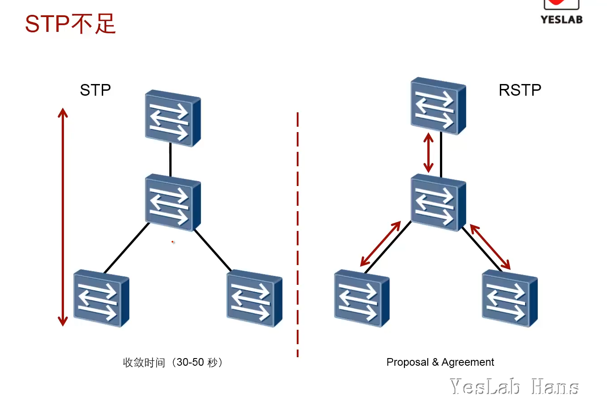

## RSTP原理

RSTP拓扑变化标准：<mark>非Edge port 迁移到Forwarding状态</mark>

[rstp对stp的改进](https://support.huawei.com/hedex/hdx.do?lib=EDOC1100021771AZH05262&docid=EDOC1100021771&lang=zh&v=13&tocLib=EDOC1100021771AZH05262&tocV=13&id=dc_fd_dhcp_0003&tocURL=resources%2525252Fdc%2525252Fdc_cfg_dhcp_6006.html&p=t&fe=1&ui=3&keyword=%2525252525u539f%2525252525u7406)

[rstp技术细节](https://support.huawei.com/hedex/hdx.do?lib=EDOC1100021771AZH05262&docid=EDOC1100021771&lang=zh&v=13&tocLib=EDOC1100021771AZH05262&tocV=13&id=dc_fd_dhcp_0003&tocURL=resources%2525252Fdc%2525252Fdc_cfg_dhcp_6006.html&p=t&fe=1&ui=3&keyword=%2525252525u539f%2525252525u7406)

### RSTP端口角色

- **Backup端口**就是由于学习到<mark>自己发送的配置BPDU报文而阻塞的端口</mark>

- **Alternate端口**就是由于学习到<mark>其他网桥发送的配置BPDU报文而阻塞的端口</mark>

| 角色        | 描述                                           |
| --------- | -------------------------------------------- |
| Backup    | Backup端口作为指定端口DP的备份，提供了另外一条从根桥到非根桥的备份链路。     |
| Alternate | Alternate端口作为根端口RP 的备份端口，提供了从指定桥到根桥的另一条备份路径。 |
| Edge      | 边缘端口不接收处理配置BPDU,不参与RSTP运算。                   |

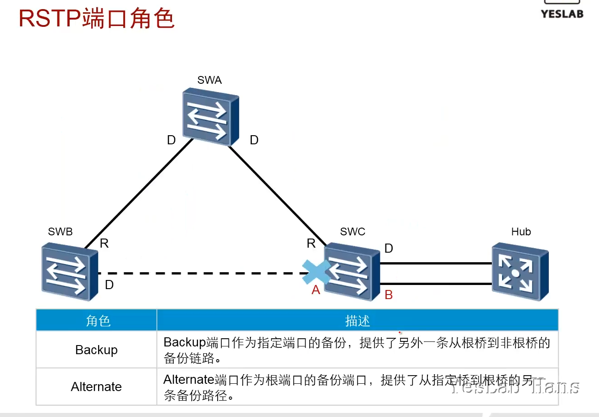

### RSTP边缘端口

- 边缘端口(Edge port)不接收处理配置BPDU,不参与RSTP运算

- 用于：服务器，主机，等终端设备

- 拓扑变化不会对边缘端口产生影响

- 边缘端口可以直接从`Discarding`状态变为`Forwarding`状态，不需要时延

- **RSTP拓扑变化标准：**<mark>非Edge port 迁移到Forwarding状态</mark>

- 边缘端口接收到BPDU后将会丧失Edge port属性，变为普通端口，进行rstp运算

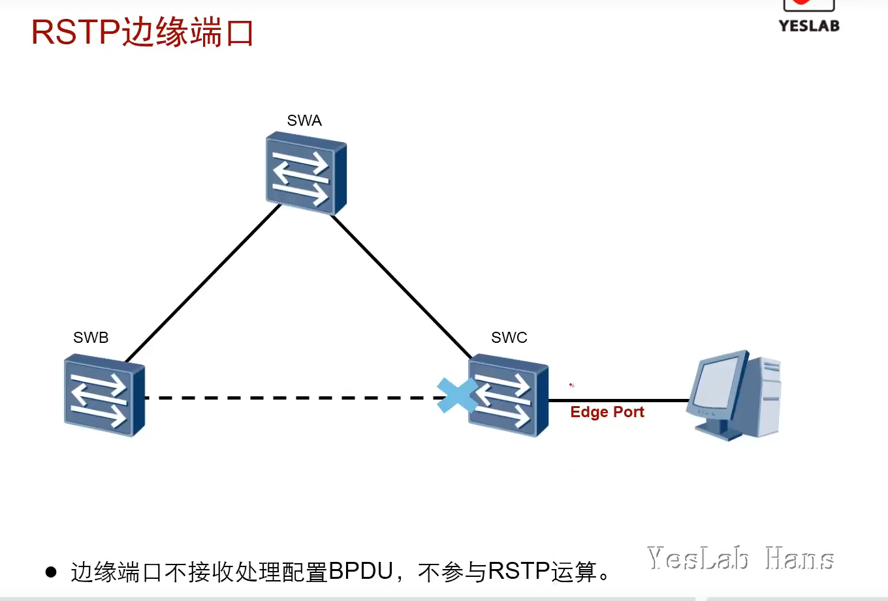

### 端口状态

**Discarding :** 既不转发用户数据流量，也不学习MAC地址

**Learning :** 不转发用户数据流量，但是学习MAC地址

**Forwarding :** 既转发用户数据流量，也学习MAC地址

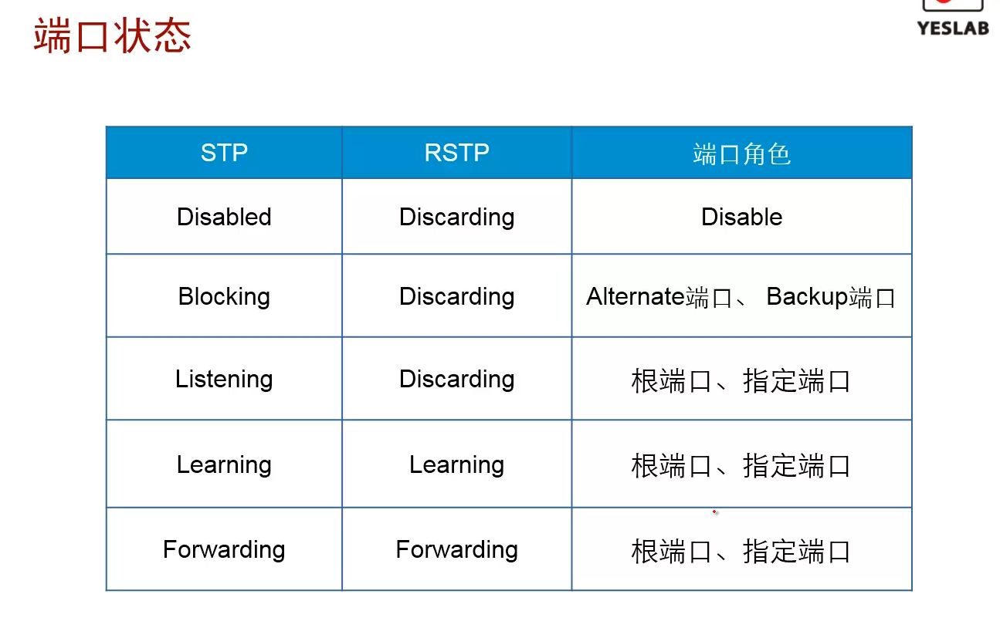

### RST BPDU

- STP的配置BPDU中的Flag字段中的中间6位在RSTP中得到了应用

- **稳定状态下：** 非根桥设备无论是否接收到根桥发送的配置BPDU,都会按照Hello timer规定的时间间隔发送配置BPDU.

- TCA：不使用

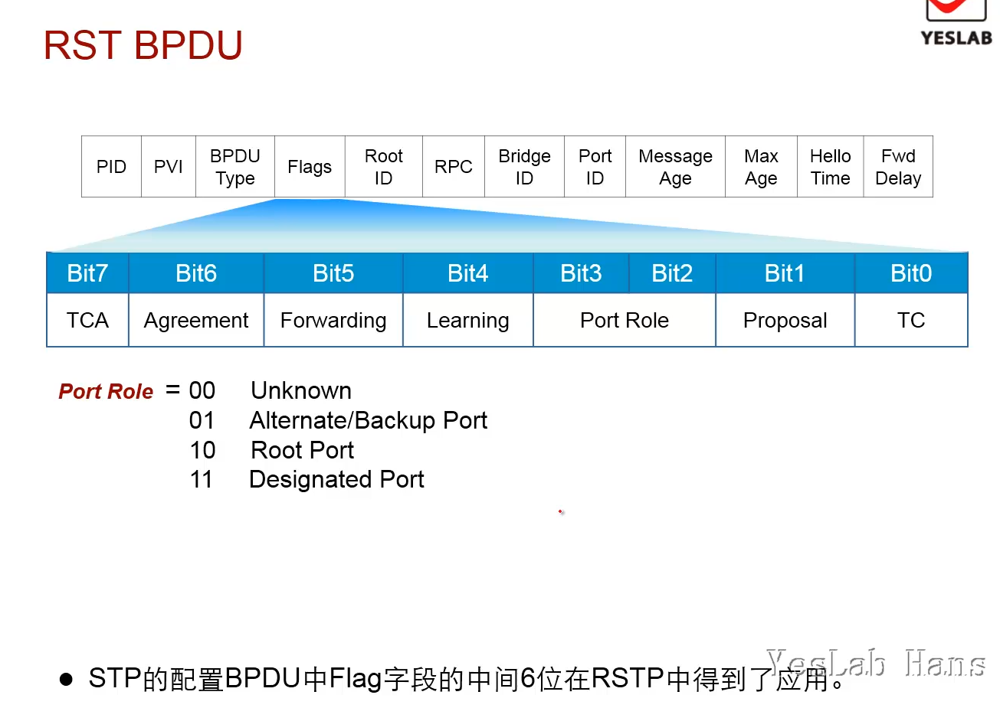

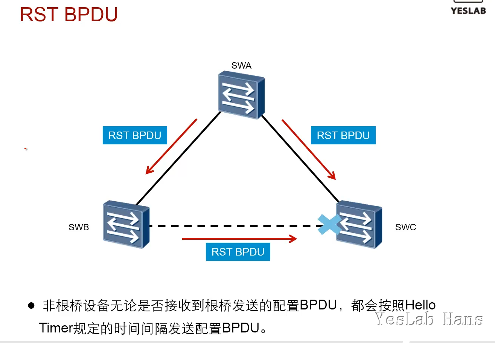

### RSTP收敛过程

- 每一台交换机启动RSTP后，都认为自己是根桥，并且发送RST BPDU。所有端口为指定端口，处于Discarding状态。

- 交换机相互发送Proposal置位的RST BPDU。

- SWA收到来自SWB的RST BPDU,发现来自SWB的没有自己的优先级高，会忽略。

- SWB收到了来自SWA的更优先的RST BPDU,于是停止发送BPDU,并开始执行同步。

- <mark>同步：将本交换机所有下游端口中除了Edge Port的端口全部变为Discarding状态</mark>

- 阻塞所有非边缘端口之后，SWB将会发送一个Agreement置位的RST BPDU给SWA。

- SWB同时会把向SWA发送A报文的端口**DP改为根端口RP,并立刻进入Forwarding状态**

- SWA收到来自SWB的A报文的端口DP**立刻进入Forwarding状态**

- P/A进程向下游继续传递，SWB和SWC会继续进行收敛。

- **P/A机制要求两台交换设备之间链路必须是点对点的全双工模式。一旦P/A协商不成功，指定端口的选择就需要等待两个Forward Delay，协商过程与STP一样。**

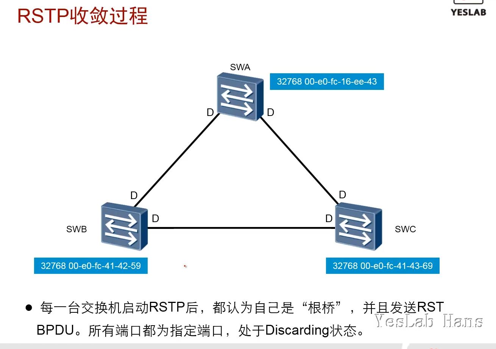

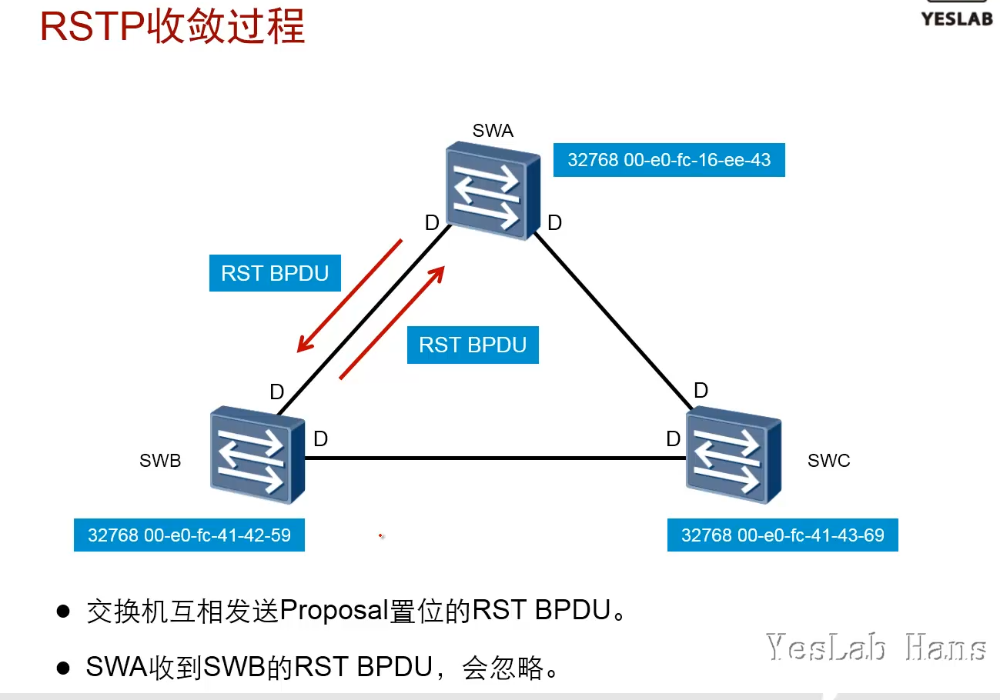

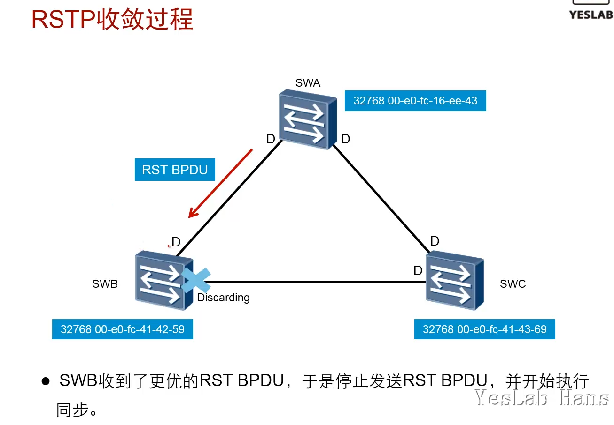

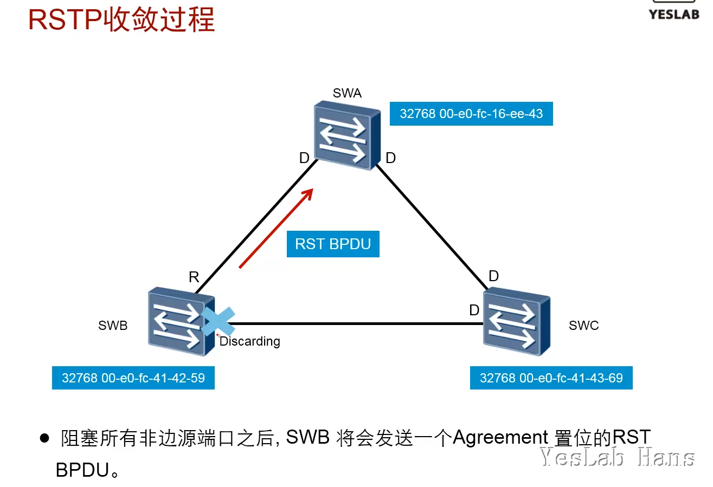

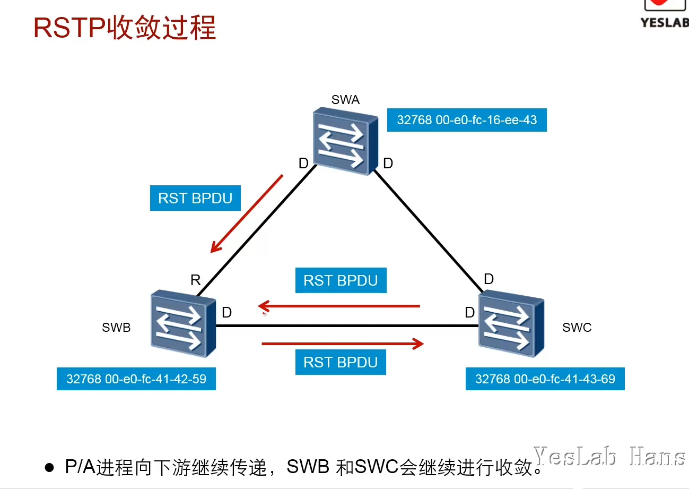

### 链路故障/根桥失效

- 链路故障或者根桥失效都会导致交换机收不到上游交换机发送的RST BPDU

- 在故障产生之后，交换机将会使用P/A机制进行重新协商。

- 标准：缺省等待`3 * Hello time[2s]` = 6秒

- 华为：缺省等待`3 * Hello time[2s] * Timer Factor[3]` = 18秒

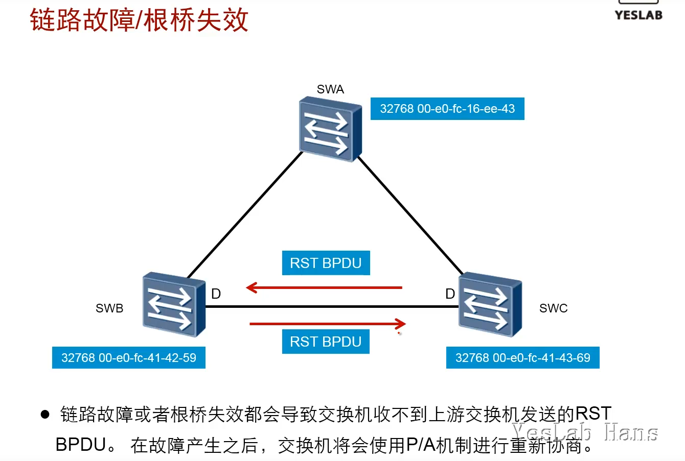

### RSTP拓扑变化处理

一旦检测到拓扑发生变化，将进行如下处理：

- 为本交换设备的所有非边缘指定端口启动一个TC While Timer，该计时器值是Hello Time的两倍。
  
  在这个时间内，清空所有端口上学习到的MAC地址。
  
  同时，由非边缘端口向外发送RST BPDU，其中TC置位。一旦TC
  While Timer超时，则停止发送RST BPDU。

- 其他交换设备接收到RST BPDU后，清空所有端口学习到MAC地址，除了收到RST BPDU的端口。然后也为自己所有的非边缘指定端口和根端口启动TC
  While Timer，重复上述过程。

如此，网络中就会产生RST BPDU的泛洪。

- 其他交换设备接收到RST BPDU后，清空所有其他端口学习到的MAC地址，除了接收到RST BPDU的端口和Edge Port 

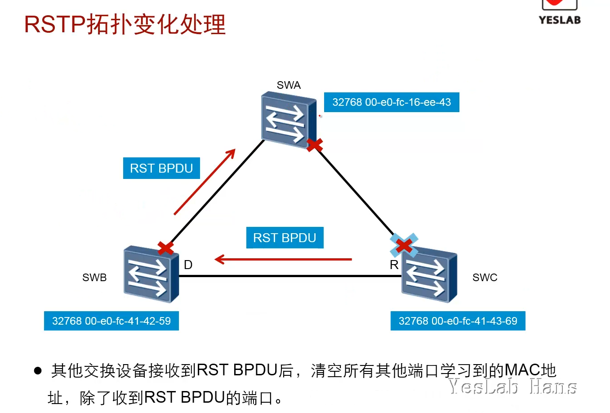

### STP兼容

- 运行RSTP的交换设备在某端口上接收到运行STP的交换设备发出的配置BPDU,会把该端口转换到STP工作模式。

- 默认等待`2*Hello time`=4秒 的时间，转换为stp模式

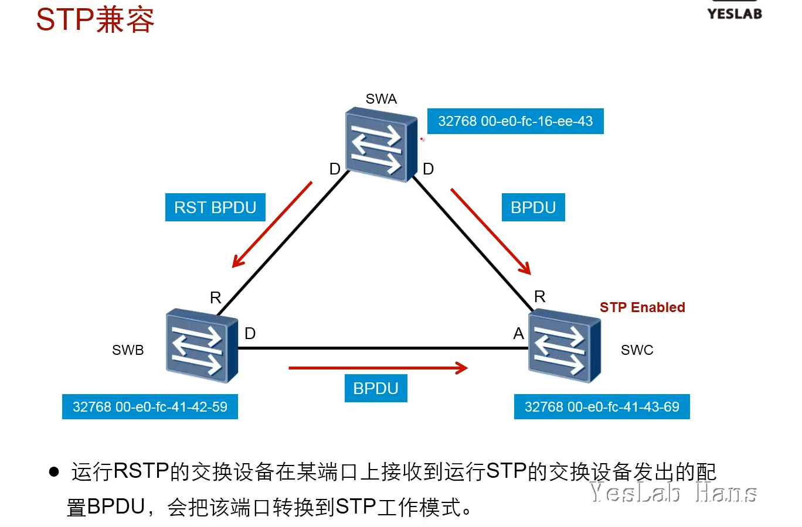

## RSTP配置

### 配置STP模式

- `stp mode rstp`

- 系统视图

- 执行命令后，所有端口都工作在RSTP模式

### 配置边缘（Edge）端口

#### stp edged-port {enable|disable}

- **stp edged-port enable**命令用来配置当前端口为边缘端口。

- **stp edged-port disable**命令用来配置当前端口为非边缘端口。

- **undo stp edged-port**命令用来恢复当前端口的边缘端口属性为缺省值。

- 缺省情况下，交换设备的所有端口都是非边缘端口。

- 边缘端口可以由Disabled直接转到Forwarding状态，不经历延时

- Sx7系列交换机**默认所有端口都工作在非边缘端口**

##### 视图

- Ethernet接口视图、Eth-Trunk接口视图、GE接口视图、端口组视图

##### 使用指南

**应用场景**

- 对于运行生成树协议的二层网络，与终端相连的端口不用参与生成树计算，这些端口参与计算会影响网络拓扑的收敛速度，而且这些端口的状态改变也可能会引起网络震荡，导致用户流量中断。此时，可以通过执行命令**stp edged-port enable**将当前端口配置成边缘端口，该端口便不再参与生成树计算，从而帮助加快网络拓扑的收敛时间以及加强网络的稳定性。

**注意事项**

- 当前端口配置成边缘端口后，如果收到BPDU报文，交换设备会自动将边缘端口设置为非边缘端口，并重新进行生成树计算。

#### stp edged-port default

##### 命令功能

- **stp edged-port default**命令用来配置交换设备<mark>所有端口为边缘端口。</mark>

- **undo stp edged-port default**命令用来恢复交换设备所有端口为非边缘端口。

- 缺省情况下，交换设备所有端口为非边缘端口。

##### 视图

**系统视图**

##### 使用指南

**应用场景**

- 对于运行生成树协议的二层网络，与终端相连的端口不用参与生成树计算，这些端口参与计算会影响网络拓扑的收敛速度，而且这些端口的状态改变也可能会引起网络震荡，导致用户流量中断。此时，可以通过执行命令[**stp edged-port enable**](https://support.huawei.com/hedex/pages/EDOC1100021771AZH05262/13/EDOC1100021771AZH05262/13/resources/dc/stp_edged-port.html)将当前端口配置成边缘端口，该端口便不再参与生成树计算，从而帮助加快网络拓扑的收敛时间以及加强网络的稳定性。

- 配置命令**stp edged-port default**时，本设备上所有端口将变为边缘端口。在网络拓扑计算过程中，可能导致网络成环，请慎用。

**注意事项**

- 端口配置成边缘端口后，如果收到BPDU报文，交换设备会自动将边缘端口设置为非边缘端口，并重新进行生成树计算。

- 为防止攻击者仿造BPDU报文导致边缘端口属性变成非边缘端口，建议在系统视图下执行[**stp bpdu-protection**](https://support.huawei.com/hedex/pages/EDOC1100021771AZH05262/13/EDOC1100021771AZH05262/13/resources/dc/stp_bpdu-protection.html)配置交换设备的BPDU保护功能，配置BPDU保护功能后，如果边缘端口收到BPDU报文，边缘端口将会被shutdown，边缘端口属性不变。

### 根保护（DP）

<mark>一定是在指定端口DP上去配置的</mark>

根保护功能确保了根桥的指定端口不会因为一些网络问题而改变端口角色

#### 命令功能

- **stp root-protection**命令用来使能当前端口的根保护功能。

- **undo stp root-protection**命令用来去使能当前端口的根保护功能。

- 缺省情况下，端口的根保护功能处于去使能状态。

#### 视图

- Ethernet接口视图、Eth-Trunk接口视图、GE接口视图、端口组视图

#### 使用指南

**应用场景**

- 由于维护人员的错误配置或网络中的恶意攻击，根桥收到优先级更高的BPDU，会失去根桥的地位，重新进行生成树的计算。由于拓扑结构的变化，可能造成高速流量迁移到低速链路上，引起网络拥塞。

- 对于使能根保护功能的指定端口，<mark>其端口角色只能保持为指定端口</mark>。**一旦使能根保护功能的指定端口收到优先级更高的BPDU时，端口状态将进入Discarding状态，不再转发报文。在经过一段时间（通常为两倍的Forward Delay），如果端口一直没有再收到优先级较高的BPDU，端口会自动恢复到正常的Forwarding状态。**

- Forward Delay的时间可通过命令[**stp timer forward-delay**](https://support.huawei.com/hedex/pages/EDOC1100021771AZH05262/13/EDOC1100021771AZH05262/13/resources/dc/stp_timer_forward-delay.html)进行设置。

**注意事项**

- 由于当前端口是指定端口时根保护便会生效，且根保护基于端口进行配置，所以建议当端口在所有实例中都是指定端口时配置根保护功能。

- 若在其他类型的端口上执行**stp root-protection**，根保护功能并不生效。

- 环路保护功能和根保护功能不能同时配置在同一端口。

### BUDP保护（Edge Port）

- 配置BPDU保护功能后，如果边缘端口接收到BPDU报文，边缘端口将会被立即关闭，并通知网关系统。被关闭的边缘端口只能通过管理员手动恢复。

- 做bpdu protection的原因
  
  - 边缘端口收到bpdu后变为普通端口，进行生成树计算，触发tc,造成网络震荡
  
  - 边缘端口如果新连接一个交换机，如果新交换机的BID较小，可能抢夺交换网络的根桥位置
  
  - 边缘端口可能造成临时环路（误操作将2个边缘端口互联）

#### 命令功能

- **stp bpdu-protection**命令用来使能设备的BPDU保护功能。

- **undo stp bpdu-protection**命令用来去使能设备的BPDU保护功能。

- 缺省情况下，设备的BPDU保护功能处于去使能状态。

- **error-down auto-recovery** cause bpdu-protection interval  *interval-value* 自动恢复

#### 视图

- 系统视图

#### 使用指南

**应用场景**

- 对于运行生成树协议的二层网络，与终端相连的端口不用参与生成树计算，这些端口参与计算会影响网络拓扑的收敛速度，而且这些端口的状态改变也可能会引起网络震荡，导致用户流量中断。此时，可以通过执行命令[**stp edged-port enable**](https://support.huawei.com/hedex/pages/EDOC1100021771AZH05262/13/EDOC1100021771AZH05262/13/resources/dc/stp_edged-port.html)将当前端口配置成边缘端口，该端口便不再参与生成树计算，从而帮助加快网络拓扑的收敛时间以及加强网络的稳定性。

- 但是，边缘端口收到BPDU报文会失去其边缘端口属性。为防止攻击者仿造BPDU报文导致边缘端口属性变成非边缘端口，可通过执行命令**stp bpdu-protection**配置交换设备的BPDU保护功能。

**注意事项**

- 配置BPDU保护功能后，如果边缘端口收到BPDU报文，边缘端口将会被error-down，边缘端口属性不变。被error-down的边缘端口可以在系统视图下执行命令[**error-down auto-recovery**](https://support.huawei.com/hedex/pages/EDOC1100021771AZH05262/13/EDOC1100021771AZH05262/13/resources/dc/error-down_auto-recovery.html) **cause** **bpdu-protection interval** *interval-value*自动恢复。

### 环路保护（RP/AP）

- 光纤链路（一收一发，单向环路） 会配置环路保护

- <mark>根端口RP和阻塞端口AP</mark>如果长时间收不到来自上游的BPDU,则会<mark>变为指定端口DP</mark>.并进入`Discarding`状态，避免在网络中形成环路

- 当网络恢复后，故障端口DP将恢复原来的端口状态和端口角色RP/AP

#### 命令功能

- **stp loop-protection**命令用来使能当前端口的环路保护功能。

- **undo stp loop-protection**命令用来去使能当前端口的环路保护功能。

- 缺省情况下，端口的环路保护功能处于去使能状态

#### 视图

- Ethernet接口视图、Eth-Trunk接口视图、GE接口视图、端口组视图

#### 使用指南

**应用场景**

- 在运行生成树协议的网络中，根端口和其他阻塞端口状态是依靠不断接收来自上游设备的BPDU报文维持。<mark>当由于链路拥塞或者单向链路故障</mark>导致这些端口收不到来自上游设备的BPDU报文时，交换设备会重新选择根端口。原先的根端口会转变为指定端口，而原先的阻塞端口会迁移到转发状态，导致网络中可能产生环路。

- 为了防止以上情况发生，可部署环路保护功能。在启动了环路保护功能后，如果根端口或Alternate端口长时间收不到来自上游设备的BPDU报文时，则向网管发出通知信息（<mark>此时根端口会进入Discarding状态，角色切换为指定端口</mark>），而<mark>Alternate端口则会一直保持在阻塞状态（角色也会切换为指定端口）</mark>，不转发报文，从而不会在网络中形成环路。直到链路不再拥塞或单向链路故障恢复，端口重新收到BPDU报文进行协商，并恢复到链路拥塞或者单向链路故障前的角色和状态。

- Alternate端口是根端口的备份端口。当根端口正常收发报文时，Alternate端口处于阻塞状态。

- 在一棵生成树中，对于互相连接的两台交换设备，离根桥近的交换设备即为另外一台交换设备的上游设备。

**注意事项**

- 环路保护功能和根保护功能不能同时配置在同一端口。

## 总结

- P/A进程中同步的作用是什么？

避免临时环路

P/A机制是RSTP网络中的一种拓扑收敛机制, P/A机制中同步的作用是避免临时环路的产生。
