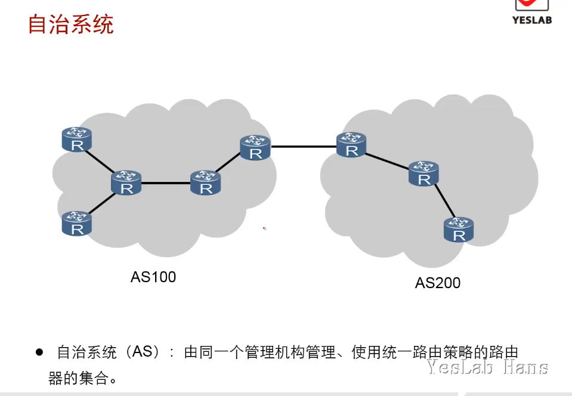
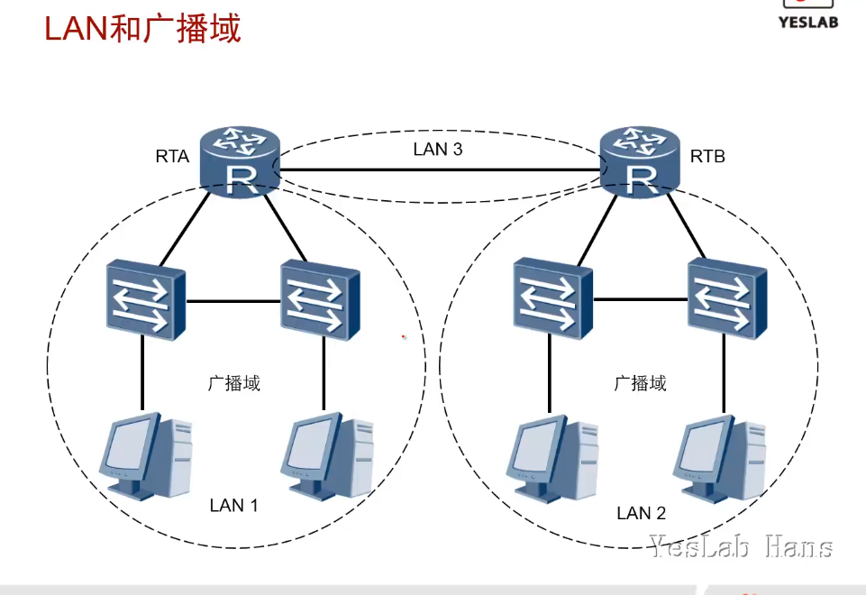
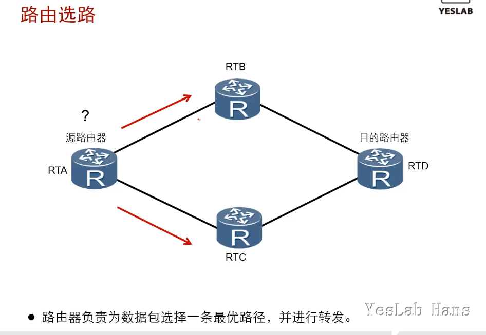
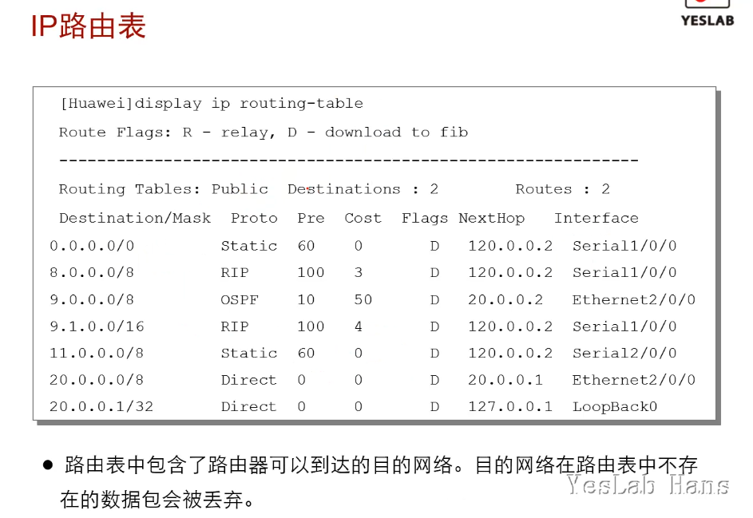
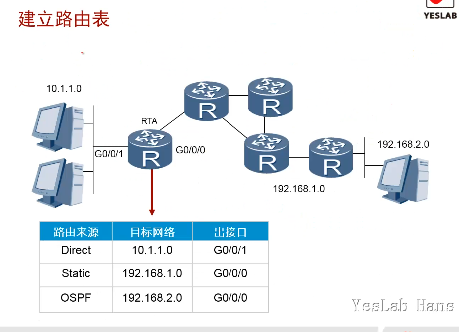
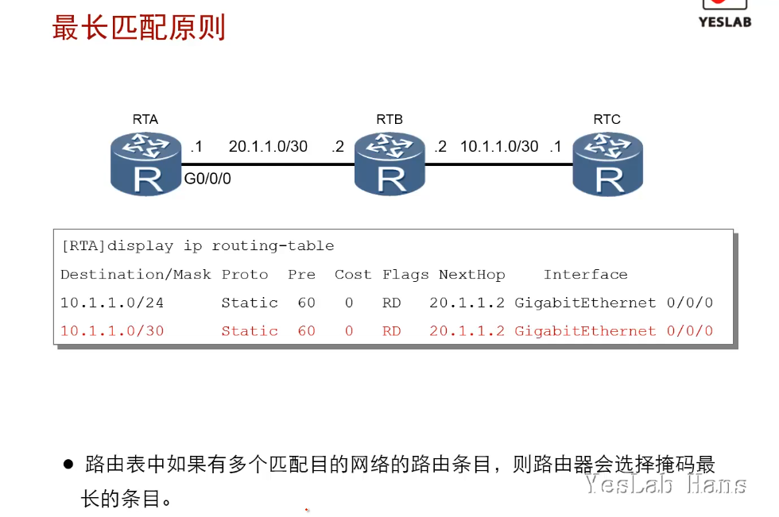
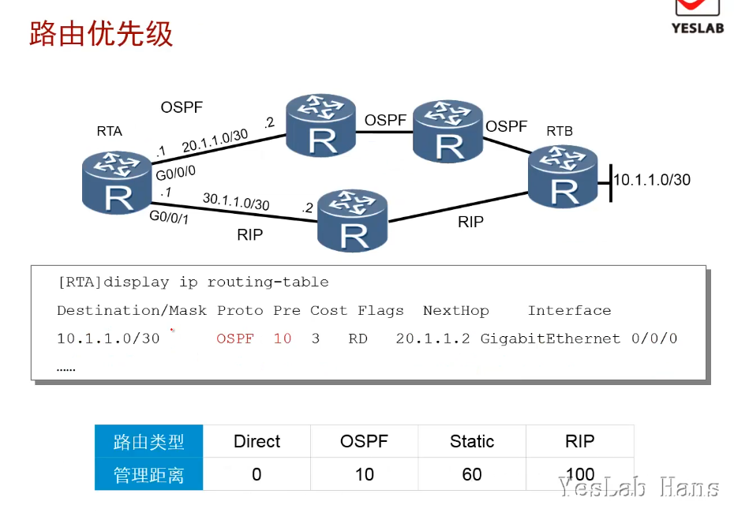
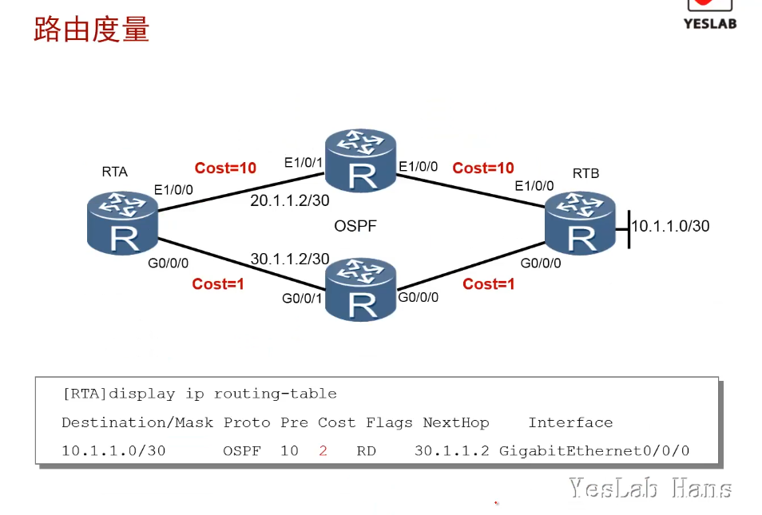
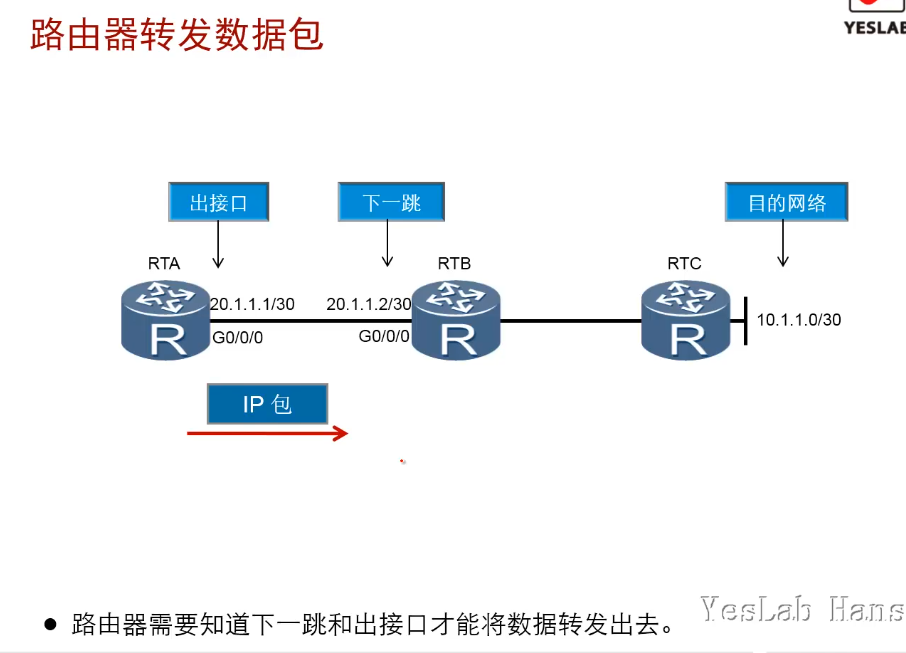

# IP路由基础

以太网交换机工作在数据链路层，用于在网络内进行数据转发。而企业网络的拓扑结构一般会比较复杂，不同的部门，或者总部和分支可能处于不同的网络中，此时就需要使用路由器来连接不同的网络，实现网络之间的数据转发。

## 学习目标

- 掌握路由器的基本工作原理

- 掌握路由器选择最优路由的方法

## 路由器工作原理

必须有路由表，才能提供转发服务

路由表形成方式：直连，静态，动态

路由表选路原则：最长掩码，优先级，度量，等价路由

### 自治系统(AS)

- 自治系统(AS,Autonomous System)：由同一个管理机构管理、使用统一路由策略的路由器的集合。

### LAN和广播域

- 去往某个目标网段的时候必须要有**路由表**

### 路由选路(Routing)

- 路由器负责为数据包选择一条最优路径，并进行转发

### IP路由表

- 路由表中包含了路由器可以到达的目的网络。目的网络在路由表中不存在的数据包会被丢弃。

- pre(preferance):路由优先级，数值小的更优先

#### 路由选路原则：

1. 掩码mask最长匹配

2. 路由优先级preferance

3. 度量(metric)，开销cost

### 建立路由表

- Direct:直连路由，给路由器接口配置IP/MASK时自动进行IP&mask（逻辑与），生成路由表项

- Static:静态路由，手工指定

- OSPF/RIP：动态路由，由动态路由协议学习到的路由信息

## 路由器选择最优路由的顺序

### 最长匹配原则

- 路由表中如果有多个匹配目的网络的路由条目，则路由器会选择掩码最长的条目

### 路由优先级

- 通过不同路由协议学习到相同前缀的路由条目的时候，路由选路routing时，会根据路由协议的优先级进行选路

### 路由度量

- 当路由条目的路由掩码前缀长度和路由优先级都一样时，根据度量metric/cost进行选路

- <mark>当掩码长度、优先级、度量都相同时，路由器2条路由都会选，会出现**等价路由**</mark>

- Metric:OSPF->COST,RIP->HOP

### 路由器转发数据包

- 路由器需要知道**下一跳和出接口**才能将**数据包转发**出去

- **路由器重新封装数据包**时，MAC地址封装，<mark>源MAC=出接口MAC</mark>,<mark>目的MAC=下一跳MAC</mark>

## 总结

- 路由器选择最优路由的顺序是什么？

1最长掩码匹配：范围的精确度的匹配

2路由优先级，AD数值小的优先：信息来源的可信度

3 度量值/开销，越小越好

4以上参数都一致，实现负载均衡，等价路由

- Preferance字段在路由表中代表什么含义？

.Preference字段在路由表中代表了路由优先级。设备厂商会在各自的产品中为不同的路由协议规定不同的优先级。

