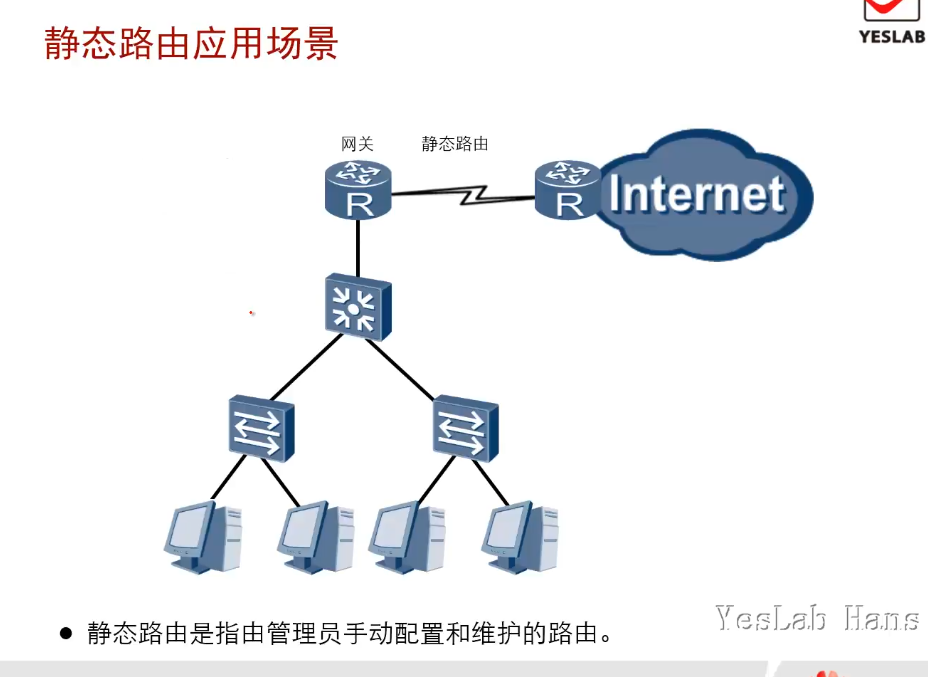
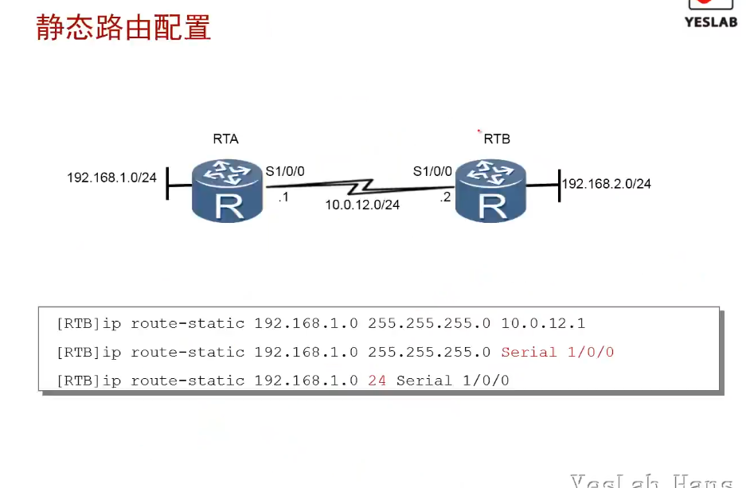
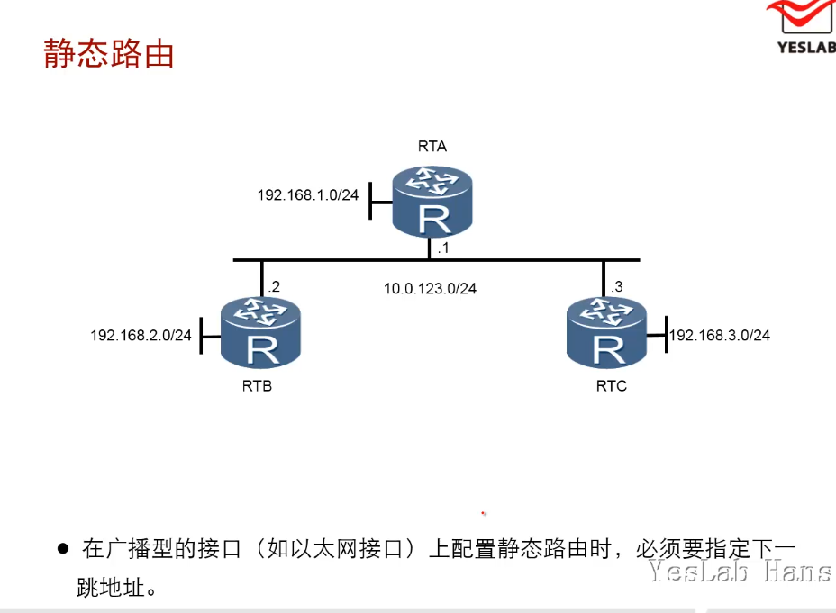
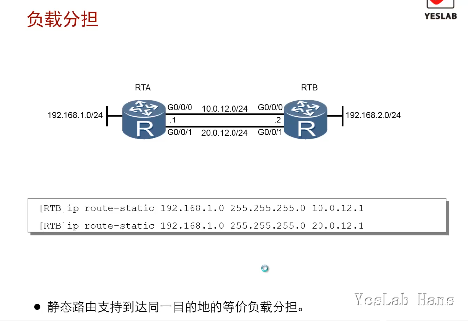
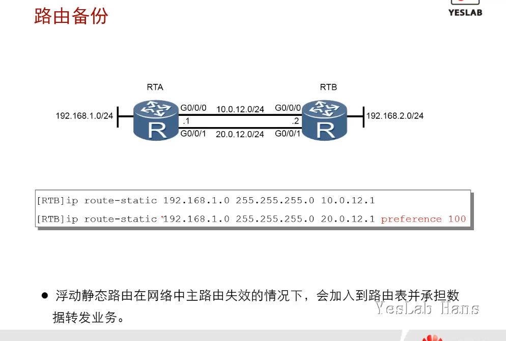
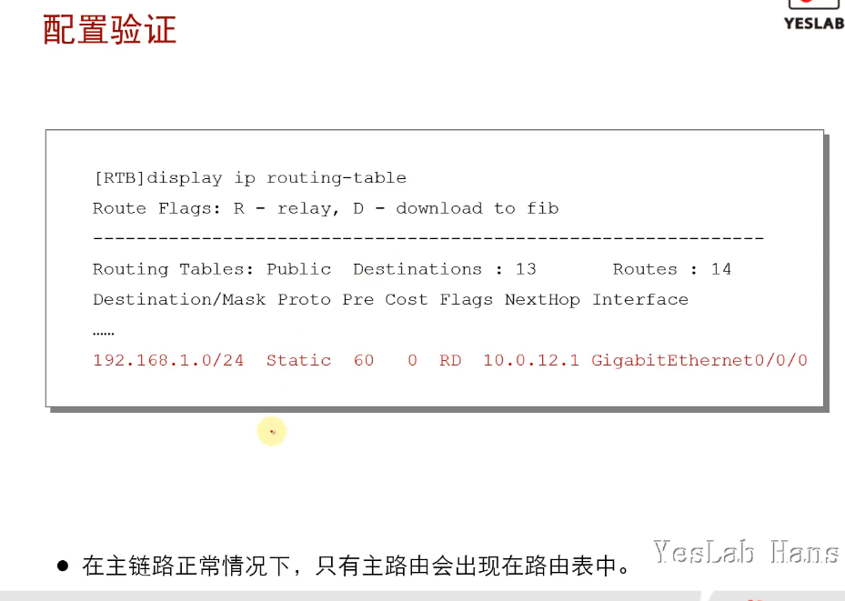
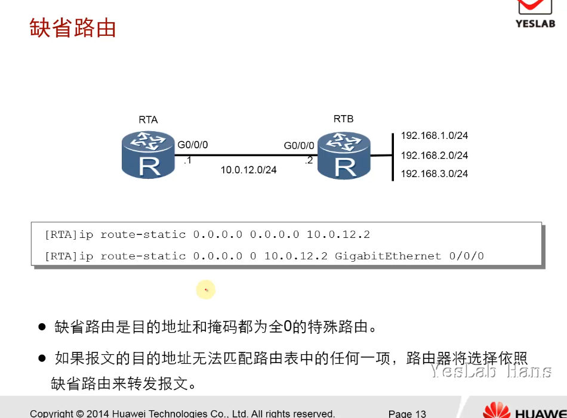

# 静态路由基础

**静态路由**是指由**管理员手动配置和维护的路由。**

静态路由配置简单，被广泛应用于网络中。另外，**静态路由还可以实现负载均衡**和**路由备份**。因此，学习并掌握好静态路由的应用与配置是非常必要的。

## 学习目标

- 识别静态路由的应用场景

- 掌握静态路由的配置

### 静态路由应用场景

- 静态路由是指由管理员手动配置和维护的路由。

- 应用场景：在企业网的网关设备上配置静态路由(缺省静态路由)，指向运营商的网络

- 缺省静态路由：0.0.0.0/0，表示所有网路



### 静态路由配置

- [ ip route-static]([Insert title here](https://support.huawei.com/hedex/hdx.do?lib=EDOC1100021771AZH05262&docid=EDOC1100021771&lang=zh&v=13&tocLib=EDOC1100021771AZH05262&tocV=13&id=ip_route-static&tocURL=resources%2525252Fdc%2525252Fip_route-static.html&p=t&fe=1&ui=3&keyword=ip%25252Broute))

- 静态路由配置命令`ip route-static IPADDR MASK|MASKLENGTH INTERFACE NEXTHOPADDR`

- 配置静态路由时，
  
  - 对于以太网络，需要指定下一跳ip地址，不能只指定出接口
  
  - 对于串口的点对点链路(串行接口)，可以指定下一跳ip地址或出接口
  
  - 可以缩写网络掩码为掩码长度

- 在串行接口上，可以通过指定下一跳地址或者出接口来配置静态路由。

- 在广播行的接口(如以太网接口)上配置静态路由时，必须要指定下一跳地址。





### 负载分担

[华为文档-负载分担与路由备份](https://support.huawei.com/enterprise/zh/doc/EDOC1000141354/dad5111)

- <mark>静态路由支持</mark>到达同一目的地的<mark>等价负载分担</mark>。
- 当多条路由的路由优先级和路由度量都相同时，这几条路由就称为等价路由，多条等价路由可以实现负载分担。
- 当实现**负载分担**时，路由器根据**五元组**（源地址、目的地址、源端口、目的端口、协议）**进行转发**，当<mark>五元组相同时，路由器总是选择与上一次相同的下一跳地址</mark>发送报文。当<mark>五元组不同时，路由器会选取相对空闲的路径进行转发</mark>。



### 路由备份

- 浮动静态路由在网络中主路由失效的情况下，会加入到路由表并承担数据转发业务。

- 路由备份是通过调整静态路由的优先级实现的；静态路由的默认优先级(preferance)60

- 当多条路由的路由优先级和路由度量都相同时，这几条路由就称为等价路由，多条等价路由可以实现负载分担。当这几条路由为非等价路由时，就可以实现路由备份。

- **路由备份功能，可以提高网络的可靠性**。用户可以根据实际情况，<mark>配置到同一目的地的多条路由</mark>，其中一条路由的**优先级最高，作为主路由**，**其余的路由优先级较低，作为备份路由。**

- 正常情况下，路由器采用主路由转发数据。当主链路出现故障时，主路由变为非激活状态，路由器选择备份路由中优先级最高的路由转发数据。这样，也就实现了主路由到备份路由的切换。当主链路恢复正常时，由于主路由的优先级最高，路由器重新选择主路由来发送数据。这样，就实现了从备份路由回切到主路由



#### 路由备份配置验证

- 在主链路正常的情况下，只有主路由会出现在路由表中。
- `display ip routing-table [protocol static]`



### 缺省路由/默认路由

- 缺省路由是目的地址和掩码都为全0的特殊路由。<mark>0.0.0.0/0</mark>

- 如果报文的目的地址无法匹配路由表中的任何一项，路由器将选择依照缺省路由来转发报文。



## CIDR,VLSM,路由汇总

### **CIDR的介绍：**

- CIDR（Classless Inter-Domain Routing，无类域间路由选择）它消除了传统的A类、B类和C类地址以及划分子网的概念，因而可以更加有效地分配IPv4的地址空间。它可以将好几个IP网络结合在一起，使用一种无类别的域际路由选择算法，使它们合并成一条路由从而较少路由表中的路由条目减轻Internet路由器的负担。

- CIDR 还使用“斜线记法”，它又称为CIDR记法，即在IP地址后面加上一个斜线“/”，然后写上网络前缀所占的比特数（这个数值对应于三级编址中子网掩码中比特1的个数）。        IP地址::={<网络前缀>,<主机号>}

### **CIDR与VLSM的区别：**

- CIDR是把几个标准网络合成一个大的网络

- VLSM是把一个标准网络分成几个小型网络(子网)

- CIDR是子网掩码往左边移了，VLSM是子网掩码往右边移了

### **CIDR汇总与路由汇总的区别**

路由汇总与CIDR汇总的区别：<mark>路由汇总还有类的概念，汇总后的掩码长度必须要大于或等于主类网络的掩码长度；</mark>**CIDR是无类域间路由，网络地址一致就能进行CIDR汇总**。

```
示例：
1.)192.168.0.0/24 - 192.168.3.0/24

CIDR汇总：192.168.0.0/30

路由汇总：192.168.0.0/30

2.)92.168.0.0/24 - 192.168.3.0/24

CIDR汇总：192.168.0.0/22

路由汇总：不能汇总！(因为22<24，不能进行路由汇总)

注意：在Ripv2版本中，使用的是路由汇总，不支持CIDR汇总，但可以传递CIDR汇总。
```

## 总结

- 如何配置能够将静态路由配置为浮动静态路由？

在配置静态路由时，需要调整其中一条静态路由的优先级，就可将其修改为浮动静态路由。

- 配置缺省路由时，目的网络地址是什么？

在配置缺省路由时，目的网络为`0.0.0.0` 带表的是任意网络
