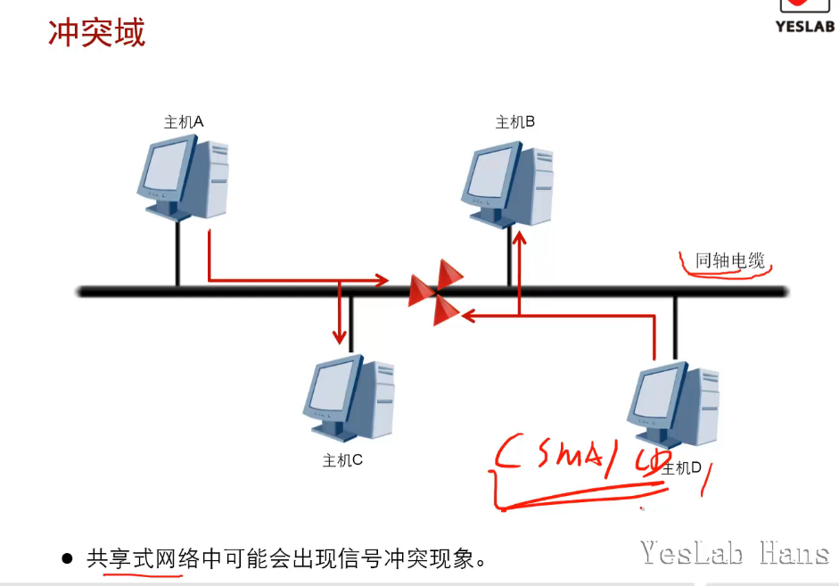

# 传输介质

通信网络除了包含通信设备本身外，还包含连接这些设备的传输介质，

如：同轴电缆，双绞线，光纤等

不同的传输介质具有不同的特性，这些特性直接影响通信的诸多方面，

如：线路编码方式，传输速度，传输距离等

## 学习目标

- 了解一些常见的传输介质

- 理解冲突和双工模式的基本概念

## 简单网络

- 两个终端，用一条能承载数据传输的物理介质(传输介质)连接起来，就组成了一个最简单的网络

### 介质-同轴电缆(coaxial cable)

| 以太网标准   | 线缆类别  | 最长有效传输距离 |
| ------- | ----- | -------- |
| 10BASE5 | 粗同轴电缆 | 500米     |
| 10BASE2 | 细同轴电缆 | 185米     |

### 介质-双绞线(Twisted pair)

| 以太网标准      | 线缆类别        | 最长有效传输距离 |
| ---------- | ----------- | -------- |
| 10BASE-T   | 2对3/4/5类双绞线 | 100米     |
| 100BASE-TX | 2对5类双绞线     | 100米     |
| 1000BASE-T | 4对5E类双绞线    | 100米     |

### 以太网线线序

|      | 1   | 2   | 3   | 4   | 5   | 6   | 7   | 8   |
| ---- | --- | --- | --- | --- | --- | --- | --- | --- |
| 568A | 白绿  | 绿   | 白橙  | 蓝   | 白蓝  | 橙   | 白棕  | 棕   |
| 568B | 白橙  | 橙   | 白绿  | 蓝   | 白蓝  | 绿   | 白棕  | 棕   |

直通线(Straight-through):    568B<--->568B,连接异种设备

交叉线(Cross-over):        568A<--->568B，连接同种设备

反转线(rolled cable)，一端采用568A或568B做线标准，另一端把568A或568B的顺序刚好从第一根到最后一根反过来。连接CONSOLE口

> 一端安在CONSOLE口，反转线的另一端不能直接与电脑的网口相连，因为网络设备的CONSOLE口是没有IP地址的，即使连接上也无法实现通信。如果需要连接电脑进行CONSOLE控制，需要将连接电脑这端用转接口转换成9针串口[母头](https://baike.baidu.com/item/%E6%AF%8D%E5%A4%B4)；而一些笔记本电脑上是没有9针串口[公头](https://baike.baidu.com/item/%E5%85%AC%E5%A4%B4)的，那样就需要再将9针串口母头用串口转USB口的转接头，转接为USB口，即调试设备是提示的COM口。

### 介质-光纤(fibre-optical)

| 以太网标准       | 线缆类别    | 最长有效传输距离 |
| ----------- | ------- | -------- |
| 10BASE-F    | 单模/多模光纤 | 2000米    |
| 100BASE-FX  | 单模/多模光纤 | 2000米    |
| 1000BASE-LX | 单模/多模光纤 | 316米     |
| 1000BASE-SX | 多模光纤    | 316米     |

包层直径相同

单模(SMF)：黄色,纤芯直径9um,传输距离长，带宽宽，成本高

多模(MMF)：橙色/水绿色,纤芯直径50um/62.5um,传输距离短，支持高速率，成本低

**SC**:用户连接器（光纤连接器）Subscriber Connector (Optial Fiber Connector)

**LC**:线路连接器 Line Connector

**ST** :直通式光纤连接器 Straight Tip

**FC** :光纤通道 Fibre Channel

### 介质-串口电缆(Serial cable)

| 线缆类别 | 速率                |
| ---- |:-----------------:|
| V.24 | 1.2Kbps~64Kbps    |
| V.35 | 1.2Kbps~2.048Mbps |

## 冲突域

- 共享式网络(同轴电缆)种可能出现信号冲突现象
- AP下的设备处于同一个冲突域

特点：同时发送信号有冲突问题

解决方案：CSMA/CD,即载波侦听多路访问/冲突检测(Carrier Sense Multiple Access with Collision Detection)

1. 先听后发

2. 边听边发

3. 冲突停发

4. 随机延时重发

## 双工模式

- 半双工：收发不能同时进行

- 全双工：同时收发

- 两种双工模式都支持双向数据传输

## 总结

- 企业网络中部署千兆以太网时使用哪种传输介质？

**超5类标准及以上的双绞线，或者使用更高等级的光纤。**

网线和光纤

几十米使用网线

超过100米使用光纤

- 什么是冲突域？

**冲突域是在同一个网络上两个设备同时进行传输则会产生冲突；在网路内部数据分组所产生与发生冲突的这样一个区域称为冲突域，所有的共享介质环境都是一个冲突域。**

> 冲突域（物理分段）
> 
> 连接在同一导线上的所有工作站的集合，或者说是同一物理网段上所有节点的集合或以太网上竞争同一带宽的节点集合。这个域代表了冲突在其中发生并传播的区域，这个区域可以被认为是共享段。在OSI模型中，冲突域被看作是第一层的概念，连接同一冲突域的设备有Hub，Reperter或者其他进行简单复制信号的设备。也就是说，用Hub或者Repeater连接的所有节点可以被认为是在同一个冲突域内，它不会划分冲突域。而第二层设备（网桥，交换机）第三层设备（路由器）都可以划分冲突域的，当然也可以连接不同的冲突域。简单的说，可以将Repeater等看成是一根电缆，而将网桥等看成是一束电缆

- CSMA/CD的作用是什么？

**CSMA/CD是一种在共享式网络上检测并避免冲突的机制。**
