# 以太网帧结构

## IEEE(I triple e)

电气与电子工程师协会（Institute of Electrical and Electronics Engineers）

网络中传输数据时需要定义并遵守一些标准，以太网是根据IEEE 802.3标准来管理和控制数据帧的。了解IEEE 802.3 标准是充分理解以太网中链路层通信的基础

IEEE 802.3 : 以太网介质访问控制协议 （CSMA/CD）及物理层技术规范

MAC-protocol:CSMA/CD

**以太网，相较同轴电缆网络，终端和交换机端口专用一段线缆，但MAC层仍旧跑CSMA/CD协议**

## 学习目标

- 理解分层模型的作用

- 掌握以太网中数据帧的结构

- 掌握MAC地址的作用

- 掌握以太网中数据帧转发的过程

## 网络通信协议

- 不同的协议栈用于定义和管理不同网络的数据转发规则

**OSI TCP/IP** ~~IPX/SPX SNA~~

局域网：IEEE802 ,以太网

广域网：~~帧中继~~ **PPP** HDLC

### 什么叫协议

- 为了使数据可以在网络上从源传递到目的地，网络上所有设备需要"讲"相同的"语言"

- 数据通信协议的定义

决定数据的格式和传输的一组规则或者惯例

### 协议分层 why?

- 网络通信的过程很复杂
  
  - 数据以电子信号的形式穿越介质到达正确的计算机，然后转换成最初的形式，以便接收者能够阅读
  - 为了降低网络设计的复杂性，将协议进行了分层设计

- 分层设计的意义
  
  - 通信服务层的模块化设计可相对独立于具体的**通信线路和通信硬件接口的差别**
  - 通信服务层的模块化设计可相对独立于具体的**用户应用要求的不同**
  - <mark>简化了相关的网络操作；提供了不同厂商之间的兼容性;</mark>促进了标准化工作;结构上进行了分层;易于学习和操作。
  - <mark>各个层次独立，一层的变化不会影响到邻层。</mark>

## 分层模型-OSI(Open System Interconnection)

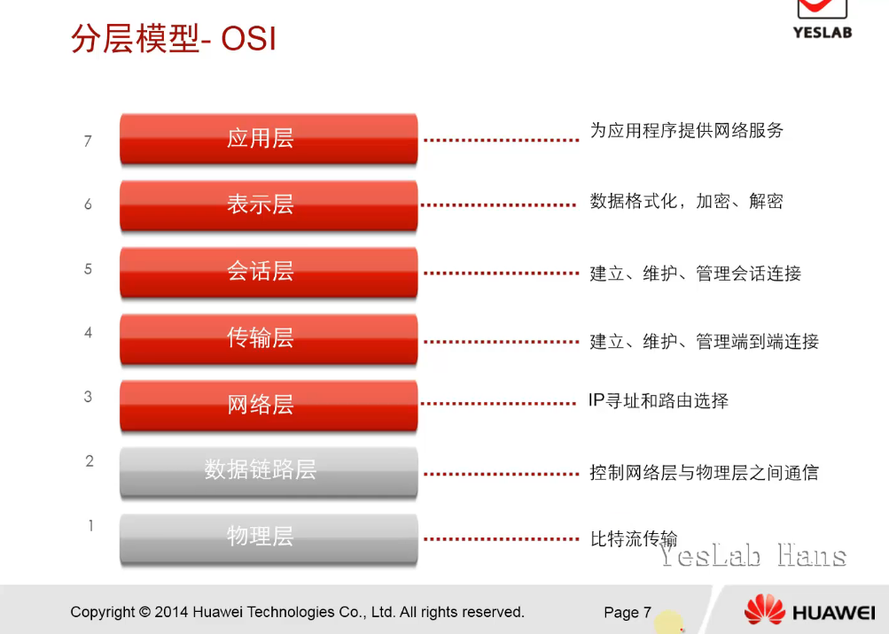

### OSI层次设计理念

- 建立七层模型的主要目的是为了解决异种网络互连时所遇到的兼容性问题

- 最大优点是将<mark>服务</mark>、<mark>接口</mark>和<mark>协议</mark>这三个概念明确的区分开来

- <mark>层次(Layer)：降低网络设计的复杂性</mark>，就像我们设计软件，基本就是加一层，分层来[解耦](https://so.csdn.net/so/search?q=%E8%A7%A3%E8%80%A6&spm=1001.2101.3001.7020)，而计算机网络也是一个层次栈，上层建立在下层基础之上

- <mark>服务(Service)：某层为紧邻上一层提供一些什么功能</mark>，某一层向它上一层提供的一组原语

- <mark>接口(Interface)：某层如何使用下层的服务</mark>，定义了下层向上层提供了哪些服务和原语操作

- <mark>协议(Protocol)：如何实现本层的服务</mark>，一组规则，规定了同一层上对等实体之间所交换的数据包或报文的格式和含义

- 这样各层之间具有很强的独立性，互连网络中各实体采用什么样的协议是没有限制的，只要向上提供相同的服务并且不过改变相邻层的接口就可以了

### 各层的PDU

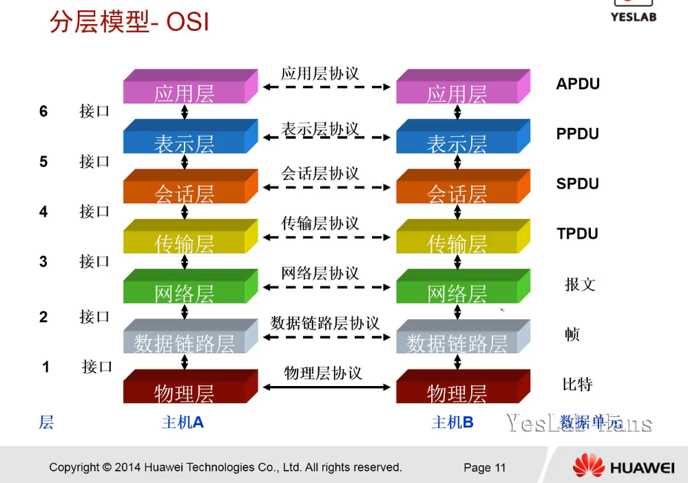

### 各层的功能

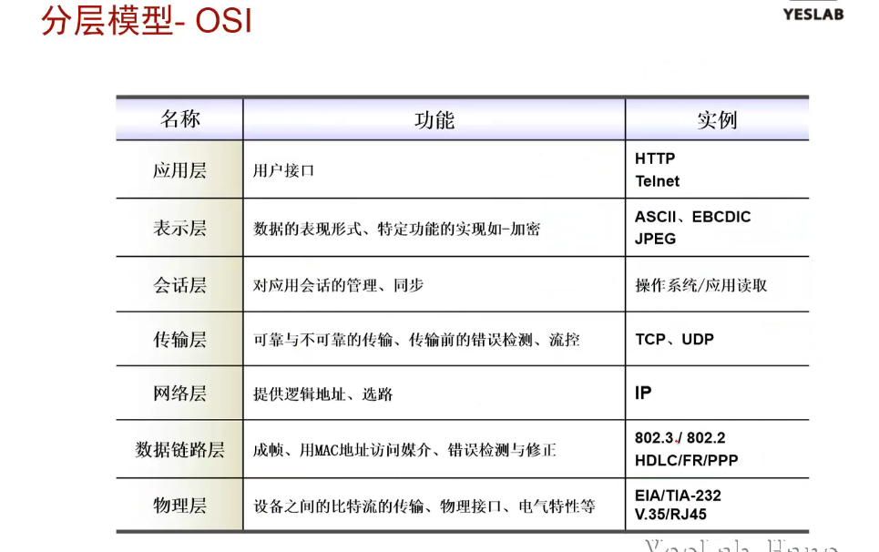

## 分层模型-TCP/IP

**Transmission Control Protocol/Internet Protocol，传输控制协议/网际协议**,是指能够在多个不同网络间实现信息传输的协议簇。TCP/IP协议不仅仅指的是[TCP](https://baike.baidu.com/item/TCP/33012) 和[IP](https://baike.baidu.com/item/IP/224599)两个协议，而是指一个由[FTP](https://baike.baidu.com/item/FTP/13839)、[SMTP](https://baike.baidu.com/item/SMTP/175887)、TCP、[UDP](https://baike.baidu.com/item/UDP/571511)、IP等协议构成的协议簇， 只是因为在TCP/IP协议中TCP协议和IP协议最具代表性，所以被称为TCP/IP协议。

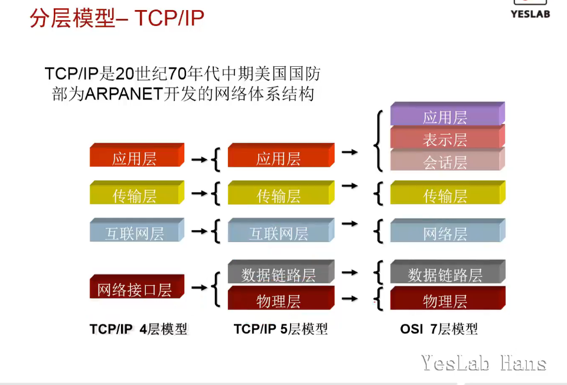

### 数据封装

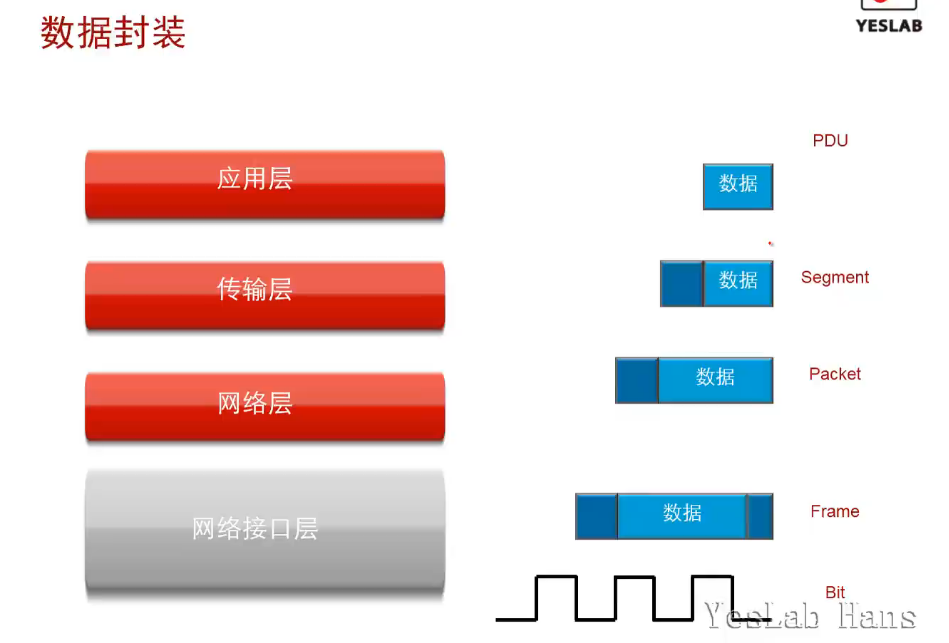

以太2：MAC 

802.3以太网：LLC+MAC

### 终端之间的通信

帧：Header+Data+trailer

- 数据链路层控制数据帧在物理链路上传输。

### 帧格式

<mark>Ethernet__II : Length/Type >=1536(0x0600)</mark> **正常传送数据**

<mark>IEEE 802.3 : Length/Type <= 1500(0x5DC)</mark>  **协议STP等**

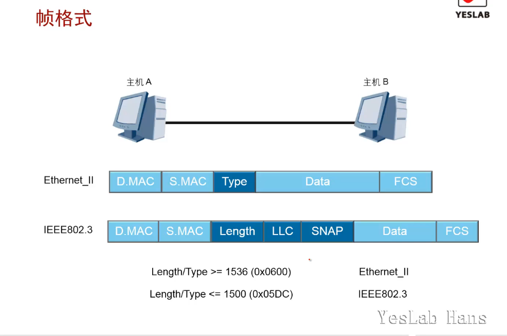

#### Ethernet_II 帧格式

- Ethernet_II 帧类型(Type)值 >= 1536 (0x0600)

- 以太网数据帧的长度在 64-1518字节之间

TYPE值:
    1. IP  0x0800 (2048)
    2.  ARP 0x0806 (2054)

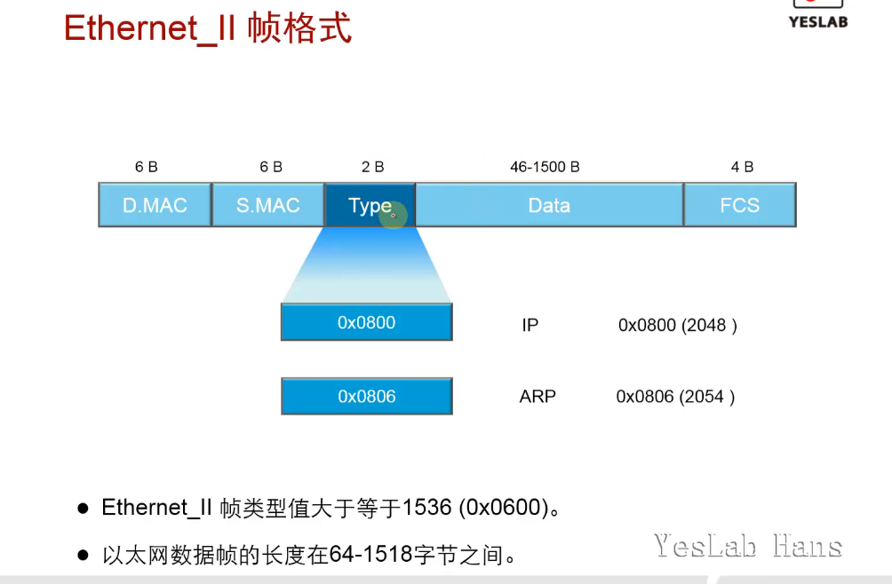

#### 以太网的最大包长和最小包长

- 最大包长1518Byte,其中2层数据链路包头和包尾的帧校验和FCS共计18Byte，3层数据1500Byte(称为MTU)，只是一个规定

- 最小包长 64Byte

原因：如果主机A发送的帧Frame很小，很快完成帧的发送，而两台冲突主机相距很远。在主机A发送的帧传输到主机B的前一刻，B开始发送帧。这样，当A的帧到达B时，B检测到冲突，于是发送冲突信号，假如在B的冲突信号到达A之前，A的帧已经发送完毕，那么A将检测不到冲突而误认为已经发送成功，因此必须有最小包长的限制。

#### IEEE 802.3 帧格式

- IEEE 802.3 帧长度(Length)字段值 <= 1500 (0x05dc)

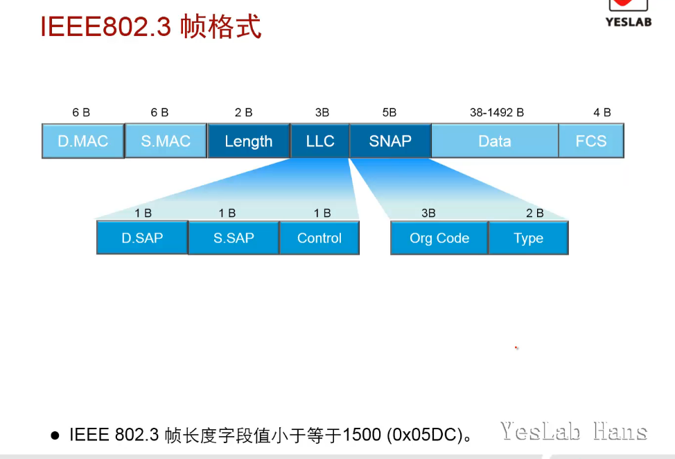

### 数据帧传输

- 数据链路层基于MAC地址进行帧的传输

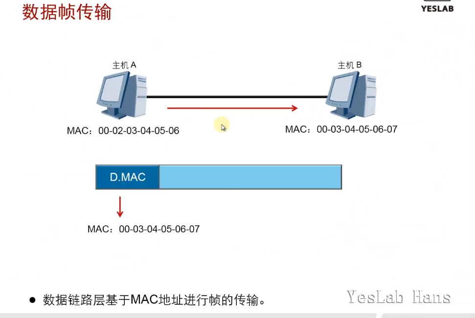

### 以太网的MAC地址

- MAC地址由2部分组成，分别是供应商代码和序列号。其中前24位代表该供应商代码，由IEEE管理和分配。剩下的24位序列号由供应商自己分配。

**OUI：组织唯一标识符(OUI，Organizationally Unique Identifier)由IEEE统一分配给设备制造商**

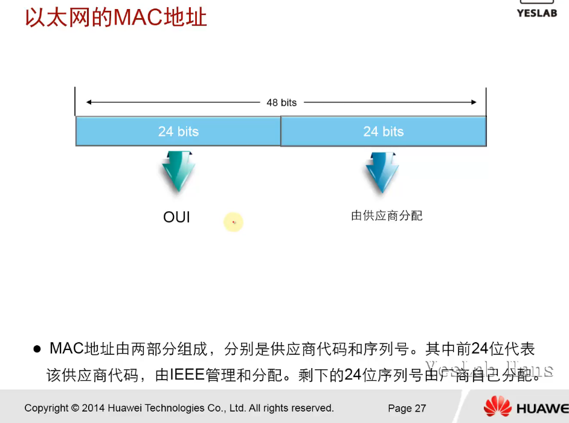

#### 单播

- 单播是主机间一对一的通讯模式，网络中的设备根据网络报文中包含的目的地址选择传输路径，将单播报文传送到指定的目的地，只对接收到的数据进行转发，不会进行复制。它能够针对每台主机及时的响应，现在的网页浏览全部都是采用单播模式

- <mark>单播MAC地址：从左至右数，第8的bit位为0</mark>

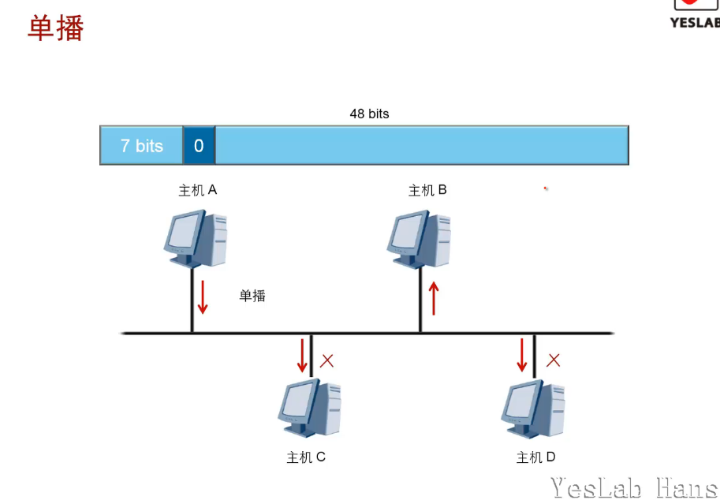

#### 广播

- 广播是主机间一对所有的通讯模式，设备会将报文发送到网络中的所有可能接收者。设备简单地将它收到的任何广播报文都复制并转发到除该报文到达的接口外的每个接口。广播处理流程简单，不用选择路径。

- <mark>广播MAC地址：全部48位为1，组播的特殊形式</mark>

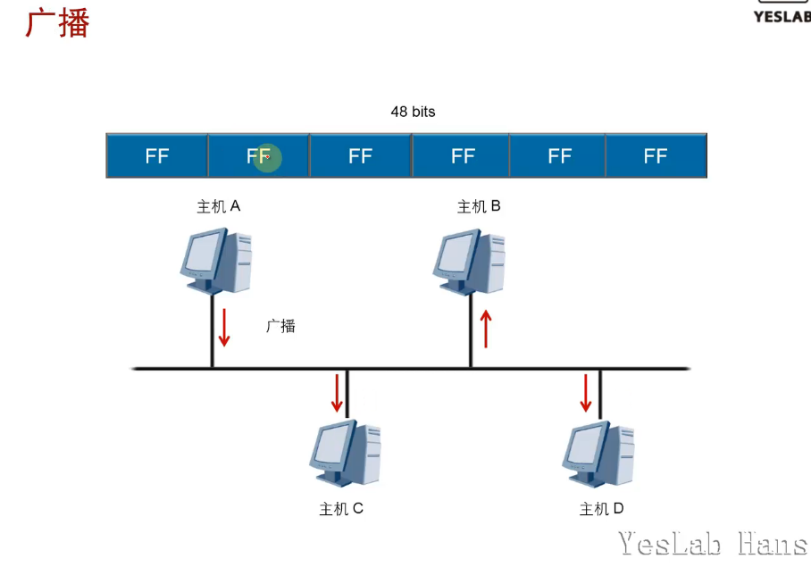

#### 组播/多播

- 组播是主机间一对多的通讯模式， 
  组播是一种允许一个或多个组播源发送同一报文到多个接收者的技术。组播源将一份报文发送到特定的组播地址，组播地址不同于单播地址，它并不属于特定某个主机，而是属于一组主机。一个组播地址表示一个群组，需要接收组播报文的接收者都加入这个群组。

- <mark>组播MAC地址：从左至右数，第8的bit位为1</mark>

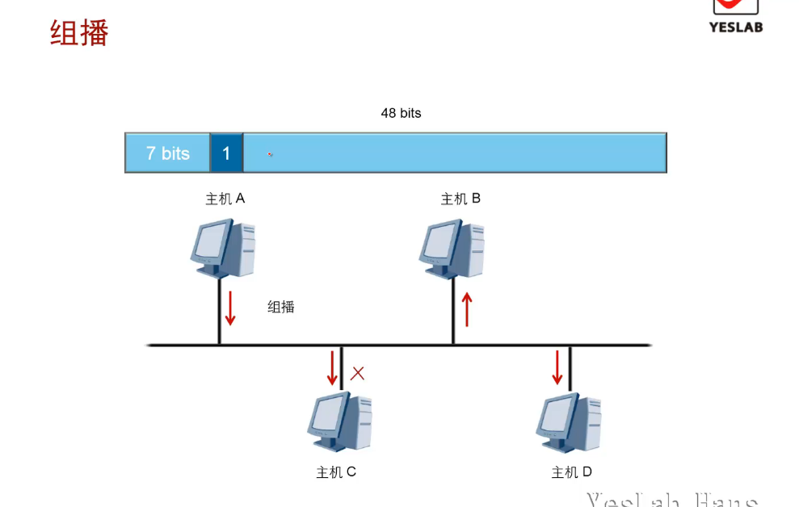

#### 数据帧的发送与接收

- 当主机接收到的数据帧(frame)所包含的目的MAC地址是自己时，会把以太网封装(Ethernet_II/IEEE 802.3 Ethernet)(frame header帧头,tailer帧尾)剥掉，然后送往上层协议。否则抛弃该数据帧

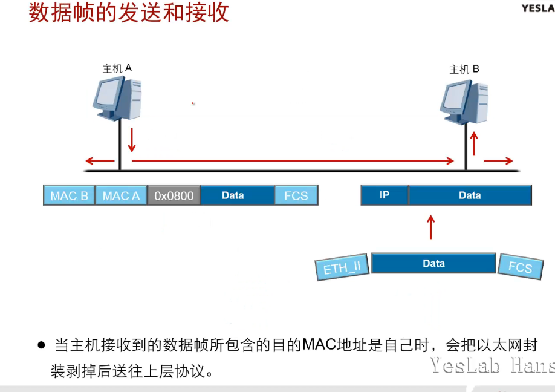

## 总结

- 网络设备如何确定以太网数据帧的上层协议？

以太网帧中包含一个type字段，表示帧中数据应该发送到上层哪个协议处理。比如，IP协议对应的Type值为0x0800，ARP协议对应的Type值为0x0806

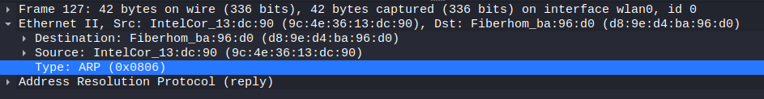

- 终端设备接收到数据帧时，会如何处理？

主机检查帧头中的目的MAC地址,如果目的MAC地址不是本机MAC 地址,也不是本机侦听的组播或广播MAC地址,则主机会丢弃收到的帧。如果目的MAC地址是本机MAC地址,则接收该帧,检查帧校验序列(FCS)字段,并与本机计算的值对比来确定帧在传输过程中是否保持了完整性。如果检查通过,就会剥离帧头和帧尾,然后根据帧头中的Type字段来决定把数据发送到哪个上层协议进行后续处理。
