# IP编址

网络层位于数据链路层与传输层之间。网络层中包含了许多协议，其中最为重要的协议就是IP协议，网络层提供了IP路由功能。理解IP路由除了要熟悉IP协议的工作机制之外，还必须理解IP编址以及如何合理地使用IP地址来设计网络。

## 学习目标

- 掌握IP报文的结构

- 掌握公有IP地址、私有IP地址以及特殊IP地址的范围

- 掌握VLSM技术

- 理解网关的作用

## IP协议类型

在Frame中的Type字段值为0x0800事表示该帧的网络层协议为IP协议

## IP报文头部

- Version:    ip协议的版本号，ipv4,ipv6,ipv5

- Header_Length:ip报文头部长度 20Bytes-60Bytes

- DS_Field: 差分服务域，部署QoS，为流量提供差分的服务

- Total_Length:头部+有效载荷的总长度

- Identification:分片重组，唯一地标识主机发送的每个数据包

- Flags:分片重组，标志，控制分片,是否要分片，后边还有没有更多的分片

- Fragment_offset:分片重组,分片的偏移量

- Time_to_Live:ttl,防止环路，每经过一个路由器，ttl值减一

- Protocol:上层的协议，tcp(6),udp(17),icmp(1)ospf

- Header_checksum:校验ip头部是否完整，正确

- Source_IP_Address:发送数据的终端的ip

- Destination_IP_Address:目的地终端的ip

- IP_Options:ip选项

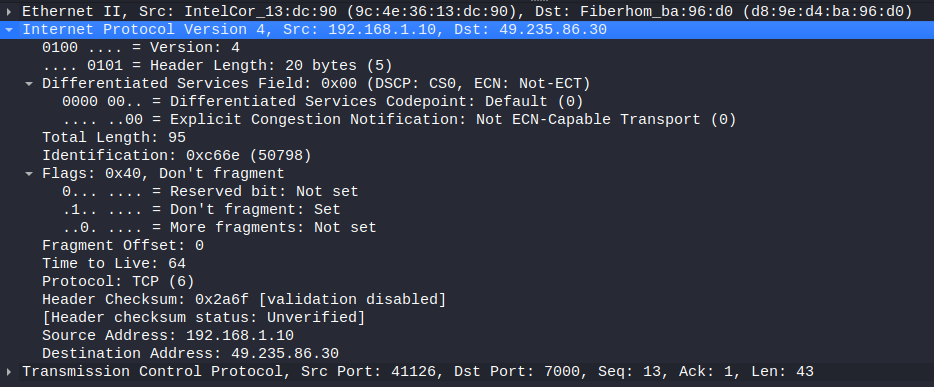

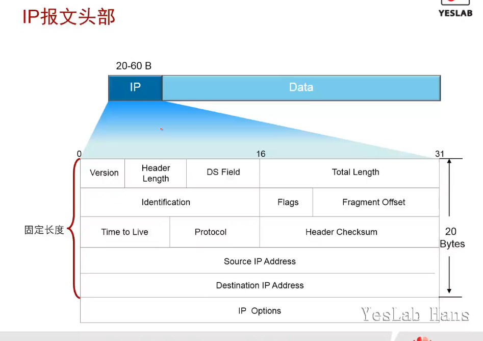

## IP编址

- IP地址分为<mark>网络部分</mark>和<mark>主机部分</mark>

- IP地址由<mark>32个二进制位</mark>组成，通常使用<mark>点分十进制形式表示</mark>

- 主机位全为0时，表示网络地址

- 主机位全为1时，表示广播地址

- 网络地址和广播地址不能给终端配置使用,网段有效ip地址数=总ip数-2

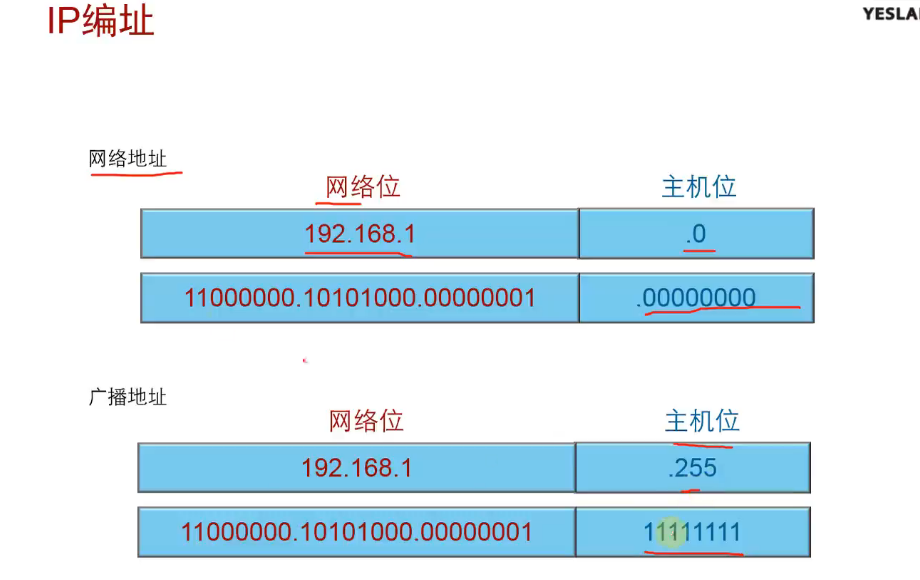

### IP地址分类

> IANA 就是指(Internet Assigned Numbers Authority) 互联网数字分配机构
> Internet号分配的机构。负责对IP地址分配规划以及对TCP/UDP公共服务的端口定义。国际互联网代理成员管理局（IANA）是在国际互联网中使用的IP
>  地址、域名和许多其它参数的管理机构。IP地址、自治系统成员以及许多顶级和二级域名分配的日常职责由国际互联网注册中心（IR）和地区注册中心承担。

- 单播：A类，B类，C类

- 组播：D类

- 科研：E类

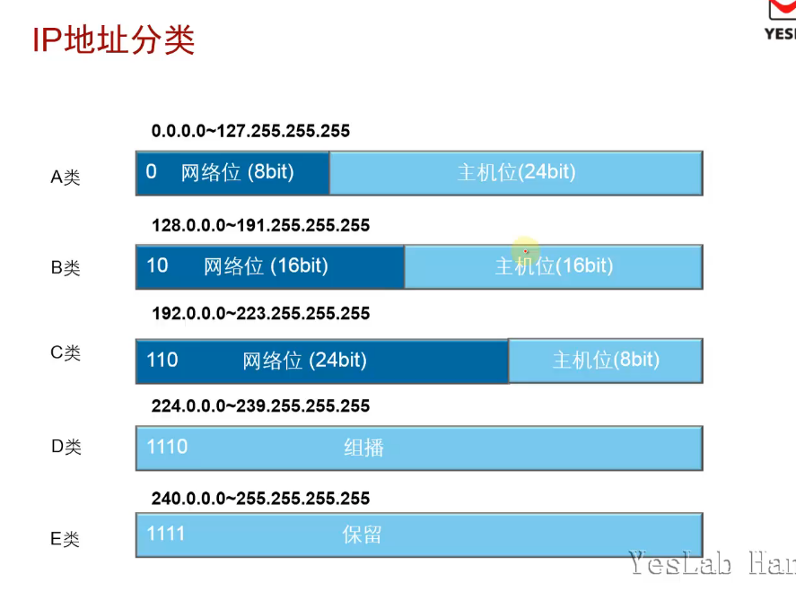

### IP地址类型

- 私有地址范围
  
  - 10.0.0.0 ~10.255.255.255 <mark>10.0.0.0/8</mark>
  - 172.16.0.0~172.31.255.255 <mark>172.16.0.0/12</mark>
  - 192.168.0.0~192.168.255.255 <mark>192.168.0.0/16</mark>

- 特殊地址
  
  - 127.0.0.0~127.255.255.255 测试本机TCP/IP协议栈，<mark>用环回口测试</mark>
  - 0.0.0.0 未指定地址，<mark>任意主机</mark>
  - 255.255.255.255 所有网络的广播，<mark>广播地址</mark>
  - 169.254.0.0～169.254.255.255,<mark></mark>

### 网络通信

相同网络，通过子网掩码识别

### 子网掩码

> 子网掩码是一个32位地址，是与IP地址结合使用的一种技术。它的主要作用有两个，一是用于屏蔽IP地址的一部分以区别网络标识和[主机](https://baike.baidu.com/item/%E4%B8%BB%E6%9C%BA)标识，并说明该IP地址是在[局域网](https://baike.baidu.com/item/%E5%B1%80%E5%9F%9F%E7%BD%91)上，还是在远程网上。二是用于将一个大的IP网络划分为若干小的子网络。
> 
> 使用子网是为了减少IP的浪费。因为随着[互联网](https://baike.baidu.com/item/%E4%BA%92%E8%81%94%E7%BD%91)的发展，越来越多的网络产生，有的网络多则几百台，有的只有区区几台，这样就浪费了很多IP地址，所以要划分子网。使用子网可以提高网络应用的效率。
> 
> 通过计算机的子网掩码判断两台计算机是否属于同一网段的方法是，将计算机十进制的IP地址和子网掩码转换为二进制的形式，然后进行二进制“与”(AND)计算（全1则得1，不全1则得0），如果得出的结果是相同的，那么这两台计算机就属于同一网段。

### 地址规划

- 根据给出的IP地址和子网掩码，计算出该网络中包含的主机数和可哟个主机地址的数量

子网掩码中网络位长度为n,主机位长度为m=32-n

则该网络中包含的主机数=2m

可用主机数=2m-2

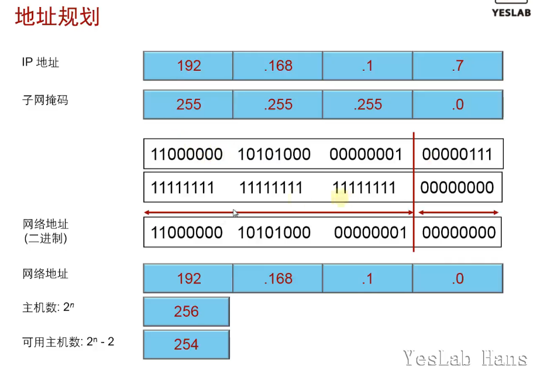

### 有类IP编址的缺陷

- 在设计网络时使用有类IP地址会造成地址的浪费

## 变长子网掩码VLSM

- VLSM(Variable Length Subnetwork Mask)的出现是打破传统的以类(Class)为标准的地址划分方法，可以更加有效的利用IP地址

- 正面作用：节约IP地址空间

- 负面作用：增加了路由表的大小

- 注意事项：使用VLSM时，所采用的路由协议必须能够支持它，这些路由协议包括RIPv2,OSPF,BGP.

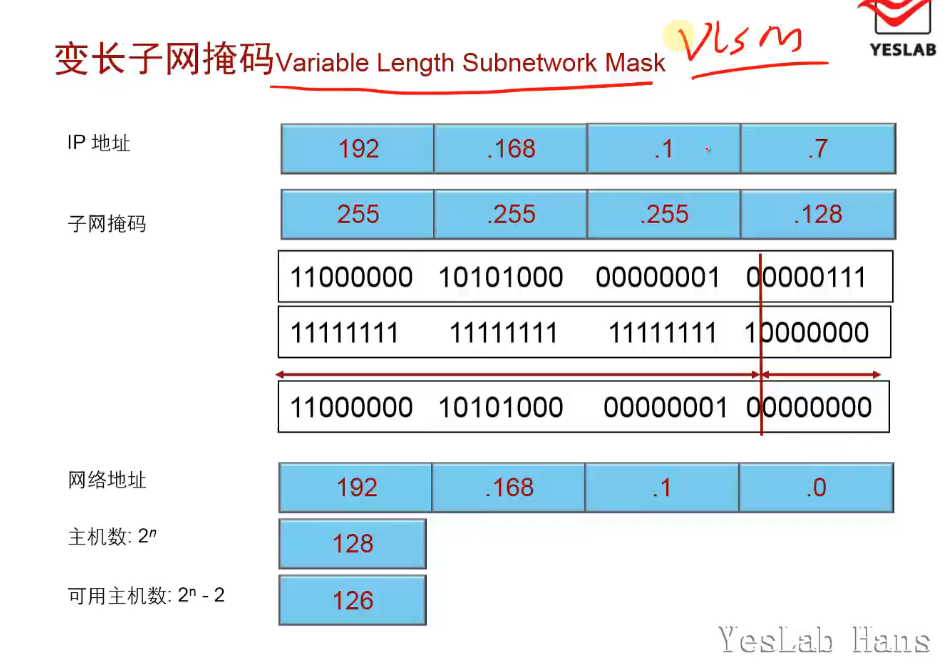

### 子网划分

- 核心思想

借用主机位来制造新的网络

- 好处
  
  - 缩减网络流量
  
  - 优化网络性能
  
  - 简化管理
  
  - 更为灵活地形成大覆盖范围的网络
  
  <mark>最本质的作用，合理分配IP地址</mark>

### 子网划分方法

1. <mark>根据需要的子网数目来确定子网位数</mark>，但是要确保每个子网可用的IP地址数目大于等于主机数
   
   优点：简单
   
   缺点：每个子网的实际主机数不同，但是分配的IP地址数目相同，可能浪费IP地址

2. <mark>根据每个子网的主机数目来确定主机位数，然后确定子网位数</mark>
   
   优点：比较充分的利用IP地址
   
   缺点：复杂

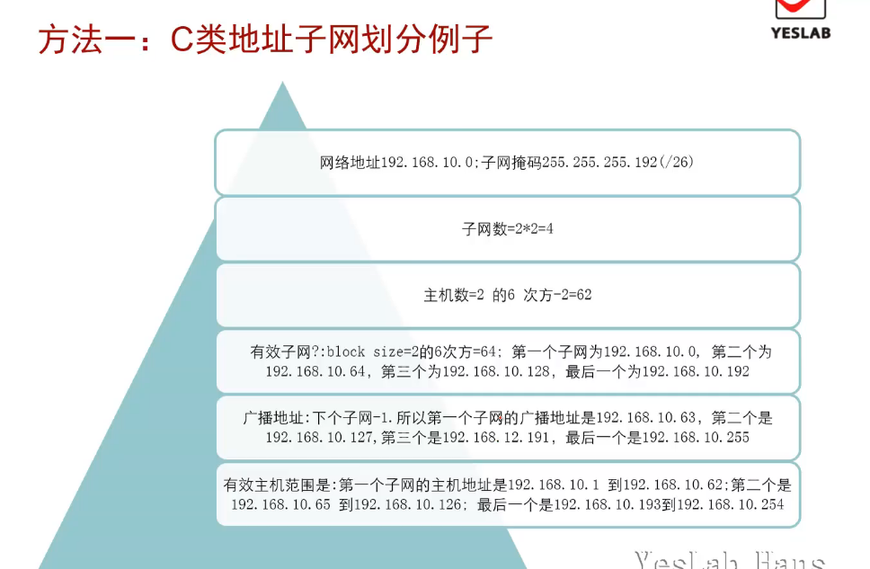

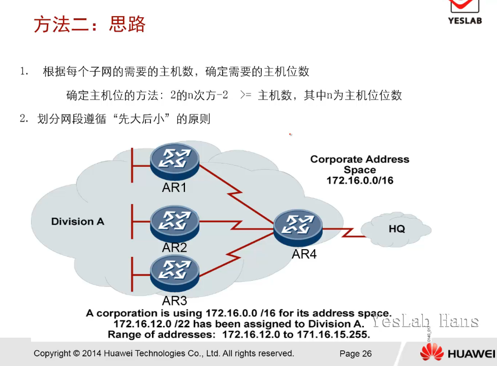

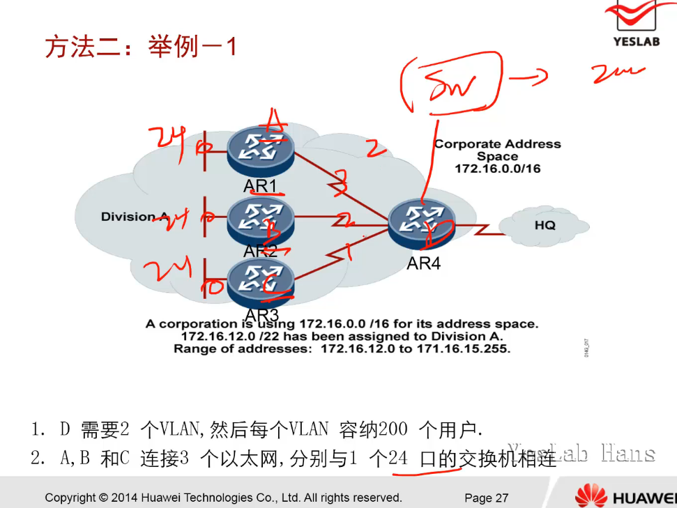

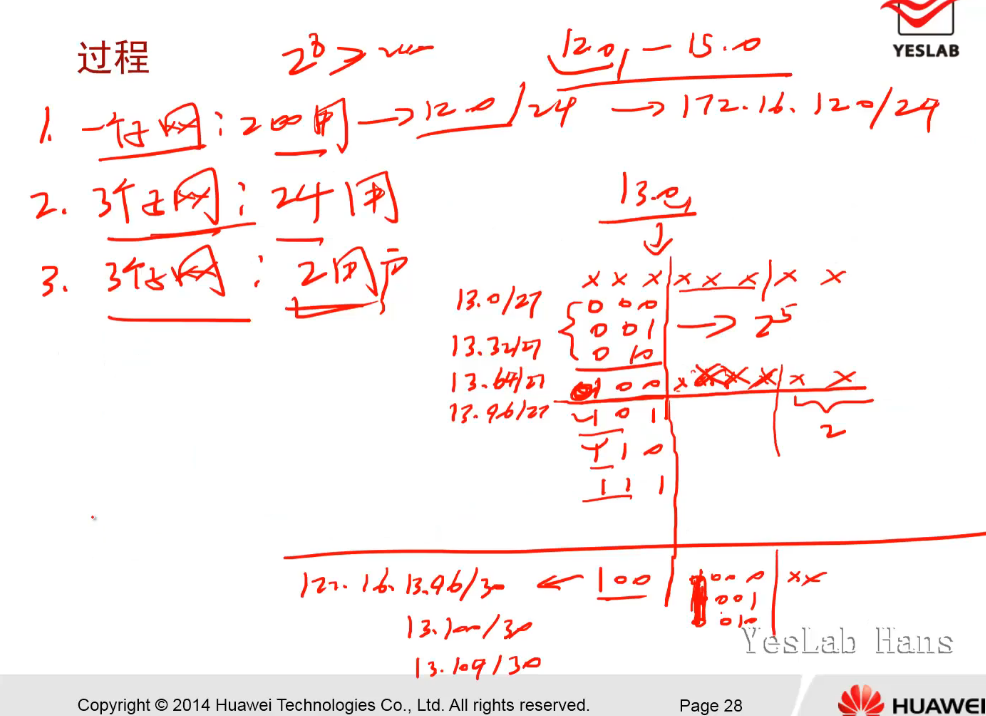

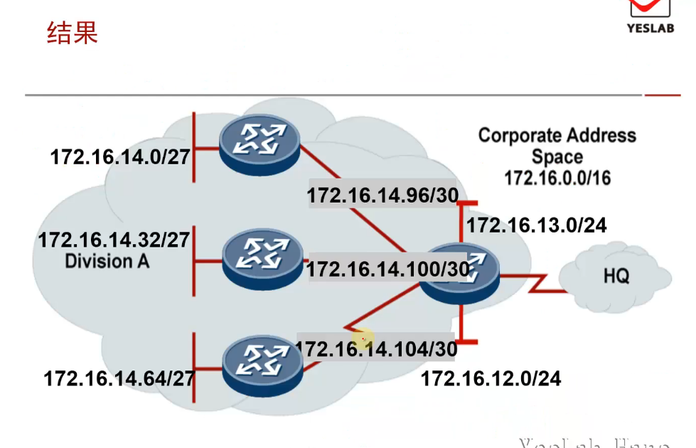

## 无类域间路由CIDR

- CIDR(Classless Inter-Domain Routing)无类域间路由增加了网络的可扩展性。

- 无类域间路由可以将路由集中起来，在路由表中更灵活地定义地址。它不区分 A 类、B 类、C 类地址，而是使用 CIDR 前缀的值指定地址中作为网络 ID 的位数。

### CIDR与VLSM的区别：

　　CIDR是把几个标准网络合成一个大的网络

　　VLSM是把一个标准网络分成几个小型网络(子网)

　<mark>　CIDR是子网掩码往左边移了，VLSM是子网掩码往右边移了</mark>

### CIDR汇总与路由汇总的区别

路由汇总与CIDR汇总的区别：路由汇总还有类的概念，汇总后的掩码长度必须要大于或等于主类网络的掩码长度；CIDR是无类域间路由，网络地址一致就能进行CIDR汇总。

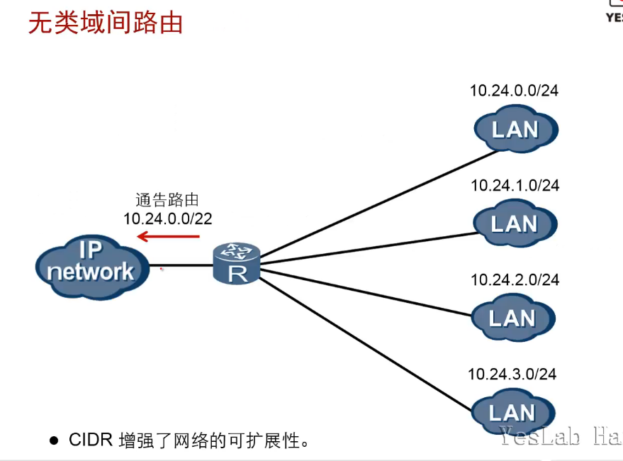

### CIDR计算方法

- 十进制转换为二进制

- 从左往右相同的进行汇总

- 精细汇总，路由黑洞，丢包

- [路由黑洞与黑洞路由简介](https://www.cnblogs.com/yyxianren/p/10790560.html)

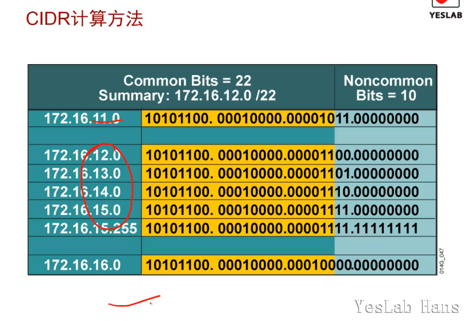

## 网关(Gateway)

- 网关用来转发来自不同网段之间的数据包。

- [网关与路由器的区别](https://zhuanlan.zhihu.com/p/140875172)

> 网关(Gateway)又称网间连接器、协议转换器。网关在传输层上以实现网络互连，是最复杂的网络互连设备，仅用于两个高层协议不同的网络互连。网关的结构也和路由器类似，不同的是互连层。网关既可以用于广域网互连，也可以用于局域网互连。
> 
> 网关是一种充当转换重任的计算机系统或设备。在使用不同的通信协议、数据格式或语言，甚至体系结构完全不同的两种系统之间，网关是一个翻译器。与网桥只是简单地传达信息不同，网关对收到的信息要重新打包，以适应目的系统的需求。同时，网关也可以提供过滤和安全功能。大多数网关运行在OSI
>  7层协议的顶层--应用层

## 总结

- 子网掩码的作用是什么？
1. 屏蔽部分IP地址，<mark>区分网络位和主机位</mark>，解释IP地址是在本地局域网上还是在远程网络上

2. <mark>将一个大的IP网络划分为几个小的子网络</mark>

3. <mark>可以减少IP浪费</mark>
- IP报文头部中TTL字段的作用是什么？

如果网络中存在环路，则IP报文可能会在网络中循环而无法到达目的端。TTL字段限定了IP报文的生存时间，保证无法到达目的端的报文最终被丢弃。

- 网关的作用是什么？

> 就是将两个使用不同协议的网络段连接在一起的设备。它的作用就是对两 个网络段中的使用不同传输协议的数据进行互相的翻译转换。  
> 网关是一种充当转换重任的计算机系统或设备。在使用不同的通信协议、数据格式或语言，甚至体系结构完全不同的两种系统之间，网关是一个翻译器。与网桥只是简单地传达信息不同，网关对收到的信息要重新打包，以适应目的系统的需求。同时，网关也可以提供过滤和安全功能。大多数网关运行在OSI
>  7层协议的顶层->应用层
