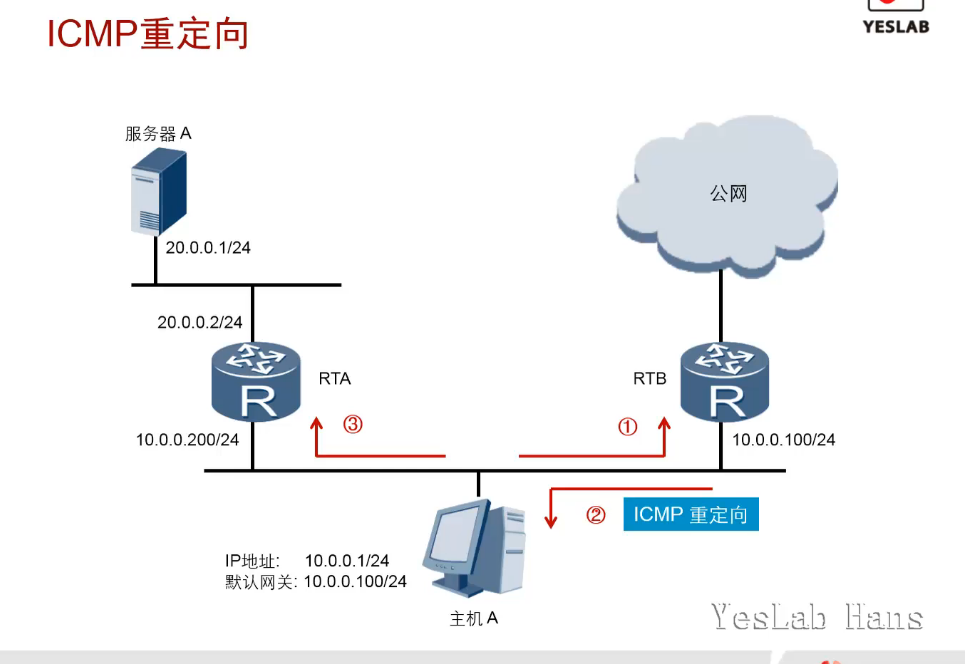
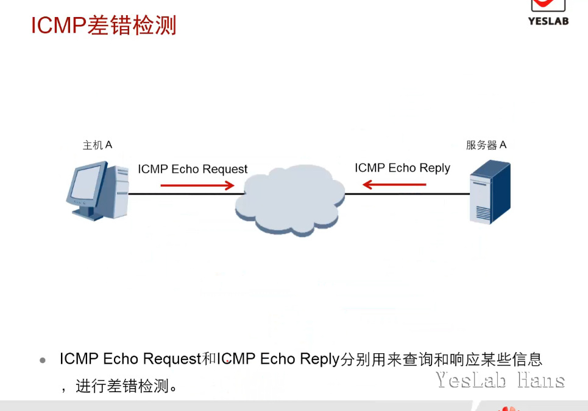
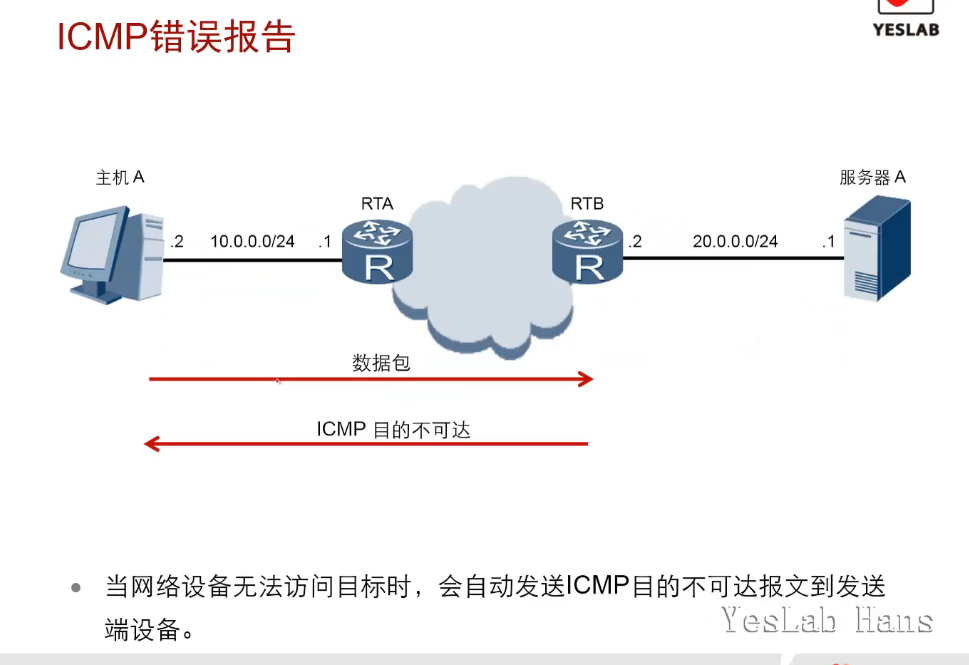
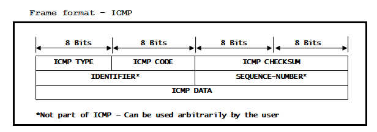
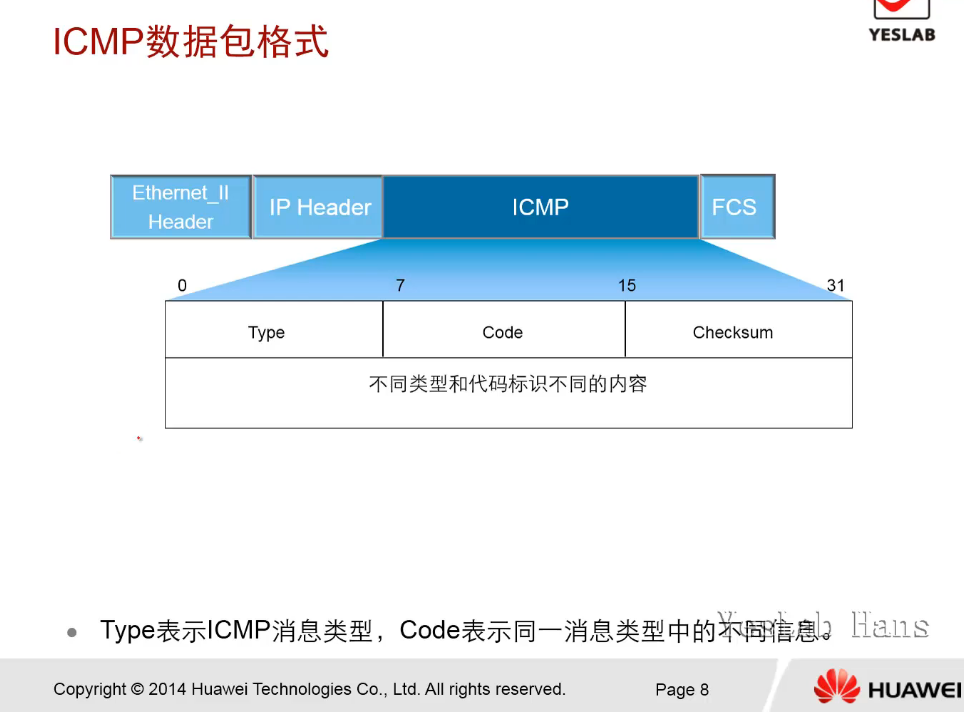
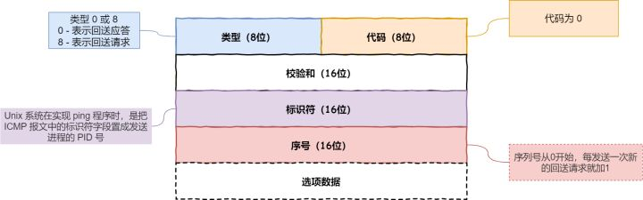
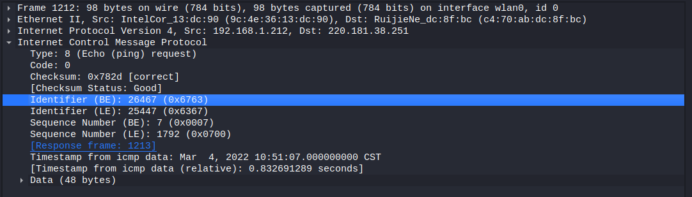
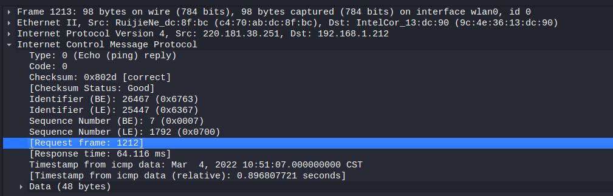
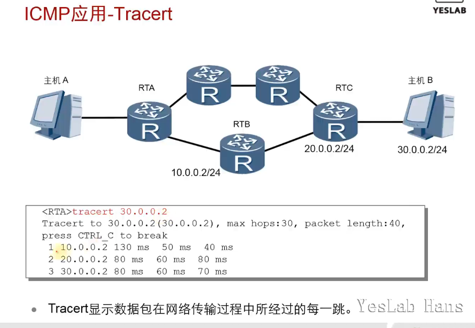

# ICMP协议详解

ICMP(Internet Control Mesage Protocol)网络控制消息协议

它是TCP/IP协议簇的一个子协议，用于在IP主机、路由器之间传递控制消息。控制消息是指网络通不通、主机是否可达、路由是否可用等网络本身的消息。这些控制消息虽然并不传输用户数据，但是对于用户数据的传递起着重要的作用。

## 学习目标

- 描述ICMP的应用场景

- 理解常见的ICMP报文类型

- 掌握Ping和Tracert的应用

## ICMP

- ICMP用来传递 <mark>差错</mark>、<mark>控制</mark>  、<mark>查询</mark>等信息。

### ICMP重定向(控制消息)

- 路径的优选

- 根据目的，进行重定向

- 安全问题，ICMP重定向攻击

- eNSP实验？？？



### ICMP差错检测

- ICMP Echo Request 和 ICMP Echo Reply 分别用来查询和相应某些信息，进行差错检测



### ICMP错误报告

- 当网络设备无法访问目标时，会自动发送ICMP目的不可达报文到发送端设备

**[ICMP差错报告报文](https://blog.csdn.net/qq_35733751/article/details/80053091)**



### ICMP数据包格式

- Type表示ICMP消息类型，Code表示同一消息类型中的不同信息





### ICMP消息类型和编码类型

#### 常用：

- **0,0,Echo reply**

- **3,(0,1,2,3),(网络,主机,协议,端口)不可达**
  
  - 网络不可达，没有路由
  
  - 主机不可达，有路由，找不到主机
  
  - 协议不可达，主机在线，协议未运行，找不到对应协议http,ftp,telnet
  
  - 端口不可达，远程端口关闭，拒绝连接

- **5,0,重定向**

- **8,0,echo request**

- **11,0,ttl超时(路由器回复的报文)**

- **11,1,ttl超时(主机回复的报文)在规定的时间内，目的主机没有收到所有的数据分片(fragment)**

| 类型TYPE | 代码CODE | 用途\|描述 Description                                                   | 查询类Query | 差错类Error |
| ------ | ------ | -------------------------------------------------------------------- | -------- | -------- |
| 0      | 0      | Echo Reply——回显应答（Ping应答）                                             | x        |          |
| 3      | 0      | Network Unreachable——网络不可达                                           |          | x        |
| 3      | 1      | Host Unreachable——主机不可达                                              |          | x        |
| 3      | 2      | Protocol Unreachable——协议不可达                                          |          | x        |
| 3      | 3      | Port Unreachable——端口不可达                                              |          | x        |
| 3      | 4      | Fragmentation needed but no frag. bit set——需要进行分片但设置不分片比特            |          | x        |
| 3      | 5      | Source routing failed——源站选路失败                                        |          | x        |
| 3      | 6      | Destination network unknown——目的网络未知                                  |          | x        |
| 3      | 7      | Destination host unknown——目的主机未知                                     |          | x        |
| 3      | 8      | Source host isolated (obsolete)——源主机被隔离（作废不用）                        |          | x        |
| 3      | 9      | Destination network administratively prohibited——目的网络被强制禁止           |          | x        |
| 3      | 10     | Destination host administratively prohibited——目的主机被强制禁止              |          | x        |
| 3      | 11     | Network unreachable for TOS——由于服务类型TOS，网络不可达                         |          | x        |
| 3      | 12     | Host unreachable for TOS——由于服务类型TOS，主机不可达                            |          | x        |
| 3      | 13     | Communication administratively prohibited by filtering——由于过滤，通信被强制禁止 |          | x        |
| 3      | 14     | Host precedence violation——主机越权                                      |          | x        |
| 3      | 15     | Precedence cutoff in effect——优先中止生效                                  |          | x        |
| 4      | 0      | Source quench——源端被关闭（基本流控制）                                          |          |          |
| 5      | 0      | Redirect for network——对网络重定向                                         |          |          |
| 5      | 1      | Redirect for host——对主机重定向                                            |          |          |
| 5      | 2      | Redirect for TOS and network——对服务类型和网络重定向                            |          |          |
| 5      | 3      | Redirect for TOS and host——对服务类型和主机重定向                               |          |          |
| 8      | 0      | Echo request——回显请求（Ping请求）                                           | x        |          |
| 9      | 0      | Router advertisement——路由器通告                                          |          |          |
| 10     | 0      | Route solicitation——路由器请求                                            |          |          |
| 11     | 0      | TTL equals 0 during transit——传输期间生存时间为0                              |          | x        |
| 11     | 1      | TTL equals 0 during reassembly——在数据报组装期间生存时间为0                       |          | x        |
| 12     | 0      | IP header bad (catchall error)——坏的IP首部（包括各种差错）                       |          | x        |
| 12     | 1      | Required options missing——缺少必需的选项                                    |          | x        |
| 13     | 0      | Timestamp request (obsolete)——时间戳请求（作废不用）                            | x        |          |
| 14     |        | Timestamp reply (obsolete)——时间戳应答（作废不用）                              | x        |          |
| 15     | 0      | Information request (obsolete)——信息请求（作废不用）                           | x        |          |
| 16     | 0      | Information reply (obsolete)——信息应答（作废不用）                             | x        |          |
| 17     | 0      | Address mask request——地址掩码请求                                         | x        |          |
| 18     | 0      | Address mask reply——地址掩码应答                                           |          |          |

## ICMP应用-Ping

- 标识符(Identifier)：用于区分是哪个应用程序发ICMP包，比如用进程PID作为标识符

- 序号(Sequence)：序列号从0开始，每发送一次新的回显请求就会加1,可以用来确认网络包是否有丢失







- **ping常用选项**

```shell
ping -a src_ip -c count -h ttl -t timeout dest_ip
```

- **使用`command + ？`  查看命令帮助**

#### ping全部选项

```shell
<AR1>ping ?
  STRING<1-255>  IP address or hostname of a remote system
  -a             Select source IP address, the default is the IP address of the 
                 output interface
  -c             Specify the number of echo requests to be sent, the default is 
                 5
  -d             Specify the SO_DEBUG option on the socket being used
  -f             Set Don't Fragment flag in packet (IPv4-only)
  -h             Specify TTL value for echo requests to be sent, the default is 
                 255
  -i             Select the interface sending packets
  -m             Time in milliseconds to wait for sending next packet, the      
                 default is 500ms
  -n             Numeric output only. No attempt will be made to lookup host    
                 addresses for symbolic names
  -name          Display the host name of the destination address
  -p             No more than 8 (pad) hexadecimal characters to fill out the    
                 sent packet. For example -p f2 will fill the sent packet with f
                 and 2 repeatedly
  -q             Quiet output. Nothing is displayed except the summary lines at 
                 startup time and when finished
  -r             Record route. Includes the RECORD_ROUTE option in the          
                 ECHO_REQUEST packet and displays the route
  -s             Specify the number of data bytes to be sent, the default is    
                 56bytes
  -si            Set the specified interface as the source interface of ping    
                 packet
  -system-time   Display the sending time of echo request packets
  -t             Timeout in milliseconds to wait for each reply, the default is 
                 2000ms
  -tos           Specify TOS value for echo requests to be sent, the default is 
                 0
  -v             Verbose output. ICMP packets other than ECHO_RESPONSE those are
                 received are listed
  -vpn-instance  Specify VPN-Instance of MPLS VPN
  ignore-mtu     Send packets without checking the interface MTU
  ip             IP Protocol
  ipv6           IPv6 protocol
  lsp            LSP Ping
  multicast      Multicast ping
  vc             PWE3 Ping
```

## ICMP应用-Tracert

- tracert
  
  - 发送 icmp echo request
  - windows主机上的命令

- traceroute
  
  - 发送 udp
  - linux系统中的命令

- [Tracert的工作原理](https://cn.bluehost.com/blog/bluehost-using-the-tutorial/2666.html)

- 功能：探究从源到目的的路径

- Tracert 显示数据包在网络传输过程中所经过的每一跳

```shell
tracert dest_ip
```



#### tracert全部选项

```shell
<AR1>tracert ?
  STRING<1-255>  IP addres or hostname of a remote system
  -a             Set source IP address, the default is the IP address of the    
                 output interface
  -f             First time to live, the default is 1
  -m             Max time to live, the default is 30
  -name          Display the host name of the router on each hop
  -p             Destination UDP port number, the default is 33434
  -q             Number of probe packet, the default is 3
  -s             
  -v             Display the MPLS label information carried in the ICMP Time    
                 Exceed message. By default, it is only to display the path     
                 information carried in the ICMP Time Exceed message and ICMP   
                 Port Unreachable message without MPLS label information
  -vpn-instance  Specify VPN-Instance of MPLS VPN
  -w             Timeout in milliseconds to wait for each reply, the default is 
                 5000ms
  ipv6           IPv6 Protocol
  lsp            LSP traceroute
  vc             PWE3 traceroute
```

## 总结

- Ping使用到的是哪两类ICMP消息？

echo request

echo reply

Ping利用ICMP Echo请求消息（Type值为8）来发起检测目的可达性。目的端收到ICMP Echo请求消息后，根据IP报文头中的源地址向源端发送ICMP Echo回复消息（Type值为0）。

- 当网络设备收到TTL值为0的IP报文时，会如何操作？

如果IP数据包在到达目的地之前TTL值已经降为0，则收到IP数据包的网络设备会丢弃该数据包，并向源端发送ICMP消息通知源端TTL超时。
