# ARP协议

网络设备有数据要发送给另一台网络设备时，必须要知道对方的网络层地址(IP地址)。IP地址由网络层来提供，但是仅有IP地址是不够的，IP数据报文(Packet)必须封装成帧(Frame)才能通过数据链路进行发送。Frame必须要包含目的MAC地址，因此发送端还必须要获取到目的MAC地址。**通过目的IP地址而获取目的MAC地址的过程是由ARP(Address Resolution Protocol)地址解析协议实现的**

## 学习目标

- 掌握ARP的工作原理

- 理解ARP缓存表的作用

## ARP

- 数据链路层在进行数据封装时，需要目的MAC地址

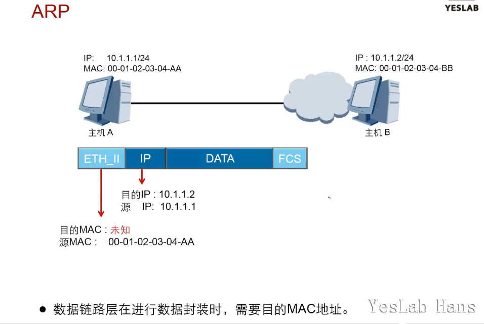

### ARP数据包格式

- ARP报文不能穿越路由器，不能被转发到其他广播域

- ARP报文被以**二层广播的方式发送出去**，<mark>以太头中的目的mac地址为全f</mark>

- ARP报文总长度为28Bytes

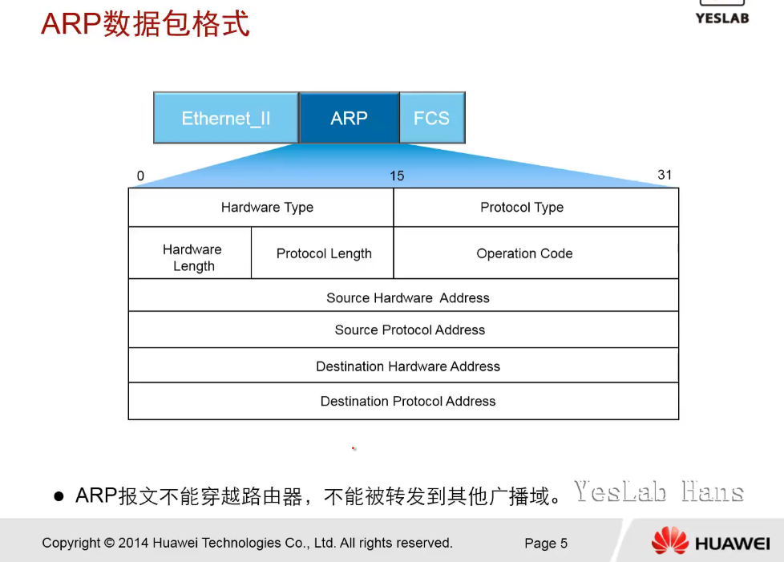

#### 字段解释

- HardwareType(2Bytes):硬件类型，指明了发送方想知道的硬件接口类型，ethernet以太网值为1

- ProtocolType(2):协议类型，表示要映射的协议地址类型，值为0x0800,表示IP地址

- HardwareLength(1):硬件地址长度，指出硬件地址的长度，以Byte为单位，对于以太网上IP地址的ARP请求或应答(request/reply)来说，值为6

- ProtocolLength(1):协议地址长度，指出该报文中协议地址的长度，值为4

- OperationCode(2):操作类型(arp_request==1,arp_reply==2,rarp_request==3,rarp_reply==4)

- SourceHardwareAddress(<mark>6</mark>):发送方设备的mac地址

- SourceProtocolAddress(4):发送方设备的IP地址

- DestinationHardwareAddress(<mark>6</mark>):接收方设备的MAC地址

- DestinationProtocolAddress(4):接收方设备的IP地址

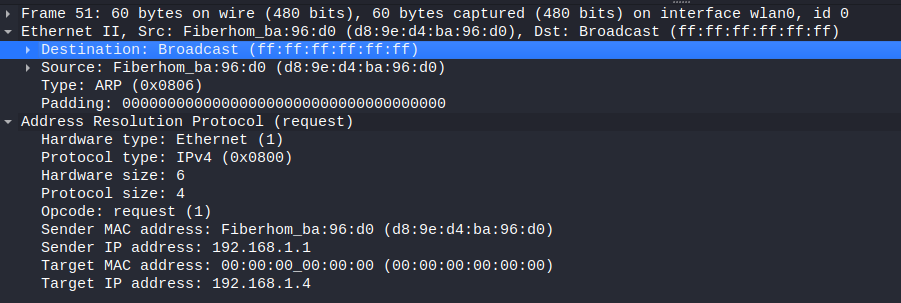

### ARP工作过程

- 主机A发送一个数据包给主机C之前，首先要获取主机C的MAC地址

#### ARP缓存

[ARP缓存表和MAC地址表](https://zhuanlan.zhihu.com/p/360574012)

- 使用`arp -a`查看本机的arp缓存表

- 超时时间，1200s

#### ARP请求

- 相同网段通信时，arp请求的mac地址就是目标设备ip的mac地址

- 不同网段通信时，arp请求的mac地址是发送端的网关ip的mac地址

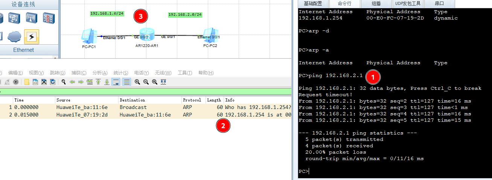

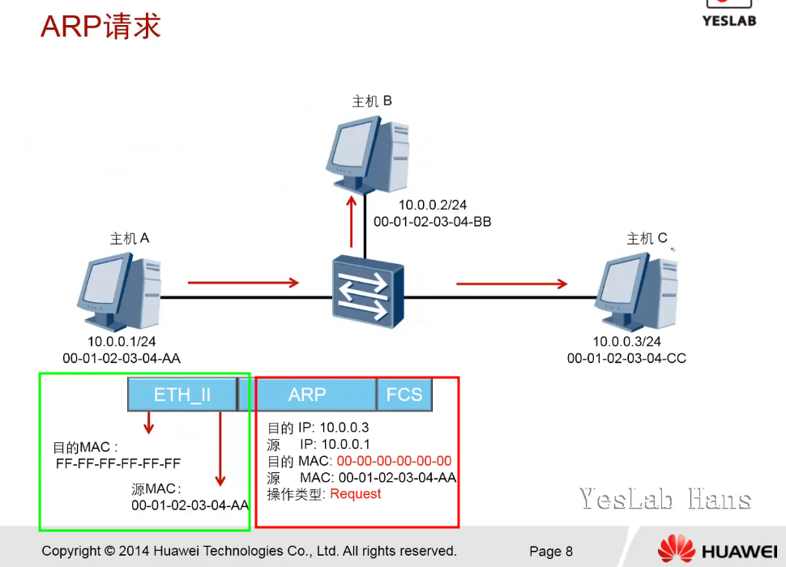

- hostA 执行 `ping 10.0.03`

- hostA一开始本机没有hostC的arp表项，2层广播发送arp request报文

- hostB和hostC收到来自hostA的arp request报文，得知hostA的arp映射，存入arp缓存表中

- hostB发现目的IP不是自己，丢弃该报文

- hostC匹配目的IP,返回arp repley报文 单播给hostA

- 只有hostA接收到hostC发送的arp reply报文，hostA将hostC的arp映射存入本机arp缓存

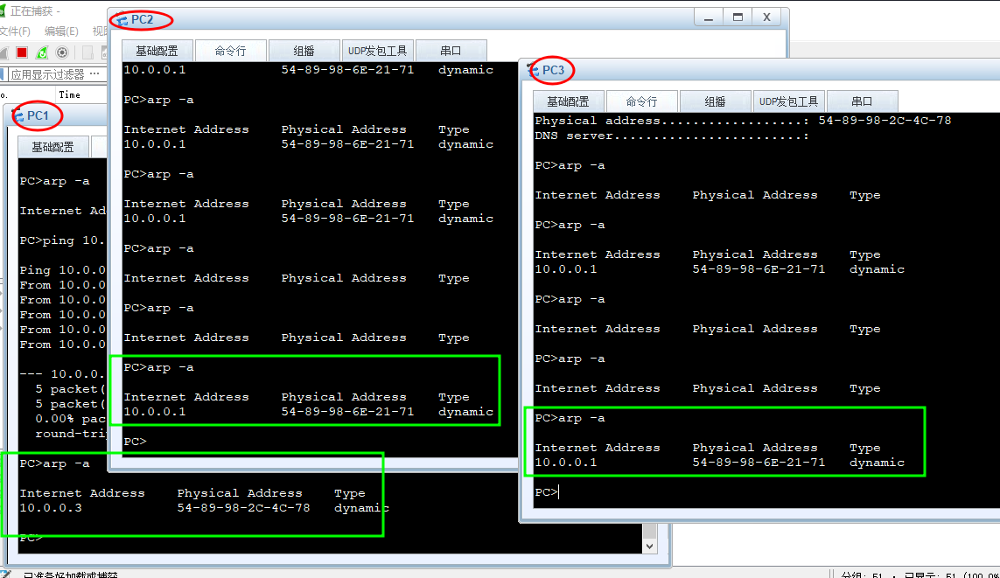

### 华为路由器上操作arp的命令

[官方文档](https://support.huawei.com/enterprise/zh/doc/EDOC1100033729/7430e643)

- 查看arp table
  
  - 任意视图下执行下列命令
    
    ```router
    <AR>display arp ?
    all           Display ARP entries or statistics of all slots
    anti-attack   Anti attack 
    brief         Brief information
    dynamic       Display dynamic ARP entry
    error         Error debugging functions
    flood         Send ARP request packets rate 
    interface     Specify interface
    ip-conflict   ARP conflict detect information
    learning      ARP learning
    network       Specify network number and mask
    packet        ARP packet
    static        Display static ARP entry
    statistics    Display statistics about arp entries
    track         Track
    vpn-instance  Specify VPN-Instance
    |             Matching output
    <cr>          Please press ENTER to execute command 
    ```

- 删除arp条目
  
  - 用户视图下执行下列命令
  
  - 用户也可以在系统视图下执行命令**undo arp static** *ip-address* [ *mac-address* ] [ **vpn-instance** *vpn-instance-name* | **vid** *vlan-id* [ **cevid** *ce-vid* ] **interface** *interface-type interface-number* ]，清除静态ARP表项。
  
  - ```router
    <AR>reset arp ?
      all          Reset static and dynamic ARP entry
      anti-attack  Anti attack 
      dynamic      Reset dynamic ARP entry
      flood        Send ARP request packets rate 
      interface    Reset ARP entry by interface
      packet       ARP packet
      static       Reset static ARP entry
    ```

### ARP代理(Proxy ARP)

- 位于不同网络的网络设备在不配置网关的情况下，能够通过ARP代理实现相互通信
- 提高第一跳路由器的冗余能力(PC1---SW--{AR1,AR2}--SW--PC2)
  - 一般不用ARP做冗余，而是使用VRRP,HSRP,堆叠等
  - [HSRP vs VRRP ](https://www.cnblogs.com/cheyunhua/p/8093236.html)
  - HSRP:(Hot Standby Router Protocol)-热备份路由协议，是cisco平台一种特有的技术，是cisco的私有协议。
  - VRRP:(Virtual Router Redundancy Protocol)-虚拟路由冗余协议，是国际标准，由IETF提出的解决局域网中配置静态网关出现单点失效现象的路由协议。
- arp代理工作原理
  - 路由器上只要有通往目的网段的路由，就会回复路由器接口的mac地址()即使没有目的主机,造成路由黑洞)
- arp-proxy缺陷
  - 主机上的arp表项过多
  - 增加某一网段上的ARP流量
  - 安全问题，比如ARP欺骗(spoofing)
  - 不能概括和推广网络拓扑
  - 不会为不使用arp来解析地址的网络工作
- 环境搭建
  - pc3和pc4不设置网关地址
  - pc3和pc4属于同一网段
  - pc3和ar2的G0/0/0口属于同一网段
  - pc4和ar2的G0/0/1口属于同一网段
  - AR2的G0/0/0和G0/0/1口都要开启ARP-PROXY功能

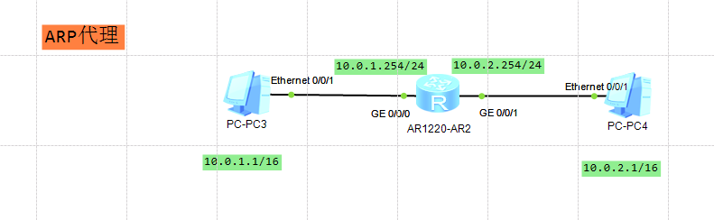

- 配置arp-proxy

- ```router
  [AR2-GigabitEthernet0/0/0]arp-proxy enable 
  [AR2-GigabitEthernet0/0/0]display this
  [V200R003C00]
  #
  interface GigabitEthernet0/0/0
   ip address 10.0.1.254 255.255.255.0 
   arp-proxy enable
  #
  return
  ```

- 只在G0/0/0接口上开启arp-proxy功能时，pc3可以ping通pc4,反之不能
  
  2个路由器开启arp代理实验：PC1---SW--{AR1,AR2}--SW--PC2

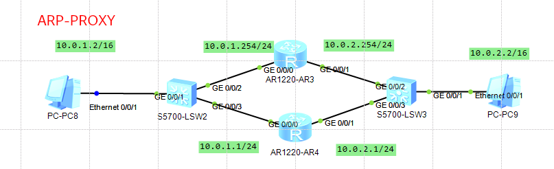

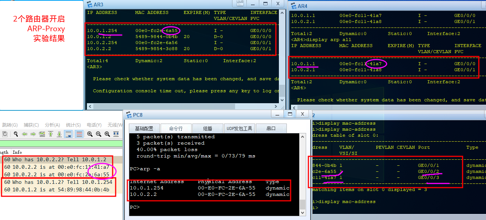

### 免费ARP(Gratuitous ARP)

- 所有设备上的接口初始化时，如果该接口有IP地址，就会触发免费ARP

- 免费ARP可以用来探测IP地址是否冲突

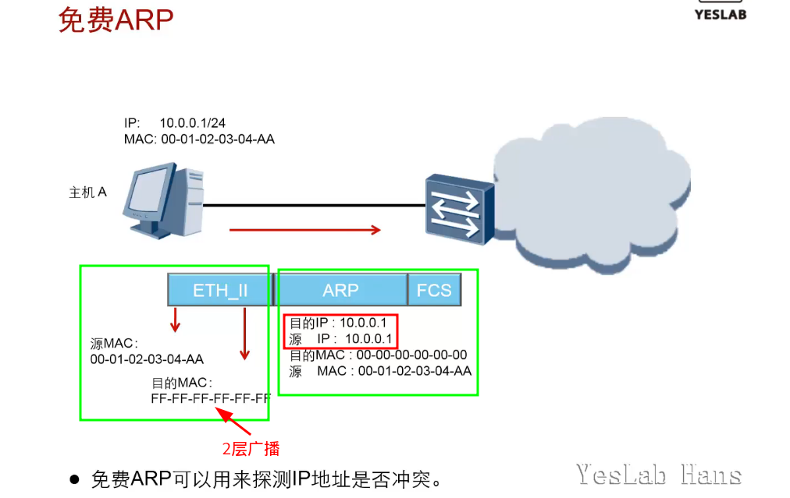

免费ARP实验

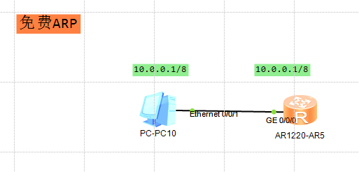

```router
[AR5]interface GigabitEthernet 0/0/0
[AR5-GigabitEthernet0/0/0]ip address 10.0.0.1 8
Mar  6 2022 21:54:05-08:00 AR5 %%01IFNET/4/LINK_STATE(l)[0]:The line protocol IP
 on the interface GigabitEthernet0/0/0 has entered the UP state. 
[AR5-GigabitEthernet0/0/0]
Mar  6 2022 21:54:06-08:00 AR5 ARP/4/ARP_IPCONFLICT_TRAP:OID 16777216.50331648.1
00663296.16777216.67108864.16777216.3674669056.83886080.419430400.2063597568.335
54432.100663296 ARP detects IP conflict. (IP address=1.0.0.10, Local interface=G
igabitEthernet0/0/0, Local MAC=00e0-fc3f-5d04, Local vlan=0, Local CE vlan=0, Re
ceive interface=GigabitEthernet0/0/0, Receive MAC=5489-9897-6c46, Receive vlan=0
, Receive CE vlan=0, IP conflict type=Local IP conflict). 
[AR5-GigabitEthernet0/0/0]
Mar  6 2022 21:54:06-08:00 AR5 %%01ARP/4/ARP_DUPLICATE_IPADDR(l)[1]:Received an 
ARP packet with a duplicate IP address from the interface. (IpAddress=1.0.0.10, 
InterfaceName=GigabitEthernet0/0/0, MacAddress=5489-9897-6c46) 
[AR5-GigabitEthernet0/0/0]shutdo    
[AR5-GigabitEthernet0/0/0]shutdown 
Mar  6 2022 21:54:22-08:00 AR5 %%01IFPDT/4/IF_STATE(l)[2]:Interface GigabitEther
net0/0/0 has turned into DOWN state.
[AR5-GigabitEthernet0/0/0]
[AR5-GigabitEthernet0/0/0]
Mar  6 2022 21:54:22-08:00 AR5 %%01IFNET/4/LINK_STATE(l)[3]:The line protocol IP
 on the interface GigabitEthernet0/0/0 has entered the DOWN state. 
[AR5-GigabitEthernet0/0/0]undo shutdown
[AR5-GigabitEthernet0/0/0]
Mar  6 2022 21:54:37-08:00 AR5 %%01IFPDT/4/IF_STATE(l)[4]:Interface GigabitEther
net0/0/0 has turned into UP state.
[AR5-GigabitEthernet0/0/0]
Mar  6 2022 21:54:37-08:00 AR5 %%01IFNET/4/LINK_STATE(l)[5]:The line protocol IP
 on the interface GigabitEthernet0/0/0 has entered the UP state. 
[AR5-GigabitEthernet0/0/0]
Mar  6 2022 21:54:38-08:00 AR5 %%01ARP/4/ARP_DUPLICATE_IPADDR(l)[6]:Received an 
ARP packet with a duplicate IP address from the interface. (IpAddress=1.0.0.10, 
InterfaceName=GigabitEthernet0/0/0, MacAddress=5489-9897-6c46) 
[AR5-GigabitEthernet0/0/0]
[AR5-GigabitEthernet0/0/0]
[AR5-GigabitEthernet0/0/0]
```

## 总结

- 网络设备在什么情况下会发送ARP request?

答：源设备在发送数据给目的设备前，会首先查看自身的ARP缓存，查找ARP缓存中是否存在目的设备的IP地址和MAC地址的映射。如果存在则直接使用，如果不存在则会发送ARP request。


- 网络设备什么时候会产生免费ARP？


答：当网络上的一个设备被分配了IP地址或者IP地址发生变更后，可以通过免费ARP来检查IP地址是否冲突。
