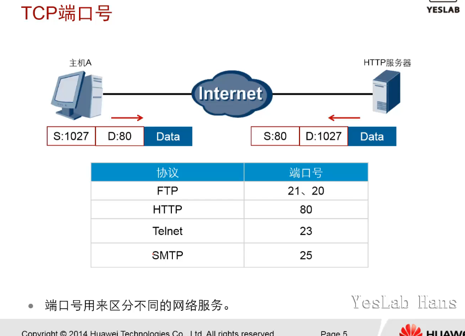
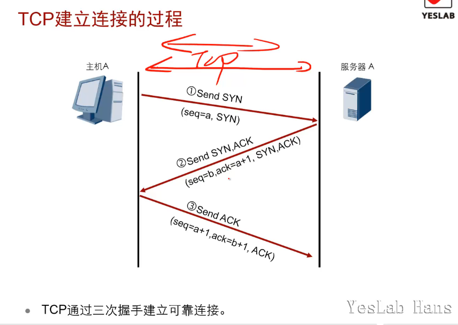

# 传输层协议

传输层定义了主机应用程序之间端到端的连通性。传输层中最为常见的2个协议分别是<mark>TCP(Transmission Control Protocol)传输控制协议</mark>和<mark>UDP(User Datagram Protocol)用户数据包协议</mark>

## 学习目标

- 掌握TCP和UDP的工作原理

- 描述TCP和UDP的报文格式

- 了解常见服务的应用端口号

## TCP

- TCP(Transmission Control Protocol)是一种面向连接的传输层协议，提供可靠的传输服务。

- 面向连接：
  
  - 是指通信双方在通信时，要事先建立一条通信线路
  
  - 一种网络协议，依赖发送方和接收器之间的显示通信和阻塞以管理双方的数据传输。网络系统需要在两台计算机之间发送数据之前先建立连接的一种特性

### TCP端口号

- 端口号用来区分不同的网络服务。

- 常见使用tcp作为传输层协议的应用层服务及其端口号
  
  - SMTP(Simple Mail Transfer Protocol):简单邮件传输协议

| 应用层协议  | 端口号   |
| ------ | ----- |
| FTP    | 20,21 |
| HTTP   | 80    |
| Telnet | 23    |
| SMTP   | 25    |

### TCP头部

- 5元组(five-tuple)，能够区分不同会话(session)，并且对应的会话是唯一的
  
  - 源目IP
  
  - 源目Port
  
  - (the layer 4 protocol.)传输层协议

- ACK报文：TCP报文中的ACK bit置位(1)的报文，俗称ACK报文

- TCP报文由header和tcp data组成

- tcp header最大长度为60Bytes,最少20Bytes(5layer*4Bytes),填充是为了使TCP header为4Bytes的整数倍

- [PSH和URG字段](https://blog.csdn.net/qq_31828515/article/details/74035260)

- header字段解析
  
  - Source/Destination Port(2Bytes+2Byes):源目端口号，用于区别主机中的不同进程
  
  - Sequence Number(4Bytes):序列号，用来标识tcp连接中的数据流，表示当前数据第一个Byte在这个报文段(segment)中的序号，主要用于解决网络报文乱序问题
  
  - Acknowledgment Number(4Bytes):确认号，期望收到对方下一个报文段的数据的第一个字节的序号，只有当标志位中的ACK标志为1时该字段才生效，主要用来解决丢包问题
  
  - Header Length/Data Offset(数据偏移)(<mark>4bit</mark>):tcp头部字节数(单位4Bytes)，最大(15*4==60Bytes)正常长度20Bytes
  
  - Resv(reserved)(6bit):保留字段，置0
  
  - URG(urgent)(1bit):紧急位，当URG=1时，表明紧急指针(Urgent Pointer)字段有效，告诉系统此报文段中有紧急数据，应当尽快传送（相当于高优先级的数据），而不是按照原先的顺序来传送。
  
  - ACK(acknowledgment)(1bit),确认位，当ack=1时，确认号字段有效
  
  - PSH(push)(1bit):推送位，要求接收方数据尽快到达应用层，不要再等到接收方缓存区满后再向上交付
  
  - RST(reset)(1bit):复位比特，表明tcp连接中出现严重差错(主机崩溃或其他原因)，必须释放连接，然后再重新建立连接;也被用来拒绝错误或者非法的数据包
  
  - SYN(synchronize)(1bit):同步位，用来建立连接，表示这是一个连接请求(SYN=1,ACK=0)或者连接接受报文(SYN=1,ACK=1);该标志的数据包常用来进行端口扫描
  
  - FIN(finish)(1bit):终止位，用来释放一个连接，表明此报文段的发送段数据已经发送完毕，并要求释放连接;该标志的数据包也常用来进行端口扫描
  
  - Window(2Bytes):窗口大小(单位Byte)，告诉对方自己的接收窗口大小，控制对方发送的数据量，用来进行流量控制;最大65535Bytes
  
  - Checksum(2Bytes):校验和，检验报文内容的正确性;检验的范围包括tcp header和tcp data这两部分。在计算检验和时，要在 TCP 报文段的前面加上 12 字节的伪首部(pseudo-header)。
  
  - Urgent Pointer(2Bytes):指出在本报文段中的紧急数据的最后一个一个字节的序号。
  
  - Options/Padding(0-40Bytes):**选项字段**，长度可变。TCP首部可以有多达40字节的可选信息，用于把附加信息传递给终点，或用来对齐其它选项。 这部分最多包含40字节，因为TCP头部最长是60字节（其中还包含前面讨论的20字节的固定部分）

- 伪首部(pseudo-header)
  
  - 伪首部共有12字节，包含如下信息：源IP地址、目的IP地址、保留字节(置0)、传输层协议号(TCP是6)、TCP报文长度(报头+数据)。
  
  - 伪首部是为了增加TCP校验和的检错能力：如检查TCP报文是否收错了(目的IP地址)、传输层协议是否选对了(传输层协议号)等

### TCP顺序号(Sequence)和确认号(Ackownledge)

### TCP建立连接的过程

- TCP通过3次握手(Three-way Handshake)建立可靠连接

### TCP传输过程

- 重传机制

### TCP流量控制

### TCP关闭连接

- 主机在关闭连接之前，要确认收到来自对方的ACK。

- TCP连接拆除，4次挥手(four-way handshake)

### TCP抓包分析

- 准备
  
  - 使用wireshark开始抓包
  
  - 使用ssh登陆服务器，ssh使用tcp协议22号端口进行通讯
  
  - 操作几个命令后，使用`CTRL+D`结束当前SSH会话
  
  - 停止抓包
  
  - 在wireshark过滤器中使用`tcp.port==22`将上述ssh会话使用tcp建立连接，传输数据，终止连接的数据包过滤出来
  
  - [抓包结果](../wireshark_capture/tcp.pcapng)

## UDP

- UDP(User Datagram Protocol)是一种面向无连接的传输层协议，传输可靠性没有保证。

- 当应用程序对传输的可靠性要求不高，但是对传输速度和延迟要求较高时，可以用UDP协议来代替TCP协议在传输层控制数据的转发

### UDP头部

- UDP头部仅占8Bytes,传输数据时没有确认机制。

- UDP适合于实时数据传输，如语音和视频通信。相比于TCP,UDP的传输效率更高，开销更少，但是无法保障数据传输的可靠性。

- header字段解析
  
  - Source Port/Destination Port(2Bytes/2Bytes):源目端口号，发送方/接收方应用程序使用的端口号，区分一台主机中不同服务的通信接口
  
  - Length(2Bytes):长度，包含header和data的总长度，最小值为8Bytes(仅包含header)
  
  - Checksum(2Bytes):校验和，检验udp数据报文在传输过程中是否出错，出错则丢弃

### UDP计算校验和的伪首部(pseudo-header)

- UDP校验
  在计算校验和的时候，需要在UDP数据报之前增加12字节的伪首部，伪首部并不是UDP真正的首部。只是在计算校验和，临时添加在UDP数据报的前面，得到一个临时的UDP数据报。校验和就是按照这个临时的UDP数据报计算的。伪首部既不向下传送也不向上递交，而仅仅是为了计算校验和。这样的校验和，既检查了UDP数据报，又对IP数据报的源IP地址和目的IP地址进行了检验。

### UDP传输过程

- 使用UDP传输数据时，由应用程序根据需要提供报文到达确认、排序、流量控制等功能。

- UDP不提供重传机制，占用资源小处理效率高

- 一些时延敏感的流量，如语音、视频等，通常使用UDP作为传输层协议。

## 总结

- TCP头部中的确认标识位有什么作用？

确认标识位ACK,

1. 用于标识 确认号(AcknowledgementNumber)字段生效。

2. 大多数情况下该标志位是置位的。

3. 同时提示远端系统已经成功接收所以数据。

4. tcp报文头内的 确认号 字段包含的确认编号为下一个预期的序列编号
- TCP头部中有哪些标识位参与TCP三次握手？

syn,ack

第一次握手，主机1发送syn=1,随机产生seq number=a的数据包到主机2,主机2由syn=1得知主机1要求建立连接

第二次握手，主机2收到请求后要确认连接信息，向主机1发送ack number=a+1(主机1的seq+1)，ack=1,syn=1,随机产生seq number=b的包到主机1

第三次握手，主机1收到后检查ack number是否正确，即第一次发送的seq number+1，以及ack标志是否为1,若正确，主机1会再发送ack number=b+1,ack=1,seq number=a+1的数据包到主机2，主机2收到该数据包后则连接建立成功

完成三次握手后，主机1和主机2开始传送数据
