# 数据转发过程

TCP/IP协议簇和底层协议配合，保证了数据能够实现端到端的传输。数据传输过程是一个非常复杂的过程，例如数据在转发的过程中会进行一系列的封装和解封装。对于网络工程师来说，只有深入地理解了数据在各种不同设备上的转发过程，才能对网络进行正确的分析和检测。

## 学习目标

- 掌握数据封装和解封装的过程

- 处理数据转发过程中的基本故障

## 数据转发过程概述

- 数据包在相同网段内或不同网段之间转发所依据的原理基本一致

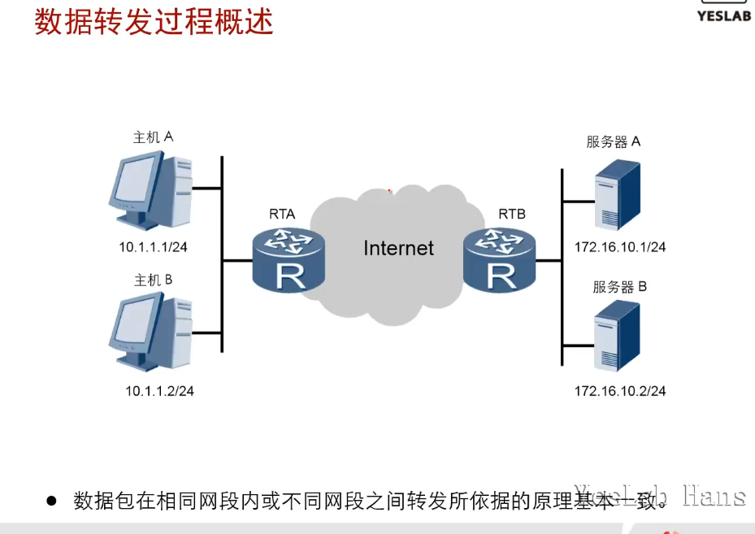

### TCP封装

- 当主机A建立了到达目的地的TCP连接后便开始对应用层数据进行封装。

- 封装**源目端口** 和应用层PDU

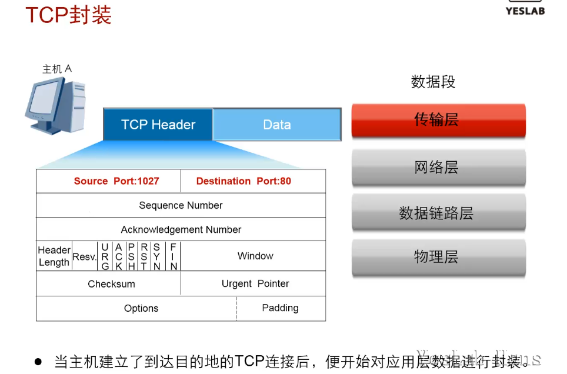

### IP封装

- 封装**源目ip地址**和上一层PUD，根据上层协议选择**协议号**

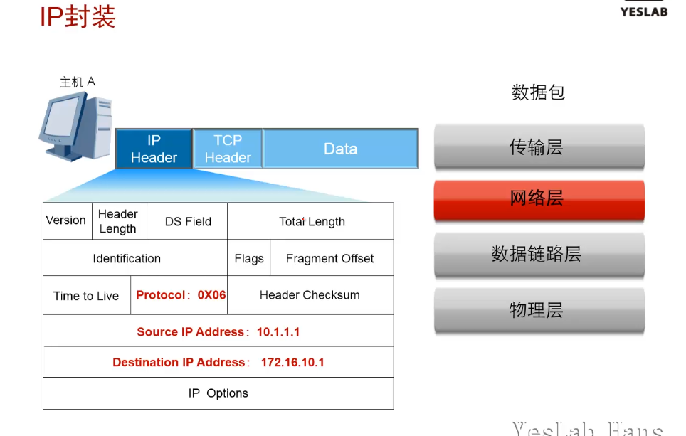

### 查找路由

- 主机A必须要拥有到达目的地的路由

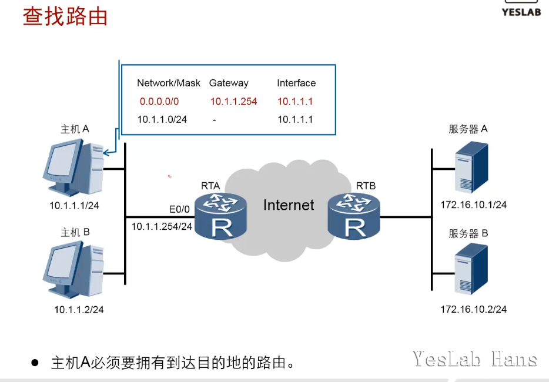

### 数据链路层封装

- 封装**源MAC,下一跳的MAC地址**和上层PDU，FCS校验;同一网段，目的mac,不同网段，网关mac

- 通过ARP缓存表找到下一跳的MAC地址。

- 如果表项里没有下一跳的MAC地址，主机会发送ARP Request请求。

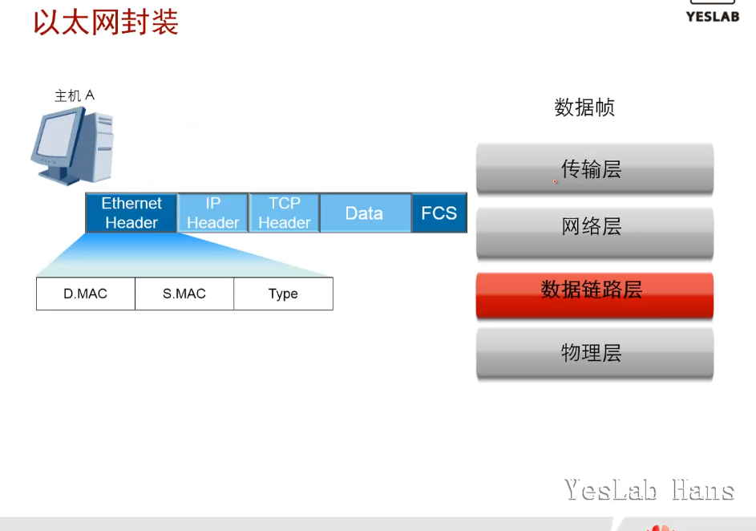

### 数据帧转发过程

- 主机工作在**半双工状态**下，所以会**使用CSMA/CD来检测链路**是否空闲

- 前导码(Preamble)用于使接收者进入同步状态，帧首定界符(SFD,Start Frame Delimiter)用于指示帧的开始

- 同一个冲突域里的设备都会接收到主机发送的数据帧。

- 只有网关(RTA)会处理该数据帧，并继续转发。

- 接收到数据帧后
  
  1. FCS校验，校验失败则丢弃
  
  2. 检查目的MAC是否为本接口的MAC，是则接收否则丢弃

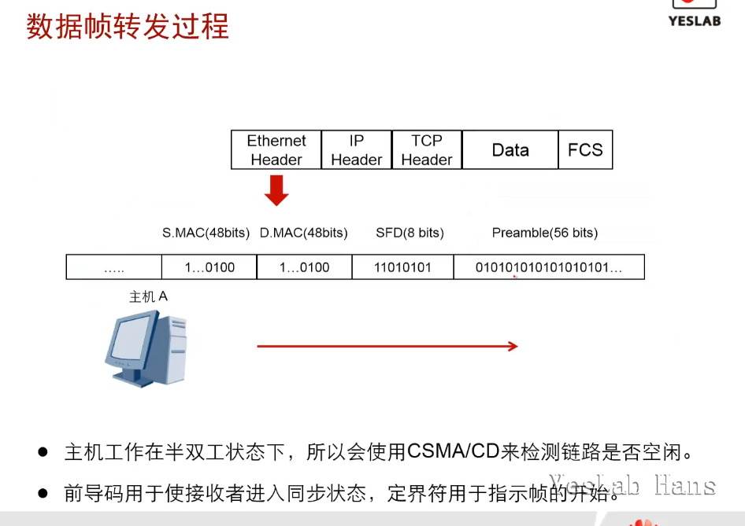

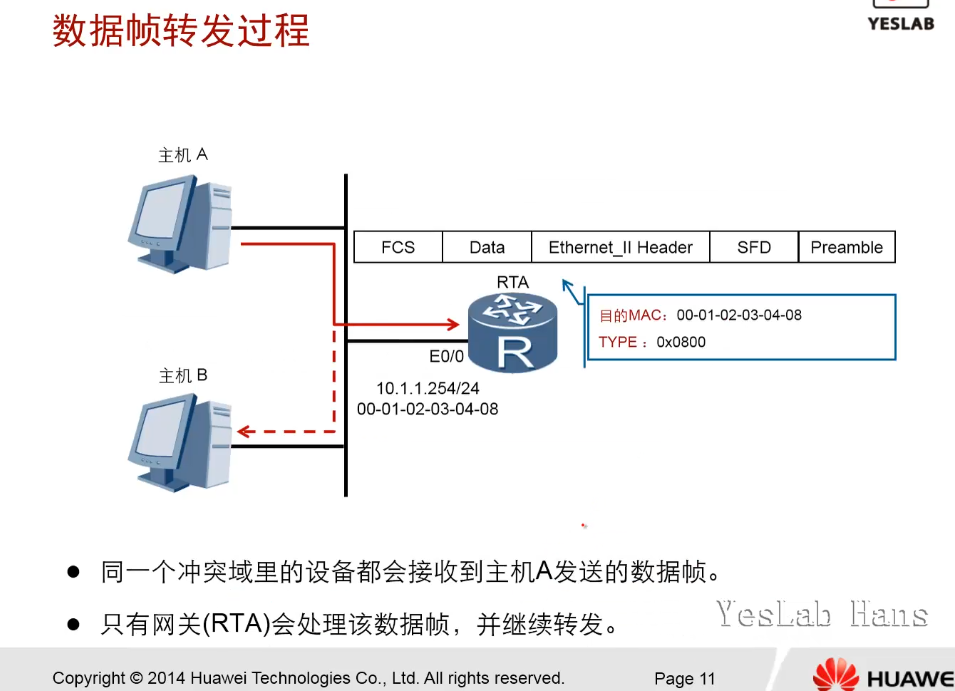

### 数据包转发过程

- 网关检(RTA)查是否具有到达目的网络的路由。

- 如果存在转发路径，则为数据包添加一个新的二层帧头和帧尾，并继续转发。
  
  - 新ether net frame头部的源mac=路由器出接口的mac地址
  
  - 目的mac=下一跳的mac地址

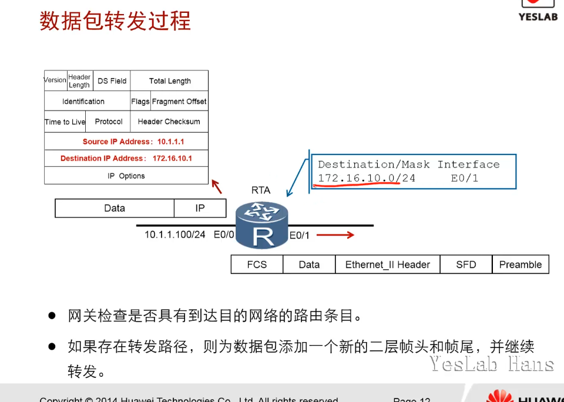

### 数据帧解封装

- 路由器RTB以服务器A的MAC地址作为目的MAC继续转发。

- 服务器A接收到该数据帧后，发现目的MAC为自己的MAC,于是会继续处理该数据帧。

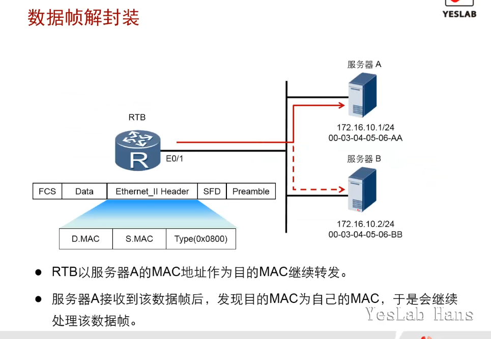

### 数据包解封装

- 服务器A检查数据包的目的IP地址，发现目的IP与自己的IP相同。

- 服务器A剥掉数据包的IP头部后会送往上层协议TCP继续进行处理。

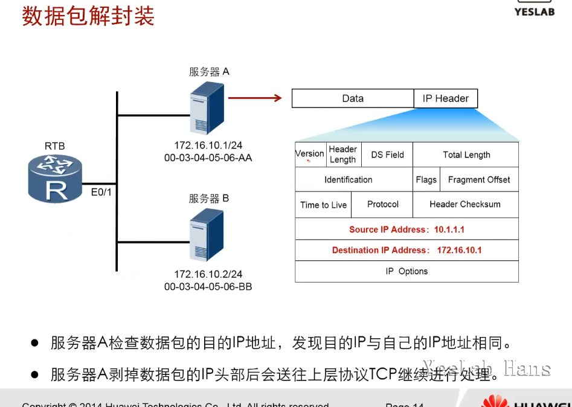

### 数据段解封装

- 服务器A检查TCP头部的目的端口，然后将数据段(segment)发送给应用层的HTTP协议进行处理。

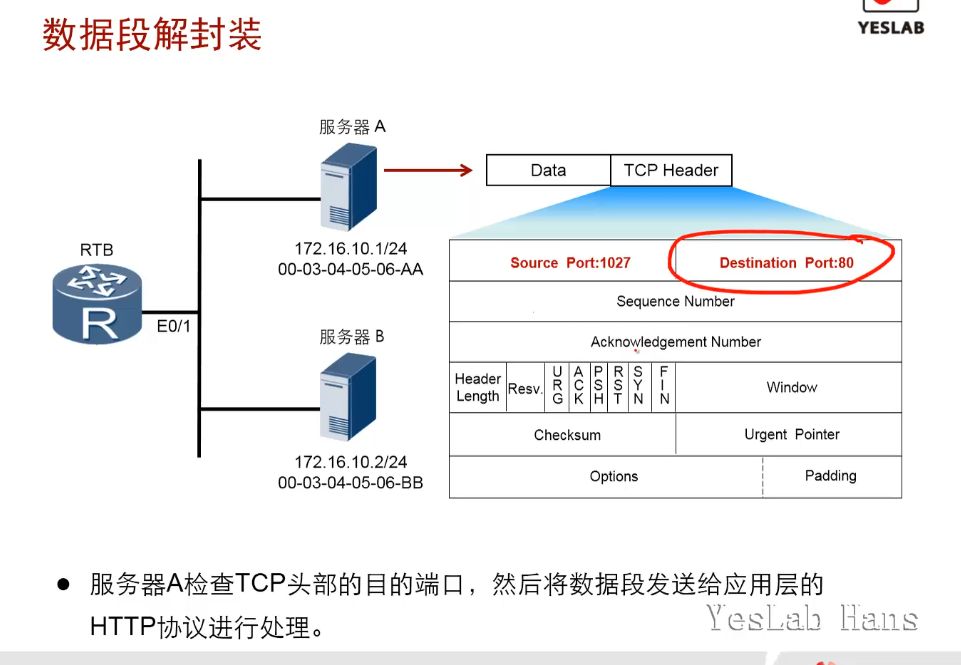

## 路由器转发数据包时的封装过程

- <mark>获取MAC地址：ARP协议</mark>

- Host A的要发包给HostB
  
  - 目的IP为`DestIP=192.168.2.2`,源IP`SrcIP=192.168.1.2`
  
  - 目的MAC为网关MAC`DestMAC=00-11-12-21-22-22`,源MAC为本机MAC`SrcMAC=00-11-12-21-11-11`

- 路由器AR1从e0口接收到来自HostA的数据包，
  
  - <mark>FCS校验</mark>
  
  - 发现目的mac是本接口e0的MAC地址，然后继续解封装
  
  - 发现目的IP不是本接口IP,查找路由表
  
  - 发现可以从e1口到达目的IP,重新进行二层封装
    
    - <mark>源目IP不变</mark>`DestIP=192.168.2.2`,`SrcIP=192.168.1.2`
    
    - <mark>目的MAC为下一跳MAC</mark>`DestMAC=00-11-12-21-33-33`
    
    - <mark>源MAC为本路由器出接口e1MAC</mark>`SrcMAC=00-11-12-21-44-44`

- 路由器AR2从e1口接收到来自AR1的数据包
  
  - <mark>FCS校验</mark>
  
  - 发现目的mac是本接口e1的MAC地址，然后继续解封装
  
  - 发现目的IP不是本接口IP,查找路由表
  
  - 发现直联路由，可以从e0口到达目的地HostB,重新进行二层封装
    
    - <mark>源目IP不变</mark>`DestIP=192.168.2.2`,`SrcIP=192.168.1.2`
    
    - <mark>目的MAC为HostB的MAC</mark>`DestMAC=00-11-12-21-66-66`
    
    - <mark>源MAC为本路由器出接口e0的</mark>`00-11-12-21-55-55`

- HostB接收到来自路由器AR2的数据包
  
  - <mark>FCS校验</mark>
  
  - 发现目的MAC为本机MAC,继续解封装
  
  - 发现目的IP为本机IP
  
  - 继续解封装，将PUD交给上层协议处理

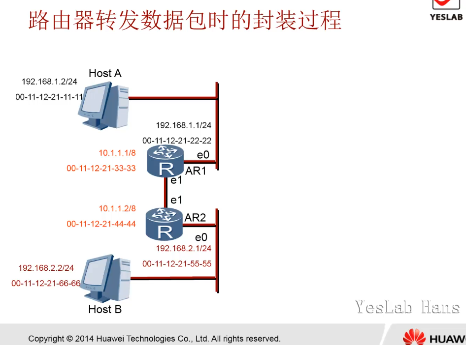

## 总结

- 数据在进行二层和三层封装之前，主机需要了解哪些信息？

同网段：源目IP,源目MAC;

跨网段：源目IP,源MAC,网关IP,网关MAC

- 当数据帧发送到非目的主机时，非目的主机将会如何处理？

主机，丢弃该数据帧;

路由器，查找路由表，转发

- 传输层如何能够准确的将数据交给特定应用？

端口号

- 当两台主机同时访问服务器的HTTP服务时，该服务器如何区分数据属于哪个会话？

5元组，源目IP,源目PORT,协议
