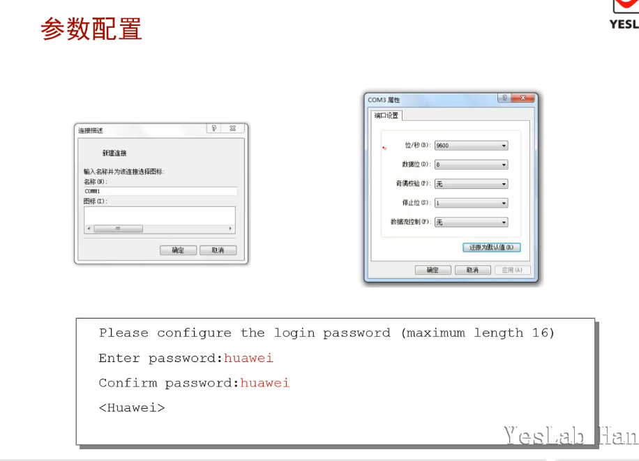

# VRP基础

交换机可以隔离冲突域，路由器可以隔离广播域，这两种设备在企业网络中应用越来越广泛，随着越来越多的终端接入到网络中，网络设备的负担也越来越重，这时网络设备可以通过华为专有的VRP系统来提升运行效率。

<mark>VRP(Versatile Routing Platform)通用路由平台</mark>。是华为公司数据通信产品的通用操作系统平台，它以IP业务为核心，采用组件化的体系结构，在实现丰富功能特性的同时，还提供了基于应用的可裁剪和可扩展的功能，使得路由器的交换机的运行效率大大增加。能对VRP熟练的进行配置和操作是对网络工程师的一种基本要求。

## 学习目标

- 掌握交换机和路由器的应用场景

- 掌握冲突域和广播域的区别

- 了解VRP的基础知识

## ARP表、MAC表、路由表

| 表名        | 层次  | 对应关系            |
| --------- | --- | --------------- |
| MAC表/FDB表 | 2   | MAC地址：接口        |
| ARP表      | 2.5 | MAC地址：IP地址      |
| 路由表/FIB表  | 3   | (网关路由)网段：网关：出接口 |
| 路由表/FIB表  | 3   | (直连路由)网段：出接口    |
| 路由表/FIB表  | 3   | (主机路由)主机：出接口    |

## 终端之间通信

通过3种方式实现数据报文在主机之间流动

1. 物理层设备转发报文

2. 数据链路层（二层）设备转发报文

3. 网络层（三层）设备转发报文

### 物理层设备

- 物理层设备直接互联主机，帮助主机A发出电信号直接传递给主机B

- 例如：
  
  1. 以太网线
  
  2. 串口线
  
  3. 中继放大器（HUB）

### 二层设备（以太网）交换机

- 交换机提供多个接口连接多台主机<mark></mark>，<mark>交换机利用MAC表，根据数据帧中的二层MAC地址转发数据</mark>

- <mark>注意：二层设备(Layer 2)除二层功能外，还拥有完整的一层功能</mark>

- 例如：
  
  1. 网络接口卡(NIC,network interface controller)
  
  2. 网桥(Bridge)
  
  3. 交换机(Switch)

### 三层设备和功能-路由器

- 路由器提供接口和主机或者其他网络设备相连接，<mark>路由器利用路由表，根据数据包的三层IP地址转发数据报文。</mark>

- 路由器采用静态或者动态方法生成路由表<mark></mark>

- <mark>注意：三层设备有完整的二层和一层功能</mark>

### 交换机的应用

- 如果使用Hub,则主机A发送数据时，其他主机都不能发送数据，否则会发生冲突。使用交换机时，则不会出现这种现象。

### 路由器的应用

- 路由器可以分割广播域。

## 冲突域和广播域

- 冲突域(collision domain):在以太网中，当多个节点同时传输数据时，从多个设备发出的帧将会碰撞，在物理介质上相遇，彼此数据都会被破坏，这样的共享介质网段就叫冲突域。

- 广播域(broadcast):广播帧传输的网络范围，一般是路由器来设定边界。因为router不转发广播。

## VRP

<mark>VRP是华为网络设备的操作系统</mark>

### VRP介绍

VRP是华为网络设备的通用操作系统平台，使用VRP系统的设备有：

- 交换机

- 路由器

- 安全设备：VPN，防火墙

- 网管设备，网管系统

- 无线设备：AC,AP

### VRP的发展

1. 集中式：VRP1(1998-2001)
   
   1. 集中式设计
   
   2. 适用于中低端设备
   
   3. 性能比较低

2. 分布式:VRP2(1999-2000)
   
   1. 分布式设计

3. 高可靠性：
   
   1. VRP3(2000-2004)
      
      1. 分布式设计
      
      2. 支持多特性
      
      3. 核心路由器
   
   2. VRP5(2004-now)
      
      1. 组件化设计
      
      2. 应用于华为多个产品
      
      3. 高性能

4. 多进程，多框，多核：VRP8(2009-now)
   
   1. 多进程
   
   2. 组件化设计
   
   3. 支持多CPU、多核

### 设备管理接口

- 管理接口：MiniUSB，console

- 设备尺寸：厚度-1U

- 设备标识：AR(AccessRouter)接入路由器，S(Switch)交换机

### Console口登陆

主机:·(USB转COM口)COM口-Console线-路由器：Console口

#### 参数配置

软件：putty,crt

波特率：9600

数据位：8

奇偶校验：none

停止位：1

经常使用的密码：`Huawei@123`

miniUSB需要到华为官网下载驱动

## 总结

- 如果路由器收到了网络中主机发送的广播报文，会如何操作？

当路由器收到该广播报文时,路由器会根据数据包内容进行处理,可能会对必要广播报文(如请求路由器MAC地址的ARP广播)进行回应,但不会将该数据包转发到其他广播域。

- 华为数通设备目前使用的VRP版本是多少？

VRP5,VRP8
目前,大多数华为数通产品使用的是VRP5版本,少数产品如NE系列路由器使用的是VRP8版本。
