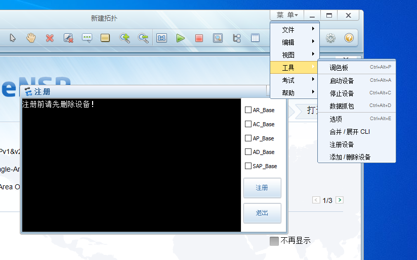
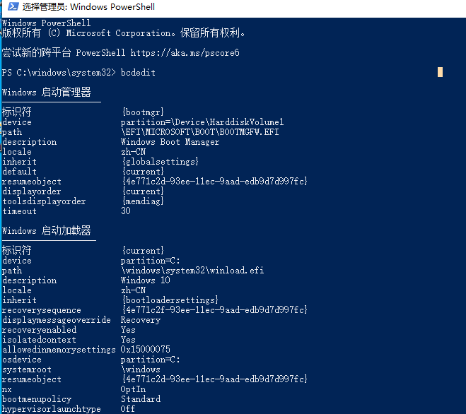

# 安装华为eNSP模拟器

## eNSP简介

> eNSP企业网络模拟平台(Enterprise Network Simulation 
> Platform)是一款可扩展的、图形化操作的网络仿真工具平台，主要对企业网路由器、交换机进行软件仿真，完美呈现真实设备实景，支持大型网络模拟，让广大用户和渠道合作伙伴有机会在没有真实设备的情况下能够模拟演练，学习网络技术。

## 安装依赖软件

### 依赖软件

1. [wireshark](https://www.wireshark.org/download.html)与[winpacp]([WinPcap · Download](https://www.winpcap.org/install/default.htm))下载
   下方百度网盘链接1中有wireshark安装包
   安装wireshark时会自动安装高版本NPCAP
   另需要单独安装winpcap

2. [virtualbox](https://www.virtualbox.org/wiki/Downloadshttps://www.virtualbox.org/wiki/Downloads)下载
    virtualbox版本需要限制在`5.2.44以下`
    virtualbox安装目录不要有中文

3. eNSP下载
   
    目前官网已取消下载渠道
   
    [百度云盘链接1](https://pan.baidu.com/s/1uSeJPe0oPy5qdqXY2pT-3Q)提取码：eyey
   
    [百度云盘链接2](https://pan.baidu.com/s/1lOr02FH0Zt0vQB5coWZptw)提取码：rkwg

### 安装eNSP

安装完成后，使用之前最好先注册设备

菜单->工具->注册设备



#### 报错及解决

错误：`Raw-mode is unavailable courtesy of Hyper-V`

解决：在WIN10中关闭Hyper-V

检查Hyper-V设置,管理员模式启动powershell
当前hypervisorlaunchtype值为Auto

```powershell
bcdedit #查看当前状态
bcdedit /set hypervisorlaunchtype off #关闭hypervisorlaunchtype
```

 

重启windows10系统

**此方法使用后虽然可以打开VirtualBox，但影响了系统其他功能，如蓝牙连接、热点连接等**

重新启用hypervisorlaunchtype

Windows的Docker需要[Hyper-V](https://so.csdn.net/so/search?q=Hyper-V&spm=1001.2101.3001.7020)提供的硬件虚拟化，需要启用 hypervisorlaunchtype，同样运行如下命令：

```powershell
bcdedit /set hypervisorlaunchtype auto
```

重启计算机
